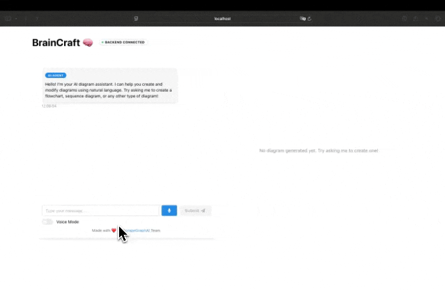

---
runme:
  document:
    relativePath: README.md
  session:
    id: 01JSVE3PGFZK6AR9GHKF9DQH86
    updated: 2025-04-27 06:07:48-05:00
---

<div align="center">
  

# BrainCraft

🧠 Your Personal Brainstorming & Diagramming AI Agent

[](ht*******************************SD)
[](ht**************rg)
[](ht******************rg)
[](ht******************om)

Transform your ideas into visual diagrams through natural conversation - both text and voice! 🎯

</div>

## 🌟 Features

- 🤖 **AI-Powered Brainstorming** - Collaborate with an intelligent AI agent to explore and refine your ideas
- 🗣️ **Voice Interaction** - Hands-free brainstorming with voice commands and AI vocal responses
- 📊 **Real-time Diagramming** - Watch your ideas transform into diagrams as you speak or type
- 🔄 **Interactive Refinement** - Instantly update diagrams through natural conversation
- 📝 **Multiple Diagram Types** - Support for flowcharts, sequence diagrams, class diagrams, and more
- 🎨 **Modern UI/UX** - Sleek, intuitive interface with customizable themes
- ⚡ **Real-time Updates** - See your diagrams evolve instantly as you brainstorm

## 🎬 Demo

Watch BrainCraft in action:



## 🚀 Getting Started

### Prerequisites

- Node.js (v16 or higher)
- Python (3.10 or higher)
- npm or yarn package manager
- Docker and Docker Compose (for containerized setup)

### 🐳 Option 1: Docker Setup (Recommended)

1. Configure environment files:

```bash
# Set up backend environment
cp backend/.env.example backend/.env
# Edit backend/.env and add your API keys:
# - MISTRAL_API_KEY (required for AI processing)
# - OPENAI_API_KEY (optional for additional AI capabilities)
# - LMNT_API_KEY (required for voice features)

# Set up frontend environment
cp frontend/.env.local.example frontend/.env.local
```

2. Launch with Docker Compose:

```bash
docker compose -f docker/docker-compose.yml up

# Ran on 2025-04-27 05:57:15-05:00 for 5m 7.785s exited with 1
 => [frontend] exporting to oci image format                                    [+] Building 18**9s (29/30)                                                           do************er:vi**************ev                                       
 => [frontend 4/6] RUN npm install                                                                                  32.5s5e927b9327831f696b10e66b22b4b58cffdd055
 => [frontend 5/6] COPY frontend/ .                                                                                  0.8sd052fa77281479a9e7329bc3a65995987081bc8
 => [frontend 6/6] COPY frontend/.env.local ./.env.local                                                             0.1s                                       
 => [frontend] exporting to oci image format                                    [+] Building 18**1s (29/30)                                                           do************er:vi**************ev                                       
 => [frontend 4/6] RUN npm install                                                                                  32.5s5e927b9327831f696b10e66b22b4b58cffdd055
 => [frontend 5/6] COPY frontend/ .                                                                                  0.8sd052fa77281479a9e7329bc3a65995987081bc8
 => [frontend 6/6] COPY frontend/.env.local ./.env.local                                                             0.1s                                       
 => [frontend] exporting to oci image format                                    [+] Building 18**2s (29/30)                                                           do************er:vi**************ev                                       
 => [frontend 4/6] RUN npm install                                                                                  32.5s5e927b9327831f696b10e66b22b4b58cffdd055
 => [frontend 5/6] COPY frontend/ .                                                                                  0.8sd052fa77281479a9e7329bc3a65995987081bc8
 => [frontend 6/6] COPY frontend/.env.local ./.env.local                                                             0.1s                                       
 => [frontend] exporting to oci image format                                    [+] Building 18**4s (29/30)                                                           do************er:vi**************ev                                       
 => [frontend 4/6] RUN npm install                                                                                  32.5s5e927b9327831f696b10e66b22b4b58cffdd055
 => [frontend 5/6] COPY frontend/ .                                                                                  0.8sd052fa77281479a9e7329bc3a65995987081bc8
 => [frontend 6/6] COPY frontend/.env.local ./.env.local                                                             0.1s                                       
 => [frontend] exporting to oci image format                                    [+] Building 18**5s (29/30)                                                           do************er:vi**************ev                                       
 => [frontend 4/6] RUN npm install                                                                                  32.5s5e927b9327831f696b10e66b22b4b58cffdd055
 => [frontend 5/6] COPY frontend/ .                                                                                  0.8sd052fa77281479a9e7329bc3a65995987081bc8
 => [frontend 6/6] COPY frontend/.env.local ./.env.local                                                             0.1s                                       
 => [frontend] exporting to oci image format                                    [+] Building 18**7s (29/30)                                                           do************er:vi**************ev                                       
 => [frontend 4/6] RUN npm install                                                                                  32.5s5e927b9327831f696b10e66b22b4b58cffdd055
 => [frontend 5/6] COPY frontend/ .                                                                                  0.8sd052fa77281479a9e7329bc3a65995987081bc8
 => [frontend 6/6] COPY frontend/.env.local ./.env.local                                                             0.1s                                       
 => [frontend] exporting to oci image format                                    [+] Building 18**8s (29/30)                                                           do************er:vi**************ev                                       
 => [frontend 4/6] RUN npm install                                                                                  32.5s5e927b9327831f696b10e66b22b4b58cffdd055
 => [frontend 5/6] COPY frontend/ .                                                                                  0.8sd052fa77281479a9e7329bc3a65995987081bc8
 => [frontend 6/6] COPY frontend/.env.local ./.env.local                                                             0.1s                                       
 => [frontend] exporting to oci image format                                    [+] Building 18**0s (29/30)                                                           do************er:vi**************ev                                       
 => [frontend 4/6] RUN npm install                                                                                  32.5s5e927b9327831f696b10e66b22b4b58cffdd055
 => [frontend 5/6] COPY frontend/ .                                                                                  0.8sd052fa77281479a9e7329bc3a65995987081bc8
 => [frontend 6/6] COPY frontend/.env.local ./.env.local                                                             0.1s                                       
 => [frontend] exporting to oci image format                                    [+] Building 18**1s (29/30)                                                           do************er:vi**************ev                                       
 => [frontend 4/6] RUN npm install                                                                                  32.5s5e927b9327831f696b10e66b22b4b58cffdd055
 => [frontend 5/6] COPY frontend/ .                                                                                  0.8sd052fa77281479a9e7329bc3a65995987081bc8
 => [frontend 6/6] COPY frontend/.env.local ./.env.local                                                             0.1s                                       
 => [frontend] exporting to oci image format                                    [+] Building 18**3s (29/30)                                                           do************er:vi**************ev                                       
 => [frontend 4/6] RUN npm install                                                                                  32.5s5e927b9327831f696b10e66b22b4b58cffdd055
 => [frontend 5/6] COPY frontend/ .                                                                                  0.8sd052fa77281479a9e7329bc3a65995987081bc8
 => [frontend 6/6] COPY frontend/.env.local ./.env.local                                                             0.1s                                       
 => [frontend] exporting to oci image format                                    [+] Building 18**4s (29/30)                                                           do************er:vi**************ev                                       
 => [frontend 4/6] RUN npm install                                                                                  32.5s5e927b9327831f696b10e66b22b4b58cffdd055
 => [frontend 5/6] COPY frontend/ .                                                                                  0.8sd052fa77281479a9e7329bc3a65995987081bc8
 => [frontend 6/6] COPY frontend/.env.local ./.env.local                                                             0.1s                                       
 => [frontend] exporting to oci image format                                    [+] Building 18**6s (29/30)                                                           do************er:vi**************ev                                       
 => [frontend 4/6] RUN npm install                                                                                  32.5s5e927b9327831f696b10e66b22b4b58cffdd055
 => [frontend 5/6] COPY frontend/ .                                                                                  0.8sd052fa77281479a9e7329bc3a65995987081bc8
 => [frontend 6/6] COPY frontend/.env.local ./.env.local                                                             0.1s                                       
 => [frontend] exporting to oci image format                                    [+] Building 18**7s (29/30)                                                           do************er:vi**************ev                                       
 => [frontend 4/6] RUN npm install                                                                                  32.5s5e927b9327831f696b10e66b22b4b58cffdd055
 => [frontend 5/6] COPY frontend/ .                                                                                  0.8sd052fa77281479a9e7329bc3a65995987081bc8
 => [frontend 6/6] COPY frontend/.env.local ./.env.local                                                             0.1s                                       
 => [frontend] exporting to oci image format                                    [+] Building 18**9s (29/30)                                                           do************er:vi**************ev                                       
 => [frontend 4/6] RUN npm install                                                                                  32.5s5e927b9327831f696b10e66b22b4b58cffdd055
 => [frontend 5/6] COPY frontend/ .                                                                                  0.8sd052fa77281479a9e7329bc3a65995987081bc8
 => [frontend 6/6] COPY frontend/.env.local ./.env.local                                                             0.1s                                       
 => [frontend] exporting to oci image format                                    [+] Building 18**0s (29/30)                                                           do************er:vi**************ev                                       
 => [frontend 4/6] RUN npm install                                                                                  32.5s5e927b9327831f696b10e66b22b4b58cffdd055
 => [frontend 5/6] COPY frontend/ .                                                                                  0.8sd052fa77281479a9e7329bc3a65995987081bc8
 => [frontend 6/6] COPY frontend/.env.local ./.env.local                                                             0.1s                                       
 => [frontend] exporting to oci image format                                    [+] Building 18**2s (29/30)                                                           do************er:vi**************ev                                       
 => [frontend 4/6] RUN npm install                                                                                  32.5s5e927b9327831f696b10e66b22b4b58cffdd055
 => [frontend 5/6] COPY frontend/ .                                                                                  0.8sd052fa77281479a9e7329bc3a65995987081bc8
 => [frontend 6/6] COPY frontend/.env.local ./.env.local                                                             0.1s                                       
 => [frontend] exporting to oci image format                                    [+] Building 18**3s (29/30)                                                           do************er:vi**************ev                                       
 => [frontend 4/6] RUN npm install                                                                                  32.5s5e927b9327831f696b10e66b22b4b58cffdd055
 => [frontend 5/6] COPY frontend/ .                                                                                  0.8sd052fa77281479a9e7329bc3a65995987081bc8
 => [frontend 6/6] COPY frontend/.env.local ./.env.local                                                             0.1s                                       
 => [frontend] exporting to oci image format                                    [+] Building 18**5s (29/30)                                                           do************er:vi**************ev                                       
 => [frontend 4/6] RUN npm install                                                                                  32.5s5e927b9327831f696b10e66b22b4b58cffdd055
 => [frontend 5/6] COPY frontend/ .                                                                                  0.8sd052fa77281479a9e7329bc3a65995987081bc8
 => [frontend 6/6] COPY frontend/.env.local ./.env.local                                                             0.1s                                       
 => [frontend] exporting to oci image format                                    [+] Building 18**6s (29/30)                                                           do************er:vi**************ev                                       
 => [frontend 4/6] RUN npm install                                                                                  32.5s5e927b9327831f696b10e66b22b4b58cffdd055
 => [frontend 5/6] COPY frontend/ .                                                                                  0.8sd052fa77281479a9e7329bc3a65995987081bc8
 => [frontend 6/6] COPY frontend/.env.local ./.env.local                                                             0.1s                                       
 => [frontend] exporting to oci image format                                    [+] Building 18**6s (29/31)                                                           do************er:vi**************ev                                       
 => [frontend 5/6] COPY frontend/ .                                                                                  0.8s5e927b9327831f696b10e66b22b4b58cffdd055
 => [frontend 6/6] COPY frontend/.env.local ./.env.local                                                             0.1sd052fa77281479a9e7329bc3a65995987081bc8
 => [frontend] exporting to oci image format                                                                        71.0s                                       
 => => exporting layers                                                         [+] Building 18**8s (31/31)                                                           do************er:vi**************ev5e927b9327831f696b10e66b22b4b58cffdd055
 => [frontend 5/6] COPY frontend/ .                                                                                  0.8sd052fa77281479a9e7329bc3a65995987081bc8
 => [frontend 6/6] COPY frontend/.env.local ./.env.local                                                             0.1s                                       
 => [frontend] exporting to oci image format                                                                        71.0s                                       
 => => exporting layers                                                         [+] Building 18**0s (31/32)                                                           do************er:vi**************ev5e927b9327831f696b10e66b22b4b58cffdd055
 => [frontend 6/6] COPY frontend/.env.local ./.env.local                                                             0.1sd052fa77281479a9e7329bc3a65995987081bc8
 => [frontend] exporting to oci image format                                                                        71.0s                                       
 => => exporting layers                                                                                             41.5s                                       
 => => exporting manifest sh**56:a24501c95e927b9327831f696b10e66b22b4b58cffdd055[+] Building 18**0s (32/32) FINISHED                                                  do************er:vi**************evd052fa77281479a9e7329bc3a65995987081bc8
 => [backend internal] load build definition from backend.Dockerfile                                                 0.0s                                       
 => => transferring dockerfile: 1.**kB                                                                               0.0s                                       
 => [backend internal] load metadata for do*****io/library/py**on:3.*****im                                          1.4s*****ta file                           
 => [backend auth] library/python:pull token for re****************io                                                0.0s
 => [backend internal] load .dockerignore                                                                            0.0s
 => => transferring context: 401B                                                                                    0.0s
 => [backend 1/9] FROM do*****io/library/py**on:3.************56:82c07f2f6e35255b92eb16f38dbd22679d5e8fb523064138d7  4.8s
 => => resolve do*****io/library/py**on:3.************56:82c07f2f6e35255b92eb16f38dbd22679d5e8fb523064138d7c6468e7b  0.0s
 => => sh**56:a7d9a0ac6293889b2e134861072f9099a06d78ca983d7172d7bb8b236008c7c3 3.**MB / 3.**MB                       0.5s
 => => sh**56:67e2e38f574308b54710381fc37a28a5addd050b2c6ed3ebbce9fd0c7b3bf234 16***MB / 16***MB                     1.9s
 => => sh**56:c4a5a5511f6e3abf8b4ac5e4a4396919e0409c4a31014c0c92b9d0b7098458aa 250B / 250B                           0.5s
 => => sh**56:16c9c4a8e9eef856231273efbb42a473740e8d50d74d35e6aedd04ff69fe161f 28***MB / 28***MB                     2.9s
 => => extracting sh**56:16c9c4a8e9eef856231273efbb42a473740e8d50d74d35e6aedd04ff69fe161f                            1.2s
 => => extracting sh**56:a7d9a0ac6293889b2e134861072f9099a06d78ca983d7172d7bb8b236008c7c3                            0.1s
 => => extracting sh**56:67e2e38f574308b54710381fc37a28a5addd050b2c6ed3ebbce9fd0c7b3bf234                            0.5s
 => => extracting sh**56:c4a5a5511f6e3abf8b4ac5e4a4396919e0409c4a31014c0c92b9d0b7098458aa                            0.0s
 => [backend internal] load build context                                                                            0.0s
 => => transferring context: 25****kB                                                                                0.0s
 => [backend 4/9] ADD ht***************************sh /uv-installer.sh                                               1.1s
 => [backend 2/9] WORKDIR /app/backend                                                                               0.1s
 => [backend 3/9] RUN apt-get update && apt-get install -y     build-essential     curl     && rm -rf /var/lib/apt  38.4s
 => [backend 4/9] ADD ht***************************sh /uv-installer.sh                                               0.1s
 => [backend 5/9] RUN sh /uv-installer.sh && rm /uv-installer.sh                                                     3.6s
 => [backend 6/9] COPY backend/pyproject.toml backend/uv.lock ./                                                     0.0s
 => [backend 7/9] COPY backend/src/ ./src/                                                                           0.0s
 => [backend 8/9] RUN uv sync --frozen --no-cache                                                                    4.7s
 => [backend 9/9] COPY backend/.env ./.env                                                                           0.0s
 => [backend] exporting to oci image format                                                                         22.6s
 => => exporting layers                                                                                             12.7s
 => => exporting manifest sh**56:31b77fa8a2b7af6906fc0a230d916a1a78cac72336f82e8c741816135cc98ec0                    0.0s
 => => exporting config sh**56:7093fd7df927d8e0c0b9fbac4a4731f89e3631ddc18c45879ca286323b62f4f8                      0.0s
 => => sending tarball                                                                                               9.9s
 => [backend] importing to docker                                                                                    0.0s
 => [backend] resolving provenance for metadata file                                                                 0.0s
 => [frontend internal] load build definition from frontend.Dockerfile                                               0.1s
 => => transferring dockerfile: 515B                                                                                 0.0s
 => [frontend internal] load metadata for do*****io/library/node:18*****ne                                           1.8s
 => [frontend auth] library/node:pull token for re****************io                                                 0.0s
 => [frontend internal] load .dockerignore                                                                           0.0s
 => => transferring context: 401B                                                                                    0.0s
 => [frontend 1/6] FROM do*****io/library/node:18************56:8d6421d663b4c28fd3ebc498332f249011d118945588d0a35cb  4.5s
 => => resolve do*****io/library/node:18************56:8d6421d663b4c28fd3ebc498332f249011d118945588d0a35cb9bc4b8ca0  0.0s
 => => sh**56:02bb84e9f3412827f177bc6c020812249b32a8425d2c1858e9d71bd4c015f031 443B / 443B                           0.1s
 => => sh**56:8bfa36aa66ce614f6da68a16fb71f875da8d623310f0cb80ae1ecfa092f587f6 1.**MB / 1.**MB                       0.4s
 => => sh**56:d84c815451acbca96b6e6bdb479929222bec57121dfe10cc5b128c5c2dbaf10a 39***MB / 39***MB                     3.4s
 => => sh**56:6e771e15690e2fabf2332d3a3b744495411d6e0b00b2aea64419b58b0066cf81 3.**MB / 3.**MB                       0.7s
 => => extracting sh**56:6e771e15690e2fabf2332d3a3b744495411d6e0b00b2aea64419b58b0066cf81                            0.2s
 => => extracting sh**56:d84c815451acbca96b6e6bdb479929222bec57121dfe10cc5b128c5c2dbaf10a                            1.0s
 => => extracting sh**56:8bfa36aa66ce614f6da68a16fb71f875da8d623310f0cb80ae1ecfa092f587f6                            0.0s
 => => extracting sh**56:02bb84e9f3412827f177bc6c020812249b32a8425d2c1858e9d71bd4c015f031                            0.0s
 => [frontend internal] load build context                                                                           0.1s
 => => transferring context: 27****kB                                                                                0.0s
 => [frontend 2/6] WORKDIR /app                                                                                      1.4s
 => [frontend 3/6] COPY frontend/package*.json ./                                                                    0.1s
 => [frontend 4/6] RUN npm install                                                                                  32.5s
 => [frontend 5/6] COPY frontend/ .                                                                                  0.8s
 => [frontend 6/6] COPY frontend/.env.local ./.env.local                                                             0.1s
 => [frontend] exporting to oci image format                                                                        71.0s
 => => exporting layers                                                                                             41.5s
 => => exporting manifest sh**56:a24501c95e927b9327831f696b10e66b22b4b58cffdd055b8ee72877358ce839                    0.0s
 => => exporting config sh**56:4f5a7e331ed052fa77281479a9e7329bc3a65995987081bc863473b11bab4274                      0.1s
 => => sending tarball                                                                                              29.5s
 => [frontend] importing to docker                                                                                   0.0s
 => [frontend] resolving provenance for metadata file                                                                0.1s
[+] Running 2/2
 ✔ backend   t                                                              [+] Running 2/3                       
 ✔ backend                            t                                                                           
[+] Running 2/3                       t                                     
 ✔ backend                            t                                                                           **ng                                  
[+] Running 3/4                       t                                     
 ✔ backend                            t                                                                           **ng                                  
 ✔ frontend                           t                                     [+] Running 3/4                       
 ✔ backend                            t                                                                           
 ✔ frontend                           t                                     [+] Running 3/4                       
 ✔ backend                            t                                                                           
 ✔ frontend                           t                                     [+] Running 3/4                       
 ✔ backend                            t                                                                           
 ✔ frontend                           t                                     [+] Running 3/4                       
 ✔ backend                            t                                                                           
 ✔ frontend                           t                                     [+] Running 3/4                       
 ✔ backend                            t                                                                           
 ✔ frontend                           t                                     [+] Running 3/4                       
 ✔ backend                            t                                                                           
 ✔ frontend                           t                                     [+] Running 3/4                       
 ✔ backend                            t                                                                           
 ✔ frontend                           t                                     [+] Running 3/4                       
 ✔ backend                            t                                                                           
 ✔ frontend                           t                                     [+] Running 3/4                       
 ✔ backend                            t                                                                           
 ✔ frontend                           t                                     [+] Running 3/4                       
 ✔ backend                            t                                                                           
 ✔ frontend                           t                                     [+] Running 3/4                       
 ✔ backend                            t                                                                           
 ✔ frontend                           t                                     [+] Running 3/4                       
 ✔ backend                            t                                                                           
 ✔ frontend                           t                                     [+] Running 3/4                       
 ✔ backend                            t                                                                           
 ✔ frontend                           t                                     [+] Running 3/4                       
 ✔ backend                            t                                                                           
 ✔ frontend                           t                                     [+] Running 3/4                       
 ✔ backend                            t                                                                           
 ✔ frontend                           t                                     [+] Running 3/4                       
 ✔ backend                            t                                                                           
 ✔ frontend                           t                                     [+] Running 3/4                       
 ✔ backend                            t                                                                           
 ✔ frontend                           t                                     [+] Running 3/4                       
 ✔ backend                            t                                                                           
 ✔ frontend                           t                                     [+] Running 3/4                       
 ✔ backend                            t                                                                           
 ✔ frontend                           t                                     [+] Running 3/4                       
 ✔ backend                            t                                                                           
 ✔ frontend                           t                                     [+] Running 3/4                       
 ✔ backend                            t                                                                           
 ✔ frontend                           t                                     [+] Running 3/4                       
 ✔ backend                            t                                                                           
 ✔ frontend                           t                                     [+] Running 3/4                       
 ✔ backend                            t                                                                           
 ✔ frontend                           t                                     [+] Running 3/4                       
 ✔ backend                            t                                                                           
 ✔ frontend                           t                                     [+] Running 3/4                       
 ✔ backend                            t                                                                           
 ✔ frontend                           t                                     [+] Running 3/4                       
 ✔ backend                            t                                                                           
 ✔ frontend                           t                                     [+] Running 3/4                       
 ✔ backend                            t                                                                           
 ✔ frontend                           t                                     [+] Running 3/4                       
 ✔ backend                            t                                                                           
 ✔ frontend                           t                                     [+] Running 3/4                       
 ✔ backend                            t                                                                           
 ✔ frontend                           t                                     [+] Running 3/4                       
 ✔ backend                            t                                                                           
 ✔ frontend                           t                                     [+] Running 3/4                       
 ✔ backend                            t                                                                           
 ✔ frontend                           t                                     [+] Running 4/5                       
 ✔ backend                            t                                                                           
 ✔ frontend                           t                                                                           
[+] Running 4/5e******************rk  d                                   
 ✔ backend                            t                                                                           d                                   
 ✔ frontend                           t                                                                           **ng                                  
[+] Running 4/5e******************rk  d                                   
 ✔ backend                            t                                                                           d                                   
 ✔ frontend                           t                                                                           **ng                                  
[+] Running 4/5e******************rk  d                                   
 ✔ backend                            t                                                                           d                                   
 ✔ frontend                           t                                                                           **ng                                  
[+] Running 4/5e******************rk  d                                   
 ✔ backend                            t                                                                           d                                   
 ✔ frontend                           t                                                                           **ng                                  
[+] Running 4/5e******************rk  d                                   
 ✔ backend                            t                                                                           d                                   
 ✔ frontend                           t                                                                           **ng                                  
[+] Running 4/5e******************rk  d                                   
 ✔ backend                            t                                                                           d                                   
 ✔ frontend                           t                                                                           **ng                                  
[+] Running 4/5e******************rk  d                                   
 ✔ backend                            t                                                                           d                                   
 ✔ frontend                           t                                                                           **ng                                  
[+] Running 4/5e******************rk  d                                   
 ✔ backend                            t                                                                           d                                   
 ✔ frontend                           t                                                                           **ng                                  
[+] Running 4/5e******************rk  d                                   
 ✔ backend                            t                                                                           d                                   
 ✔ frontend                           t                                                                           **ng                                  
[+] Running 4/5e******************rk  d                                   
 ✔ backend                            t                                                                           d                                   
 ✔ frontend                           t                                                                           **ng                                  
[+] Running 4/5e******************rk  d                                   
 ✔ backend                            t                                                                           d                                   
 ✔ frontend                           t                                                                           **ng                                  
[+] Running 4/5e******************rk  d                                   
 ✔ backend                            t                                                                           d                                   
 ✔ frontend                           t                                                                           **ng                                  
[+] Running 4/5e******************rk  d                                   
 ✔ backend                            t                                                                           d                                   
 ✔ frontend                           t                                                                           **ng                                  
[+] Running 4/5e******************rk  d                                   
 ✔ backend                            t                                                                           d                                   
 ✔ frontend                           t                                                                           **ng                                  
[+] Running 4/5e******************rk  d                                   
 ✔ backend                            t                                                                           d                                   
 ✔ frontend                           t                                                                           **ng                                  
[+] Running 4/5e******************rk  d                                   
 ✔ backend                            t                                                                           d                                   
 ✔ frontend                           t                                                                           **ng                                  
[+] Running 4/5e******************rk  d                                   
 ✔ backend                            t                                                                           d                                   
 ✔ frontend                           t                                                                           **ng                                  
[+] Running 4/5e******************rk  d                                   
 ✔ backend                            t                                                                           d                                   
 ✔ frontend                           t                                                                           **ng                                  
[+] Running 4/5e******************rk  d                                   
 ✔ backend                            t                                                                           d                                   
 ✔ frontend                           t                                                                           **ng                                  
[+] Running 4/5e******************rk  d                                   
 ✔ backend                            t                                                                           d                                   
 ✔ frontend                           t                                                                           **ng                                  
[+] Running 4/5e******************rk  d                                   
 ✔ backend                            t                                                                           d                                   
 ✔ frontend                           t                                                                           **ng                                  
[+] Running 4/5e******************rk  d                                   
 ✔ backend                            t                                                                           d                                   
 ✔ frontend                           t                                                                           **ng                                  
[+] Running 4/5e******************rk  d                                   
 ✔ backend                            t                                                                           d                                   
 ✔ frontend                           t                                                                           **ng                                  
[+] Running 4/5e******************rk  d                                   
 ✔ backend                            t                                                                           d                                   
 ✔ frontend                           t                                                                           **ng                                  
[+] Running 4/5e******************rk  d                                   
 ✔ backend                            t                                                                           d                                   
 ✔ frontend                           t                                                                           **ng                                  
[+] Running 4/5e******************rk  d                                   
 ✔ backend                            t                                                                           d                                   
 ✔ frontend                           t                                                                           **ng                                  
[+] Running 4/5e******************rk  d                                   
 ✔ backend                            t                                                                           d                                   
 ✔ frontend                           t                                                                           **ng                                  
[+] Running 4/5e******************rk  d                                   
 ✔ backend                            t                                                                           d                                   
 ✔ frontend                           t                                                                           **ng                                  
[+] Running 4/5e******************rk  d                                   
 ✔ backend                            t                                                                           d                                   
 ✔ frontend                           t                                                                           **ng                                  
[+] Running 4/5e******************rk  d                                   
 ✔ backend                            t                                                                           d                                   
 ✔ frontend                           t                                                                           **ng                                  
[+] Running 4/5e******************rk  d                                   
 ✔ backend                            t                                                                           d                                   
 ✔ frontend                           t                                                                           **ng                                  
[+] Running 4/5e******************rk  d                                   
 ✔ backend                            t                                                                           d                                   
 ✔ frontend                           t                                                                           **ng                                  
[+] Running 4/5e******************rk  d                                   
 ✔ backend                            t                                                                           d                                   
 ✔ frontend                           t                                                                           **ng                                  
[+] Running 4/5e******************rk  d                                   
 ✔ backend                            t                                                                           d                                   
 ✔ frontend                           t                                                                           **ng                                  
[+] Running 4/5e******************rk  d                                   
 ✔ backend                            t                                                                           d                                   
 ✔ frontend                           t                                                                           **ng                                  
[+] Running 4/5e******************rk  d                                   
 ✔ backend                            t                                                                           d                                   
 ✔ frontend                           t                                                                           **ng                                  
[+] Running 4/5e******************rk  d                                   
 ✔ backend                            t                                                                           d                                   
 ✔ frontend                           t                                                                           **ng                                  
[+] Running 4/5e******************rk  d                                   
 ✔ backend                            t                                                                           d                                   
 ✔ frontend                           t                                                                           **ng                                  
[+] Running 4/5e******************rk  d                                   
 ✔ backend                            t                                                                           d                                   
 ✔ frontend                           t                                                                           **ng                                  
[+] Running 4/5e******************rk  d                                   
 ✔ backend                            t                                                                           d                                   
 ✔ frontend                           t                                                                           **ng                                  
[+] Running 4/5e******************rk  d                                   
 ✔ backend                            t                                                                           d                                   
 ✔ frontend                           t                                                                           **ng                                  
[+] Running 4/5e******************rk  d                                   
 ✔ backend                            t                                                                           d                                   
 ✔ frontend                           t                                                                           **ng                                  
[+] Running 4/5e******************rk  d                                   
 ✔ backend                            t                                                                           d                                   
 ✔ frontend                           t                                                                           **ng                                  
[+] Running 4/5e******************rk  d                                   
 ✔ backend                            t                                                                           d                                   
 ✔ frontend                           t                                                                           **ng                                  
[+] Running 4/5e******************rk  d                                   
 ✔ backend                            t                                                                           d                                   
 ✔ frontend                           t                                                                           **ng                                  
[+] Running 4/5e******************rk  d                                   
 ✔ backend                            t                                                                           d                                   
 ✔ frontend                           t                                                                           **ng                                  
[+] Running 4/5e******************rk  d                                   
 ✔ backend                            t                                                                           d                                   
 ✔ frontend                           t                                                                           **ng                                  
[+] Running 4/5e******************rk  d                                   
 ✔ backend                            t                                                                           d                                   
 ✔ frontend                           t                                                                           **ng                                  
[+] Running 4/5e******************rk  d                                   
 ✔ backend                            t                                                                           d                                   
 ✔ frontend                           t                                                                           **ng                                  
[+] Running 4/5e******************rk  d                                   
 ✔ backend                            t                                                                           d                                   
 ✔ frontend                           t                                                                           **ng                                  
[+] Running 4/5e******************rk  d                                   
 ✔ backend                            t                                                                           d                                   
 ✔ frontend                           t                                                                           **ng                                  
[+] Running 4/5e******************rk  d                                   
 ✔ backend                            t                                                                           d                                   
 ✔ frontend                           t                                                                           **ng                                  
[+] Running 4/5e******************rk  d                                   
 ✔ backend                            t                                                                           d                                   
 ✔ frontend                           t                                                                           **ng                                  
[+] Running 4/5e******************rk  d                                   
 ✔ backend                            t                                                                           d                                   
 ✔ frontend                           t                                                                           **ng                                  
[+] Running 4/5e******************rk  d                                   
 ✔ backend                            t                                                                           d                                   
 ✔ frontend                           t                                                                           **ng                                  
[+] Running 4/5e******************rk  d                                   
 ✔ backend                            t                                                                           d                                   
 ✔ frontend                           t                                                                           **ng                                  
[+] Running 4/5e******************rk  d                                   
 ✔ backend                            t                                                                           d                                   
 ✔ frontend                           t                                                                           **ng                                  
[+] Running 4/5e******************rk  d                                   
 ✔ backend                            t                                                                           d                                   
 ✔ frontend                           t                                                                           **ng                                  
[+] Running 4/5e******************rk  d                                   
 ✔ backend                            t                                                                           d                                   
 ✔ frontend                           t                                                                           **ng                                  
[+] Running 4/5e******************rk  d                                   
 ✔ backend                            t                                                                           d                                   
 ✔ frontend                           t                                                                           **ng                                  
[+] Running 4/5e******************rk  d                                   
 ✔ backend                            t                                                                           d                                   
 ✔ frontend                           t                                                                           **ng                                  
[+] Running 4/5e******************rk  d                                   
 ✔ backend                            t                                                                           d                                   
 ✔ frontend                           t                                                                           **ng                                  
[+] Running 4/5e******************rk  d                                   
 ✔ backend                            t                                                                           d                                   
 ✔ frontend                           t                                                                           **ng                                  
[+] Running 4/5e******************rk  d                                   
 ✔ backend                            t                                                                           d                                   
 ✔ frontend                           t                                                                           **ng                                  
[+] Running 4/5e******************rk  d                                   
 ✔ backend                            t                                                                           d                                   
 ✔ frontend                           t                                                                           **ng                                  
[+] Running 4/5e******************rk  d                                   
 ✔ backend                            t                                                                           d                                   
 ✔ frontend                           t                                                                           **ng                                  
[+] Running 4/5e******************rk  d                                   
 ✔ backend                            t                                                                           d                                   
 ✔ frontend                           t                                                                           **ng                                  
[+] Running 4/5e******************rk  d                                   
 ✔ backend                            t                                                                           d                                   
 ✔ frontend                           t                                                                           **ng                                  
[+] Running 4/5e******************rk  d                                   
 ✔ backend                            t                                                                           d                                   
 ✔ frontend                           t                                                                           **ng                                  
[+] Running 4/5e******************rk  d                                   
 ✔ backend                            t                                                                           d                                   
 ✔ frontend                           t                                                                           **ng                                  
[+] Running 4/5e******************rk  d                                   
 ✔ backend                            t                                                                           d                                   
 ✔ frontend                           t                                                                           **ng                                  
[+] Running 4/5e******************rk  d                                   
 ✔ backend                            t                                                                           d                                   
 ✔ frontend                           t                                                                           **ng                                  
[+] Running 4/5e******************rk  d                                   
 ✔ backend                            t                                                                           d                                   
 ✔ frontend                           t                                                                           **ng                                  
[+] Running 4/5e******************rk  d                                   
 ✔ backend                            t                                                                           d                                   
 ✔ frontend                           t                                                                           **ng                                  
[+] Running 4/5e******************rk  d                                   
 ✔ backend                            t                                                                           d                                   
 ✔ frontend                           t                                                                           **ng                                  
[+] Running 4/5e******************rk  d                                   
 ✔ backend                            t                                                                           d                                   
 ✔ frontend                           t                                                                           **ng                                  
[+] Running 4/5e******************rk  d                                   
 ✔ backend                            t                                                                           d                                   
 ✔ frontend                           t                                                                           **ng                                  
[+] Running 4/5e******************rk  d                                   
 ✔ backend                            t                                                                           d                                   
 ✔ frontend                           t                                                                           **ng                                  
[+] Running 4/5e******************rk  d                                   
 ✔ backend                            t                                                                           d                                   
 ✔ frontend                           t                                                                           **ng                                  
[+] Running 4/5e******************rk  d                                   
 ✔ backend                            t                                                                           d                                   
 ✔ frontend                           t                                                                           **ng                                  
[+] Running 4/5e******************rk  d                                   
 ✔ backend                            t                                                                           d                                   
 ✔ frontend                           t                                                                           **ng                                  
[+] Running 4/5e******************rk  d                                   
 ✔ backend                            t                                                                           d                                   
 ✔ frontend                           t                                                                           **ng                                  
[+] Running 4/5e******************rk  d                                   
 ✔ backend                            t                                                                           d                                   
 ✔ frontend                           t                                                                           **ng                                  
[+] Running 5/5*******************rk  d                                   
v View in Docker Desktop   o View Config   w Enable Watch
v View in Docker Desktop   o View Config   w Enable Watch
v View in Docker Desktop   o View Config   w Enable Watch------------------------                                      **ng                                  
v View in Docker Desktop   o View Config   w Enable Watch------------------------                                      
v View in Docker Desktop   o View Config   w Enable Watch------------------------                                      
v View in Docker Desktop   o View Config   w Enable Watch
v View in Docker Desktop   o View Config   w Enable Watch
*******ng to ba*****-1, fr******-1
v View in Docker Desktop   o View Config   w Enable Watch
      Built src @ file:///app/backend
v View in Docker Desktop   o View Config   w Enable Watch
v View in Docker Desktop   o View Config   w Enable Watch------------------------ may lead to degraded performance.
v View in Docker Desktop   o View Config   w Enable Watch------------------------*****ms, hardlinking may not be supported.
v View in Docker Desktop   o View Config   w Enable Watch------------------------ use `--link-mode=copy` to suppress this warning.
v View in Docker Desktop   o View Config   w Enable Watch
**FO:     Will watch for changes in these directories: ['/app/backend']
v View in Docker Desktop   o View Config   w Enable Watch
v View in Docker Desktop   o View Config   w Enable Watch
**FO:     Started reloader process [36] using StatReload
v View in Docker Desktop   o View Config   w Enable Watch------------------------***nt
v View in Docker Desktop   o View Config   w Enable Watch------------------------LLM
v View in Docker Desktop   o View Config   w Enable Watch------------------------****on memory
v View in Docker Desktop   o View Config   w Enable Watch------------------------***ng: Please see the migration guide at: ht**********************************rs
v View in Docker Desktop   o View Config   w Enable Watch
v View in Docker Desktop   o View Config   w Enable Watch
v View in Docker Desktop   o View Config   w Enable Watch------------------------ols
v View in Docker Desktop   o View Config   w Enable Watch
v View in Docker Desktop   o View Config   w Enable Watch
********27 11:00:44,635 - ai_service - INFO - Creating agent execu
v View in Docker Desktop   o View Config   w Enable Watch
v View in Docker Desktop   o View Config   w Enable Watch------------------------**ed successfully
v View in Docker Desktop   o View Config   w Enable Watch
v View in Docker Desktop   o View Config   w Enable Watch
*****ss Sp**********-1:
v View in Docker Desktop   o View Config   w Enable Watch
v View in Docker Desktop   o View Config   w Enable Watch
v View in Docker Desktop   o View Config   w Enable Watch
    self.run()
v View in Docker Desktop   o View Config   w Enable Watch
v View in Docker Desktop   o View Config   w Enable Watch
v View in Docker Desktop   o View Config   w Enable Watch
  File "/app/backend/.venv/lib/py******11/site-packages/uvicorn/_s
v View in Docker Desktop   o View Config   w Enable Watch
v View in Docker Desktop   o View Config   w Enable Watch
v View in Docker Desktop   o View Config   w Enable Watch------------------------*****py", line 66, in run
v View in Docker Desktop   o View Config   w Enable Watch
v View in Docker Desktop   o View Config   w Enable Watch
v View in Docker Desktop   o View Config   w Enable Watch------------------------n run
v View in Docker Desktop   o View Config   w Enable Watch
v View in Docker Desktop   o View Config   w Enable Watch
  File "/usr/local/lib/py******11/asyncio/runners.py", line 118, i
v View in Docker Desktop   o View Config   w Enable Watch
v View in Docker Desktop   o View Config   w Enable Watch
           ^^^^^^^^^^^^^^^^^^^^^^^^^^^^^^^^^^^
v View in Docker Desktop   o View Config   w Enable Watch
v View in Docker Desktop   o View Config   w Enable Watch
v View in Docker Desktop   o View Config   w Enable Watch
           ^^^^^^^^^^^^^^^
v View in Docker Desktop   o View Config   w Enable Watch
v View in Docker Desktop   o View Config   w Enable Watch
v View in Docker Desktop   o View Config   w Enable Watch
  File "/app/backend/.venv/lib/py******11/site-packages/uvicorn/se
v View in Docker Desktop   o View Config   w Enable Watch
v View in Docker Desktop   o View Config   w Enable Watch
v View in Docker Desktop   o View Config   w Enable Watch
v View in Docker Desktop   o View Config   w Enable Watch
    self.loaded_app = import_from_string(self.app)
v View in Docker Desktop   o View Config   w Enable Watch
  File "/app/backend/.venv/lib/py******11/site-packages/uvicorn/im
v View in Docker Desktop   o View Config   w Enable Watch
    module = importlib.import_module(module_str)
v View in Docker Desktop   o View Config   w Enable Watch
  File "/usr/local/lib/py******11/importlib/__init__.py", line 126
v View in Docker Desktop   o View Config   w Enable Watch
    return _bootstrap._gcd_import(name[level:], package, level)
v View in Docker Desktop   o View Config   w Enable Watch
v View in Docker Desktop   o View Config   w Enable Watch
v View in Docker Desktop   o View Config   w Enable Watch
v View in Docker Desktop   o View Config   w Enable Watch
v View in Docker Desktop   o View Config   w Enable Watch
v View in Docker Desktop   o View Config   w Enable Watch
  File "<frozen importlib._bootstrap>", line 690, in _load_unlocke
v View in Docker Desktop   o View Config   w Enable Watch
v View in Docker Desktop   o View Config   w Enable Watch
v View in Docker Desktop   o View Config   w Enable Watch
v View in Docker Desktop   o View Config   w Enable Watch
v View in Docker Desktop   o View Config   w Enable Watch
v View in Docker Desktop   o View Config   w Enable Watch
    from .api.routes import router
v View in Docker Desktop   o View Config   w Enable Watch
v View in Docker Desktop   o View Config   w Enable Watch
                    ^^^^^^^^^^^^^^
v View in Docker Desktop   o View Config   w Enable Watch------------------------*****__
v View in Docker Desktop   o View Config   w Enable Watch
               ^^^^^^^^^^^^^^
v View in Docker Desktop   o View Config   w Enable Watch
    return Settings()
v View in Docker Desktop   o View Config   w Enable Watch
v View in Docker Desktop   o View Config   w Enable Watch------------------------ettings/main.py", line 171, in __init__
v View in Docker Desktop   o View Config   w Enable Watch
  File "/app/backend/.venv/lib/py******11/site-packages/pydantic/m
v View in Docker Desktop   o View Config   w Enable Watch
v View in Docker Desktop   o View Config   w Enable Watch------------------------ata, self_instance=self)
v View in Docker Desktop   o View Config   w Enable Watch------------------------^^^^^^^^^^^^^^^^^^^^^^^^
v View in Docker Desktop   o View Config   w Enable Watch------------------------for Settings
************EY
  Field required [type=missing, input_value={'MISTRAL_API_KEY': '8I********EL': 'mistral-large'}, input_type=dict]
    For further information visit ht**************************************ng
**********EY
  Field required [type=missing, input_value={'MISTRAL_API_KEY': '8I********EL': 'mistral-large'}, input_type=dict]
    For further information visit ht**************************************ng
Gracefully stopping... (press Ctrl+C again to force)
dependency failed to start: container do************-1 is unhealthy

```

🌐 Access the application:

- Web Interface: ht*****************00
- API Endpoint: ht*****************00

To stop:

```bash
docker compose -f docker/docker-compose.yml down
```

### 💻 Option 2: Local Setup

 Frontend Setup

```bash
cd frontend
npm install
cp .env.local.example .env.local
npm run dev
```

 Backend Setup

```bash
cd backend
uv sync
cp .env.example .env
# Configure API keys in .env:
# - MISTRAL_API_KEY: For AI processing
# - LMNT_API_KEY: For voice features

uv run uvicorn src.main:app --reload --port 8000
```

## 🎯 Usage

1. 🌐 Open BrainCraft in your browser at `ht*****************00`
2. 🎤 Choose between voice or text input mode
3. 🗣️ Start brainstorming! Describe your ideas naturally
4. 📊 Watch as your thoughts transform into professional diagrams
5. 🔄 Refine the diagrams through conversation
6. 🎨 Customize the appearance to match your preferences

## 🛠️ Technology Stack

- **Frontend**: Next.js, TypeScript, Mermaid.js for diagramming
- **Backend**: FastAPI, [Mistral AI](ht**************ai/) for LLM, [LMNT](ht****************om/) for voice synthesis, [OpenAI](ht**************om/) Whisper for voice transcription and [Langchain](ht*********************om/) for agentic workflow
- **Containerization**: Docker & Docker Compose

## 🏆 Hackathon Submission

<div align="center">
  <a href="ht*****************io/">
    
  </a>
</div>

This project was created as part of the **Tech: Berlin** hackathon. We aimed to revolutionize the way people brainstorm and visualize their ideas by combining the power of AI, voice interaction, and real-time diagramming. Our solution enables a more natural and intuitive way to create and refine diagrams, making the brainstorming process more efficient and enjoyable.

## 🤝 Contributing

We welcome contributions! Here's how you can help:

1. Fork the repository
2. Create your feature branch (`git checkout -b feature/amazing-feature`)
3. Commit your changes (`git commit -m 'Add some amazing feature'`)
4. Push to the branch (`git push origin feature/amazing-feature`)
5. Open a Pull Request

## 📄 License

BrainCraft is open-source software licensed under the BS********se License. See the [LICENSE](LICENSE) file for details.

---

Made with ❤️ by [ScrapegraphAI](ht*********************om)
