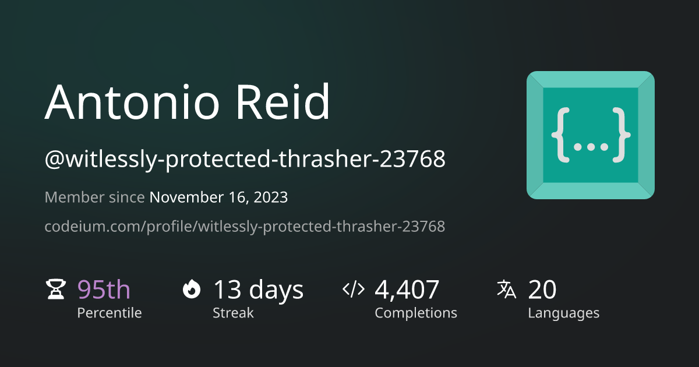

# devLog XPRT

<!-- PROJECT SHIELDS -->

[![Contributors][contributors-shield]][contributors-url]
[![Forks][forks-shield]][forks-url]
[![Stargazers][stars-shield]][stars-url]
[![Issues][issues-shield]][issues-url]/\*

- Filename: /Users/antonioreid/01_DOING/XPRT/README.md
- Path: /Users/antonioreid/01_DOING/XPRT
- Created Date: Saturday, April 5th 2025, 1:10:01 pm
- Author: Antonio J. Reid
-
- Copyright (c) 2025 10xAigency
  \*/

* Filename: /Users/antonioreid/01_DOING/XPRT/README.md
* Path: /Users/antonioreid/01_DOING/XPRT
* Created Date: Saturday, April 5th 2025, 1:10:01 pm
* Author: Antonio J. Reid
*
* Copyright (c) 2025 10xAigency
  \*/

[][commitizen-url]
[][wakatime-url]
[][stackshare-url]
[![autofix.ci](https://shields.io/badge/autofix.ci-yes-success?logo=data:image/svg+xml;base64,PHN2ZyBmaWxsPSIjZmZmIiB2aWV3Qm94PSIwIDAgMTI4IDEyOCIgeG1sbnM9Imh0dHA6Ly93d3cudzMub3JnLzIwMDAvc3ZnIj48cGF0aCB0cmFuc2Zvcm09InNjYWxlKDAuMDYxLC0wLjA2MSkgdHJhbnNsYXRlKC0yNTAsLTE3NTApIiBkPSJNMTMyNSAtMzQwcS0xMTUgMCAtMTY0LjUgMzIuNXQtNDkuNSAxMTQuNXEwIDMyIDUgNzAuNXQxMC41IDcyLjV0NS41IDU0djIyMHEtMzQgLTkgLTY5LjUgLTE0dC03MS41IC01cS0xMzYgMCAtMjUxLjUgNjJ0LTE5MSAxNjl0LTkyLjUgMjQxcS05MCAxMjAgLTkwIDI2NnEwIDEwOCA0OC41IDIwMC41dDEzMiAxNTUuNXQxODguNSA4MXExNSA5OSAxMDAuNSAxODAuNXQyMTcgMTMwLjV0MjgyLjUgNDlxMTM2IDAgMjU2LjUgLTQ2IHQyMDkgLTEyNy41dDEyOC41IC0xODkuNXExNDkgLTgyIDIyNyAtMjEzLjV0NzggLTI5OS41cTAgLTEzNiAtNTggLTI0NnQtMTY1LjUgLTE4NC41dC0yNTYuNSAtMTAzLjVsLTI0MyAtMzAwdi01MnEwIC0yNyAzLjUgLTU2LjV0Ni41IC01Ny41dDMgLTUycTAgLTg1IC00MS41IC0xMTguNXQtMTU3LjUgLTMzLjV6TTEzMjUgLTI2MHE3NyAwIDk4IDE0LjV0MjEgNTcuNXEwIDI5IC0zIDY4dC02LjUgNzN0LTMuNSA0OHY2NGwyMDcgMjQ5IHEtMzEgMCAtNjAgNS41dC01NCAxMi41bC0xMDQgLTEyM3EtMSAzNCAtMiA2My41dC0xIDU0LjVxMCA2OSA5IDEyM2wzMSAyMDBsLTExNSAtMjhsLTQ2IC0yNzFsLTIwNSAyMjZxLTE5IC0xNSAtNDMgLTI4LjV0LTU1IC0yNi41bDIxOSAtMjQydi0yNzZxMCAtMjAgLTUuNSAtNjB0LTEwLjUgLTc5dC01IC01OHEwIC00MCAzMCAtNTMuNXQxMDQgLTEzLjV6TTEyNjIgNjE2cS0xMTkgMCAtMjI5LjUgMzQuNXQtMTkzLjUgOTYuNWw0OCA2NCBxNzMgLTU1IDE3MC41IC04NXQyMDQuNSAtMzBxMTM3IDAgMjQ5IDQ1LjV0MTc5IDEyMXQ2NyAxNjUuNWg4MHEwIC0xMTQgLTc3LjUgLTIwNy41dC0yMDggLTE0OXQtMjg5LjUgLTU1LjV6TTgwMyA1OTVxODAgMCAxNDkgMjkuNXQxMDggNzIuNWwyMjEgLTY3bDMwOSA4NnE0NyAtMzIgMTA0LjUgLTUwdDExNy41IC0xOHE5MSAwIDE2NSAzOHQxMTguNSAxMDMuNXQ0NC41IDE0Ni41cTAgNzYgLTM0LjUgMTQ5dC05NS41IDEzNHQtMTQzIDk5IHEtMzcgMTA3IC0xMTUuNSAxODMuNXQtMTg2IDExNy41dC0yMzAuNSA0MXEtMTAzIDAgLTE5Ny41IC0yNnQtMTY5IC03Mi41dC0xMTcuNSAtMTA4dC00MyAtMTMxLjVxMCAtMzQgMTQuNSAtNjIuNXQ0MC41IC01MC41bC01NSAtNTlxLTM0IDI5IC01NCA2NS41dC0yNSA4MS41cS04MSAtMTggLTE0NSAtNzB0LTEwMSAtMTI1LjV0LTM3IC0xNTguNXEwIC0xMDIgNDguNSAtMTgwLjV0MTI5LjUgLTEyM3QxNzkgLTQ0LjV6Ii8+PC9zdmc+)]][autofix-url]

<!-- PROJECT LOGO -->
 

  

  <h3 align="center">devLog XPRT</h3>

  

    Your Intelligent Knowledge Operating System
     
     
    <a href="#about-the-project"><strong>Explore the docs »</strong></a>
    ·
    <a href="#">View Demo</a> <!-- [TODO: Add Demo Link] -->
    ·
    <a href="https://github.com/AReid987/devLog-XPRT/issues/new?labels=bug&amp;template=bug-report---.md">Report Bug</a>
    ·
    <a href="https://github.com/AReid987/devLog-XPRT/issues/new?labels=enhancement&amp;template=feature-request---.md">Request Feature</a>
  

 

<!-- Repobeats Analytics -->

<!-- Codeium Profile -->

---

<!-- TABLE OF CONTENTS -->

  
Table of Contents

  <ol>
    <li>
      <a href="#about-the-project">About The Project</a>
      <ul>
        <li><a href="#features">Features</a></li>
        <li><a href="#built-with">Built With</a></li>
        <li><a href="#architecture">Architecture</a></li>
        <li><a href="#project-structure">Project Structure</a></li>
      </ul>
    </li>
    <li>
      <a href="#getting-started">Getting Started</a>
      <ul>
        <li><a href="#prerequisites">Prerequisites</a></li>
        <li><a href="#installation">Installation</a></li>
      </ul>
    </li>
    <li><a href="#usage">Usage</a></li>
    <li><a href="#roadmap">Roadmap</a></li>
    <li><a href="#contributing">Contributing</a></li>
    <li><a href="#license">License</a></li>
    <li><a href="#contact">Contact</a></li>
    <li><a href="#acknowledgments">Acknowledgments</a></li>
  </ol>

---

## About The Project

**devLog XPRT** is envisioned as a **Knowledge Operating System (Knowledge OS)**, designed to streamline the process of acquiring, organizing, and utilizing information for developers and knowledge workers.

**What is a "Knowledge OS"?**

Think of it as an intelligent system combining:

- **Intelligence:** Transforming unstructured data (from websites, documents, etc.) into an organized, interconnected knowledge graph.
- **Operations:** Providing tools for automation (like data ingestion), collaboration, and project management, all centered around this knowledge base.

**Goals:**

- Develop a robust system for managing knowledge effectively.
- Provide an efficient way to ingest information from various sources.
- Create a dynamic knowledge graph that evolves as new information is added.
- Enable users to spend more time deepening comprehension rather than repeatedly searching for details.

**What is "devLog"?**
devLog represents the core system for frictionless knowledge management.

**What is "XPRT"?**
XPRT is the intelligent agent component of the system:

- Tightly integrated with the knowledge base.
- Features an intelligent web crawler for data ingestion.
- Utilizes Retrieval-Augmented Generation (RAG) for informed responses.
- Learns quickly and retains details effectively.
- Access knowledge via Natural Language, Search, UI, or Visualization.

<!-- [TODO: Add a screenshot of the project] -->
<!--  -->

### Features

- Centralized knowledge store across projects.
- Natural language interface for querying knowledge.
- Autonomous Extract, Transform, Load (ETL) processes.
- Agentic Retrieval-Augmented Generation (RAG).
- Knowledge graph visualization and retrieval exploration.
- Project management tools (e.g., Kanban boards).
- Collaboration tools (Real-time and Async).
- Intuitive capture mechanisms (Wikilinks, Tags).
- Self-organizing knowledge structure.

**Upcoming Collaboration &amp; Project Management Features:**

- Integration with TLDraw for whiteboarding.
- A Notion-like rich text editor.
- Asset creation and storage capabilities.
- Real-time voice &amp; video meetings.
- Asynchronous co-working features.

(<a href="#readme-top">back to top</a>)

### Built With

This project leverages a modern tech stack:

**Package Management:**

- [PNPM](https://pnpm.io/)
- [PDM](https://pdm-project.org/en/latest/)
- [uv (by Astral)](https://docs.astral.sh/uv/)

**Frontend &amp; UI:**

- [Next.js](https://nextjs.org/)
- [React](https://react.dev/)
- [Tailwind CSS](https://tailwindcss.com/)
- [Radix UI](https://www.radix-ui.com/)
- [Framer Motion](https://motion.dev/)

**Backend &amp; API:**

- [Python](https://www.python.org/)
- [FastAPI](https://fastapi.tiangolo.com/)

**Data &amp; Storage:**

- [PostgreSQL](https://www.postgresql.org/)
- [Redis](https://redis.io/)
- [Supabase](https://supabase.com/) (Auth, Realtime, DB)
- [Neon](https://neon.tech/) (Serverless Postgres)
- [Turso](https://turso.tech/) (Edge SQLite)
- [Cloudflare](https://www.cloudflare.com/) (D1, KV, Caching)
- [Neo4j](https://neo4j.com/) (Graph Database)
- [KuzuDB](https://kuzudb.com/) (Embeddable Graph DB)

**AI &amp; Agents:**

- [Mem0](https://docs.mem0.ai/overview) (Self-improving Memory Layer)
- [LightRAG](https://github.com/HKUDS/LightRAG) (RAG Framework)
- [Crawl4AI](https://github.com/unclecode/crawl4ai) (Web Crawler)

**Creative &amp; Design:**

- [Blender](https://www.blender.org/)

**Deployment &amp; Infrastructure:**

- [Vercel](https://vercel.com/docs)

(<a href="#readme-top">back to top</a>)

### Architecture

**Continuous Deployment Strategy:**

&#x60;&#x60;&#x60;
[Vercel] Next.js App (Frontend + API Routes)
│
├── [Neon/Turso/Supabase/Cloudflare D1] Primary Database (SQL Options)
├── [Supabase] Auth + Realtime Features
├── [Cloudflare] Caching/Edge KV
└── [Render/Railway/etc.] Supporting Services (e.g., n8n, Background Workers)
&#x60;&#x60;&#x60;

**Database Options Overview:**

| Provider   | Type                  | Free Tier Highlights        | Vercel Integration       |
| :--------- | :-------------------- | :-------------------------- | :----------------------- |
| Turso      | Edge SQLite           | 1 Cluster / 5 GB Storage    | ++ Vercel Edge Functions |
| Neon       | Serverless PostgreSQL | 3 Projects / 500 MB Storage | Native (Vercel Postgres) |
| Supabase   | PostgreSQL + BaaS     | 3 Projects / 500 MB DB      | Native (Vercel Postgres) |
| Cloudflare | D1 (SQLite) + KV      | 1M Reads/Day / 1 GB KV      | Requires Workers         |
| AWS        | RDS (Managed SQL)     | 750 Hrs/Mo (1 yr Free Tier) | Manual Setup             |

_(Note: Free tier limits are subject to change. Please refer to provider documentation for current details.)_

(<a href="#readme-top">back to top</a>)

### Continuous Integration &amp; Code Quality

We use a suite of tools to maintain code quality and consistency:

- **[cz-git (Commitizen)](https://cz-git.qbb.sh/cli/):** Interactive CLI for standardized commit messages.
- **[Commitlint](https://commitlint.js.org/):** Enforces commit message conventions.
- **[Lint-Staged](https://github.com/lint-staged/lint-staged):** Runs linters/formatters on staged files.
- **[Lefthook](https://lefthook.dev/):** Fast Git hooks manager.
- **[Prettier](https://prettier.io/):** Opinionated code formatter.
- **[Biome.js](https://biomejs.dev/):** Integrated linter, formatter, and more for web projects.
- **[ESLint](https://eslint.org/):** Pluggable JavaScript/TypeScript linter.
- **[TypeScript](https://www.typescriptlang.org/):** Static typing for JavaScript.
- **[GPTLint](https://gptlint.dev/):** Uses LLMs to enforce best practices (Experimental).

(<a href="#readme-top">back to top</a>)

### Project Structure

The repository uses a monorepo structure managed by pnpm workspaces and TurboRepo:

- 📁 &#x60;apps/&#x60;: Contains standalone applications (e.g., &#x60;xprt-webui&#x60;, &#x60;xprt-crawler&#x60;).
- 📦 &#x60;packages/&#x60;: Contains reusable code packages shared across applications (e.g., UI components, configurations).

**Key Apps:**

- ✅ **&#x60;xprt-coder&#x60;**: UI for the Software Engineer Agent.
- ✅ **&#x60;xprt-crawler&#x60;**: Web crawler for data ingestion (uses Crawl4AI).
- ✅ **&#x60;xprt-docs&#x60;**: Project documentation site.
- ✅ **&#x60;xprt-flow&#x60;**: Node-based UI for diagrams/graphs (uses xyFlow).
- ✅ **&#x60;xprt-mcp-blender&#x60;**: Blender integration via MCP Server.
- ✅ **&#x60;xprt-voice&#x60;**: Experimental Speech-to-Speech Agent.
- ✅ **&#x60;xprt-webui&#x60;**: Main Next.js frontend application.

**Key Packages:**

- ✅ **&#x60;xprt-draw&#x60;**: Real-time/async drawing components (likely using TLDraw).
- ✅ **&#x60;xprt-notes&#x60;**: Notion-like editor components.
- &#x60;eslint-config&#x60;, &#x60;typescript-config&#x60;: Shared configurations.
- &#x60;ui&#x60;: Shared React UI components.
- &#x60;context-store&#x60;: State management or context logic.
- &#x60;neo4j-kg&#x60;: Neo4j integration utilities.
- &#x60;proxy-lite&#x60;: Lightweight proxy or API gateway.
- &#x60;xprt-serve&#x60;: Backend serving components (likely FastAPI related).
- ... and others for specific functionalities.

(<a href="#readme-top">back to top</a>)

---

## Getting Started

### Prerequisites

Ensure you have the following installed:

- **Node.js:** (LTS version recommended) - [Download Node.js](https://nodejs.org/)
- **pnpm:**
  &#x60;&#x60;&#x60;bash
  npm install -g pnpm
  &#x60;&#x60;&#x60;
- **Docker:** (Required for certain services or local database setups) - [Install Docker](https://docs.docker.com/get-docker/)
- **Git:** [Install Git](https://git-scm.com/book/en/v2/Getting-Started-Installing-Git)

### Installation

1.  **Clone the repository:**
    &#x60;&#x60;&#x60;bash
    git clone https://github.com/AReid987/devLog-XPRT.git
    cd devLog-XPRT
    &#x60;&#x60;&#x60;
2.  **Install dependencies:**
    &#x60;&#x60;&#x60;bash
    pnpm install
    &#x60;&#x60;&#x60;
3.  **Set up environment variables:**
    - Copy the example environment file:
      &#x60;&#x60;&#x60;bash
      cp .env.example .env
      &#x60;&#x60;&#x60;
    - Edit the &#x60;.env&#x60; file and add your API keys for necessary services (e.g., LLM providers like OpenAI, Gemini, Groq; Database providers like Supabase, Neon).
4.  **(Optional) Set up local databases/services:**
    - If you plan to run databases (like PostgreSQL, Redis, Neo4j) locally, use Docker Compose or install them manually. Refer to specific app/package READMEs for details.
    - [Instructions TBD - Link to detailed setup guide if available]
5.  **(Optional) Change Git remote:** If you forked the repository and want to push changes to your fork:
    &#x60;&#x60;&#x60;bash
    git remote set-url origin git@github.com:<YOUR_GITHUB_USERNAME>/devLog-XPRT.git
    git remote -v # Confirm the change
    &#x60;&#x60;&#x60;

### Running the Development Environment

- **To run all apps and packages (using Turborepo):**
  &#x60;&#x60;&#x60;bash
  pnpm dev
  &#x60;&#x60;&#x60;
- **To run a specific app (e.g., the web UI):**
  &#x60;&#x60;&#x60;bash
  pnpm dev --filter=xprt-webui...
  &#x60;&#x60;&#x60;

Refer to individual &#x60;apps/_/README.md&#x60; or &#x60;packages/_/README.md&#x60; files for more specific build/run instructions.

(<a href="#readme-top">back to top</a>)

---

## Usage

- **Accessing the Deployed Application:** [Link TBD - Add link to live deployment]
- **Using the Web Interface (&#x60;xprt-webui&#x60;):** [Details TBD - Describe key UI features and workflows]
- **Interacting with Agents (&#x60;xprt-coder&#x60;, &#x60;xprt-voice&#x60;):** [Details TBD - Explain how to use the agents]
- **Data Ingestion (&#x60;xprt-crawler&#x60;):** [Details TBD - How to configure and run the crawler]

See the &#x60;/project_documentation&#x60; folder for more in-depth guides and examples.

(<a href="#readme-top">back to top</a>)

---

## Roadmap

- [ ] Implement core knowledge graph visualization in &#x60;xprt-flow&#x60;.
- [ ] Integrate &#x60;xprt-notes&#x60; (Notion-like editor) into &#x60;xprt-webui&#x60;.
- [ ] Finalize authentication flow using Supabase.
- [ ] Develop robust data ingestion pipelines using &#x60;xprt-crawler&#x60; and &#x60;LightRAG&#x60;.
- [ ] Add real-time collaboration features using &#x60;xprt-draw&#x60; and Supabase Realtime.
- [ ] Refine agent capabilities (&#x60;xprt-coder&#x60;, &#x60;xprt-voice&#x60;).
- [ ] Implement project management Kanban boards.
- [ ] Add comprehensive end-to-end testing.

See the [open issues](https://github.com/AReid987/devLog-XPRT/issues) for a full list of proposed features and known issues.

(<a href="#readme-top">back to top</a>)

---

## Contributing

Contributions make the open-source community an amazing place to learn, inspire, and create. Any contributions you make are **greatly appreciated**.

If you have a suggestion that would make this better, please fork the repo and create a pull request. You can also simply open an issue with the tag "enhancement".

1.  Fork the Project
2.  Create your Feature Branch (&#x60;git checkout -b feature/AmazingFeature&#x60;)
3.  Commit your Changes (&#x60;git commit -m &#x27;feat: Add some AmazingFeature&#x27;&#x60;) - _Please follow [Conventional Commits](https://www.conventionalcommits.org/en/v1.0.0/)_
4.  Push to the Branch (&#x60;git push origin feature/AmazingFeature&#x60;)
5.  Open a Pull Request

Please ensure your code adheres to the project&#x27;s linting and formatting standards (enforced by Lefthook and CI).

### Top Contributors

(<a href="#readme-top">back to top</a>)

---

## License

Distributed under the **[License Name TBD]**. See &#x60;LICENSE&#x60; file for more information.

<!-- [TODO: Create a LICENSE file (e.g., MIT, Apache 2.0) and update the link/shield] -->
<!-- Example: Distributed under the MIT License. See &#x60;LICENSE&#x60; for more information. -->

(<a href="#readme-top">back to top</a>)

---

## Contact

**A. Reid**

- Twitter: [@AReid987](https://x.com/AReid987)
- LinkedIn: [Antonio Reid](https://linkedin.com/in/antonio-reid987)
- Email: antonio.reid@aigency.site

**Project Link:** [https://github.com/AReid987/devLog-XPRT](https://github.com/AReid987/devLog-XPRT)

(<a href="#readme-top">back to top</a>)

---

## Acknowledgments

Special thanks to the creators and maintainers of these valuable resources:

- [PARA Method](https://fortelabs.com/blog/para/) (Inspiration for organization)
- [xyFlow](https://xyflow.com/) (React Flow / Diagramming)
- [Vercel](https://vercel.com/) (Deployment Platform)
- [TLDraw](https://tldraw.dev/) (Whiteboarding Library)
- [Crawl4AI](https://github.com/unclecode/crawl4ai) (Web Data Extraction)
- [Repobeats (by Axiom)](https://repobeats.axiom.co/) (Repository Analytics)
- [Figma](https://figma.com/) (Design Tooling)
- [Best-README-Template](https://github.com/othneildrew/Best-README-Template) (Inspiration for structure)
- [Shields.io](https://shields.io/) (Badges)
- [Contrib.rocks](https://contrib.rocks/) (Contributor Showcase)

(<a href="#readme-top">back to top</a>)

---

<!-- MARKDOWN LINKS &amp; IMAGES -->

[contributors-shield]: https://img.shields.io/github/contributors/AReid987/devLog-XPRT.svg?style=for-the-badge
[contributors-url]: https://github.com/AReid987/devLog-XPRT/graphs/contributors
[forks-shield]: https://img.shields.io/github/forks/AReid987/devLog-XPRT.svg?style=for-the-badge
[forks-url]: https://github.com/AReid987/devLog-XPRT/network/members
[stars-shield]: https://img.shields.io/github/stars/AReid987/devLog-XPRT.svg?style=for-the-badge
[stars-url]: https://github.com/AReid987/devLog-XPRT/stargazers
[issues-shield]: https://img.shields.io/github/issues/AReid987/devLog-XPRT.svg?style=for-the-badge
[issues-url]: https://github.com/AReid987/devLog-XPRT/issues
[license-shield]: https://img.shields.io/github/license/AReid987/devLog-XPRT.svg?style=for-the-badge

[license-url]: #license <!-- [TODO: Update when LICENSE file exists] -->
[linkedin-shield]: https://img.shields.io/badge/-LinkedIn-black.svg?style=for-the-badge&amp;logo=linkedin&amp;colorB=555
[linkedin-url]: https://linkedin.com/in/antonio-reid987
[twitter-shield]: https://img.shields.io/badge/-Twitter-black.svg?style=for-the-badge&amp;logo=x&amp;colorB=555
[twitter-url]: https://x.com/AReid987
[commitizen-url]: https://github.com/commitizen/cz-cli
[wakatime-url]: https://wakatime.com/badge/user/018dd211-b1fc-4a37-9172-f06c7f1fa85d/project/51b28874-b119-4bdc-9def-36331e80e54f
[stackshare-url]: https://stackshare.io/areid987/devlog-xprt
[autofix-url]: https://autofix.ci
/\*

- Filename: /Users/antonioreid/01_DOING/XPRT/README.md
- Path: /Users/antonioreid/01_DOING/XPRT
- Created Date: Saturday, April 5th 2025, 1:10:01 pm
- Author: Antonio J. Reid
-
- Copyright (c) 2025 10xAigency
  \*/
