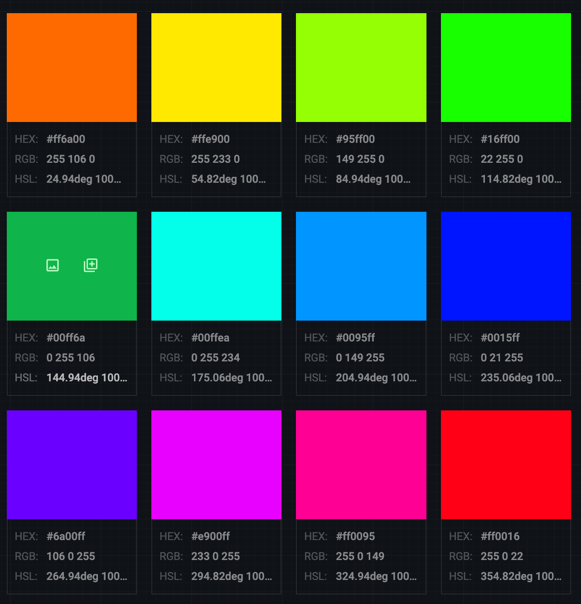

---
runme:
  id: 01JNE9GNERV8JHYP974ZAXHPC9
  version: v3
---

# Design Tokens

## BlackNor Design System

### Resources

[[design-resources]]

### Color Tokens

#### Aigency Color Tokens

<!-- *TODO: Neutral & Semantic Color Tokens -->

#### Alternate Options

**Optoin A:**

| HEX     | Brand   | Palette Brand  |
|---------|---------|----------------|
| #615fff | Aigency | Brand.primary  |
| #2cf788 | Aigency | Brand.tertiary |
| #10090e | Aigency | Brand.neutral  |

**Option B:**

        | Brand   | Palette Brand | HEX

--------|---------|---------------|------------------
#141313 |         | Aigency       | Brand.neutral.900
| #615eff | Aigency       | Brand.primary
| #0050f0 | Aigency       | Brand.secondary
| #e7e9ef | Aigency       | Brand.neutral.100

| Brand       | Palette Brand         | HEX                 |
|-------------|-----------------------|---------------------|
| #6461ff     | Aigency               | Brand.primary       |
| #b361ff     | Aigency               | Brand.secondary     |
| #ff61fc     | Aigency               | Brand.tertiary      |
| #ff61ad     | Aigency               | Brand.quaternary    |
| #ff6461     | Aigency               | Brand.quinary       |
| #ffb361     | Aigency               | Brand.septenary     |
| #fcff61     | Aigency               | Brand.octonary      |
| #61ff64     | Aigency               | Brand.novenary      |
| #61ffb3     | Aigency               | Brand.decenary      |
| #61fcff     | Aigency               | Brand.undecenary    |
| #61adff     | Aigency               | Brand.duodecenary   |
| ----------- | --------------------- | ------------------- |

| Brand       | Palette Complementary         | HEX                       |
|-------------|-------------------------------|---------------------------|
| #6461ff     | Aigency                       | Complementary.primary     |
| #fcff61     | Aigency                       | Complementary.secondary   |
| ----------- | ----------------------------- | ------------------------- |
| #61ff64     | Aigency                       | Complementary.tertiary    |

| Brand       | Palette               | HEX       |
|-------------|-----------------------|-----------|
| Aigency     | Analogous.primary     | #6461ff   |
| Aigency     | Analogous.secondary   | #b361ff   |
| Aigency     | Analogous.teriary     | #ff61fc   |
| ----------- | --------------------- | --------- |

| Brand     | Palette Split Complementary       | HEX       |
|-----------|-----------------------------------|-----------|
| Aigency   | SplitComplementary.primary        | #6461ff   |
| Aigency   | SplitComplementary.secondary      | #ffb361   |
| Aigency   | SplitComplementary.tertiary       | #adff61   |
| --------- | --------------------------------- | --------- |

| Brand     | Palette Triad     | HEX       |
|-----------|-------------------|-----------|
| Aigency   | Triad.primary     | #6461ff   |
| Aigency   | Triad.secondary   | #ff6461   |
| Aigency   | Triad.tertiary    | #61ff64   |
| --------- | ----------------- | --------- |

| Brand   | Palette Square | HEX     |
|---------|----------------|---------|
| Aigency | Square.primary | #6461ff |
| Aigency | Square.primary | #ff61ad |
| Aigency | Square.primary | #fcff61 |
| Aigency | Square.primary | #61ffb3 |
| ------- | -------------- | ------- |

| Brand     | Palette Rectangle   | HEX       |
|-----------|---------------------|-----------|
| Aigency   | Rectangle.primary   | #6461ff   |
| Aigency   | Rectangle.primary   | #ff61fc   |
| Aigency   | Rectangle.primary   | #fcff61   |
| Aigency   | Rectangle.primary   | #61ff64   |
| --------- | ------------------- | --------- |

---

#### Minicuration Color Tokens

| Hex     | Brand        | Palette Brand       |
|---------|--------------|---------------------|
| #ff6a00 | Minicuration | Brand.primary       |
| #ffe900 | Minicuration | Brand.secondary     |
| #95ff00 | Minicuration | Brand.tertiary      |
| #16ff00 | Minicuration | Brand.quaternary    |
| #00ff6a | Minicuration | Brand.quinary       |
| #00ffea | Minicuration | Brand.senary        |
| #0095ff | Minicuration | Brand.octonary      |
| #0015ff | Minicuration | Brand.novenary      |
| #6a00ff | Minicuration | Brand.decenary      |
| #e900ff | Minicuration | Brand.undecenary    |
| #ff0095 | Minicuration | Brand.duodecenary   |
| #ff0016 | Minicuration | Brand.unduodecenary |

---

#### Sportsclub Color Tokens

---

#### Lynx Color Tokens

---

#black-noir #design-systems #design-tokens

[[design-resources]]