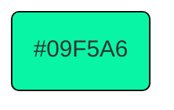

### Labstr Color Palettes

#### Primary 



![[01 - ColorPalettes 2024-12-11 14.56.29.excalidraw]]
#### Coolors

##### Labster Coolers 1


[[Labstr - Coolers Palette -1.png]]

![[Labstr - Coolers Palette -1.png]]

##### Labstr Coolers 2


![[Labstr - Coolers Palette - 2.png]]
##### Labstr Coolers 3


![[Labstr - Coolers Palette 3.png]]
#### Adobe - Triadic Phi 

##### Triadic Phi 

![[Labstr - Tetradic-Phi - Palette.jpeg]]

##### Triadic Phi Desaturated


![[Labstr - Triadic Phi-DeSatr - Palette.jpeg]]


##### Triadic Phi Saturated

![[Labstr - Triadic-Phi-Satr - Pallette  - 1.jpeg]]

#### Mint

![[Labstr - Mint Colors - 1.jpeg]]

#### Mint Porsche

![[Labstr - Porsche Mint 1.jpeg]]
#### Obsidian Paletes
##### Complimentary

```palette
#09f5a6
#f50958
{"gradient":true,"aliases":["Base","Complimentary Color"]}
```

##### Monochromatic

```palette
#6afaca
#39f8b8
#09f5a6
#07c485
#059363
{"gradient":true,"aliases":["Lightest","Lighter","Base","Darker","Darkest"]}
```

##### Analogous

```palette
#09f544
#09f5a6
#09e2f5
{"gradient":true,"aliases":["Analogous East","Base","Analogous West"]}
```

##### Tetradic

```palette
#09f5a6
#3009f5
#f50958
#cef509
{"gradient":true,"aliases":["Base","Tetradic Second","Tetradic Third","Tetradic Fourth"]}
```

##### Triadic

```palette
#09f5a6
#a609f5
#f5a609
{"gradient":true,"aliases":["Triadic First","Base","Triadic Third"]}
```

[[02 - What is Color?]]

---

## Palette Patterns
### Golden Ratio

### Triadic Harmony

### Complementary

### Tetradic

### Analogous

### Tetradic

### Split Complementary

---

[[02 - What is Color?]]