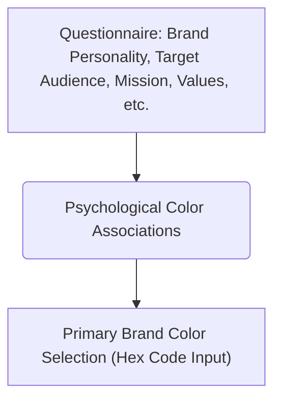

```mermaid
graph TD 
	A[Questionnaire: Brand Personality, Target Audience, Mission, Values, etc.] --> B(Psychological Color Associations); 
	B --> C["Primary Brand Color Selection (Hex Code Input)"];
```