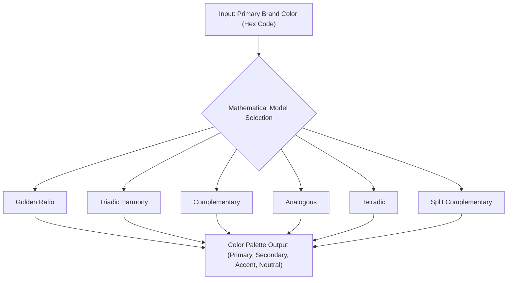

```mermaid
graph TD 
	A["Input: Primary Brand Color (Hex Code)"] --> B{Mathematical Model Selection}; 
	B --> GR[Golden Ratio] --> C["Color Palette Output (Primary, Secondary, Accent, Neutral)"]; 
	B --> TH[Triadic Harmony] --> C; 
	B --> CP[Complementary] --> C; 
	B --> AG[Analogous] --> C; 
	B --> TT[Tetradic] --> C; 
	B --> SC[Split Complementary] --> C;
```
