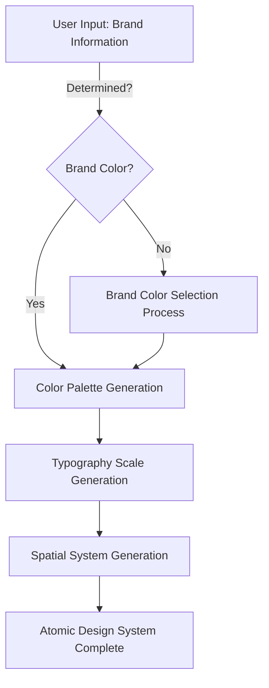

```mermaid
graph TD
    A[User Input: Brand Information] -- Determined? --> B{Brand Color?};
    B -- Yes --> C[Color Palette Generation];
    B -- No --> D[Brand Color Selection Process];
    D --> C;
    C --> E[Typography Scale Generation];
    E --> F[Spatial System Generation];
    F --> G[Atomic Design System Complete];
```

