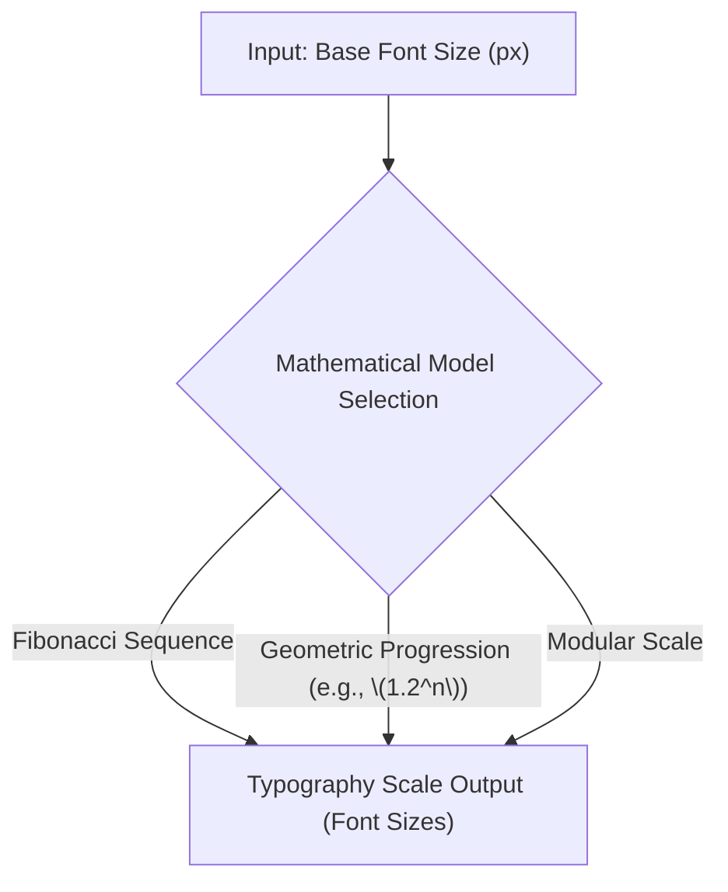

```mermaid
graph TD 
	A["Input: Base Font Size (px)"] --> B{Mathematical Model Selection}; 
	B -- Fibonacci Sequence --> C["Typography Scale Output (Font Sizes)"]; 
	B -- "Geometric Progression (e.g., \(1.2^n\))" --> C; 
	B -- Modular Scale --> C;
```