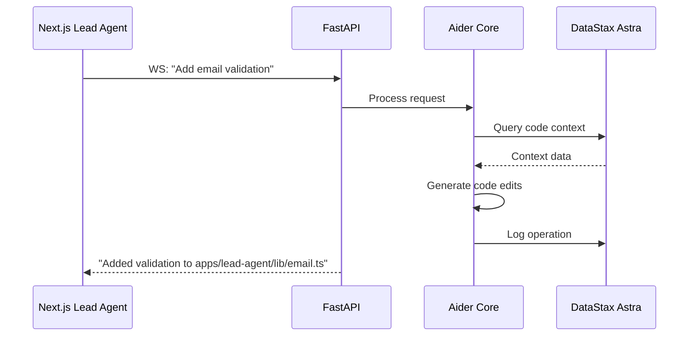

```mermaid
    sequenceDiagram
        participant UI as Next.js Lead Agent
        participant API as FastAPI
        participant Aider as Aider Core
        participant DB as DataStax Astra
        UI->>API: WS: "Add email validation"
        API->>Aider: Process request
        Aider->>DB: Query code context
        DB-->>Aider: Context data
        Aider->>Aider: Generate code edits
        Aider->>DB: Log operation
        API-->>UI: "Added validation to apps/lead-agent/lib/email.ts"
```