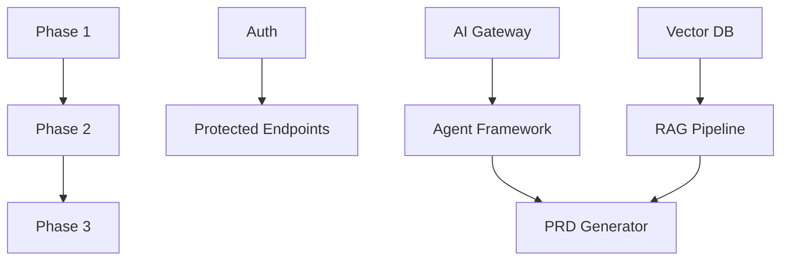

/\*

- Filename: /Users/antonioreid/01_DOING/XPRT/project_journal/planning/xprt_implementation_plan.md
- Path: /Users/antonioreid/01_DOING/XPRT
- Created Date: Monday, April 7th 2025, 9:52:10 pm
- Author: Antonio J. Reid
-
- Copyright (c) 2025 10xAigency
  \*//\*

* Filename: /Users/antonioreid/01_DOING/XPRT/project_journal/planning/xprt_implementation_plan.md
* Path: /Users/antonioreid/01_DOING/XPRT
* Created Date: Monday, April 7th 2025, 9:52:10 pm
* Author: Antonio J. Reid
*
* Copyright (c) 2025 10xAigency
  \*/

# XPRT Implementation Plan (Consolidated)

_Current Priority: Completing xprt-commit package before further AI Gateway refinements_

## Phase 1: Core Infrastructure (Weeks 1-2)

1. **Turborepo Setup** (EPIC 1.1)

   - Initialize packages: `xprt-webui`, `api-server`, `ai-gateway-mvp`, `xprt-firecrawl`
   - Configure shared tooling (linting, testing)

2. **Backend Foundation** (EPIC 1.2, 1.4)

   - FastAPI structure with WebSocket support
   - PostgreSQL setup with `Users`, `Projects` schemas
   - Vector DB (ChromaDB/Weaviate) configuration

3. **Authentication** (EPIC 2)

   - JWT implementation with RBAC
   - Signup/login endpoints and UI

4. **AI Gateway** (EPIC 3)
   - `/gateway/llm/v1` endpoint
   - Portkey SDK integration for model fallbacks (refactoring in progress to support additional LLM providers)

## Phase 2: Documentation Generation (Weeks 3-4)

1. **Agent Framework** (EPIC 4)

   - LangChain/LlamaIndex integration
   - Conversation state tracking

2. **RAG Pipeline** (EPIC 5)

   - Text ingestion and chunking
   - Vector embedding generation
   - Query endpoint implementation

3. **PRD Generator Backend** (EPIC 6)

   - Session management
   - Question-generation logic
   - RAG integration

4. **PRD Generator Frontend** (EPIC 7)
   - Chat UI in Next.js
   - xyFlow visualization
   - Document rendering

## Phase 3: Post-MVP (Weeks 5+)

1. **Advanced Features** (EPIC 8)
   - Branching chat interface
   - Kanban task tracking
   - 3D knowledge graph

## Dependencies Graph

## Key Metrics (from PRD)

- API Latency: ≤500ms
- AI Accuracy: ≥90% F1 Score
- Document Generation: 70% via AI
