/\*

- Filename: /Users/antonioreid/01_DOING/current-projects/XPRT/project_journal/visualizations/multi_agent_architecture.md
- Path: /Users/antonioreid/01_DOING/current-projects/XPRT
- Created Date: Tuesday, April 15th 2025, 2:13:50 pm
- Author: Antonio J. Reid
-
- Copyright (c) 2025 10xAigency
  \*/

# Multi-Agent Architecture Diagram

```mermaid
    graph LR
        subgraph UserInterfaceLayer
            User --> CoordinatorAgent("Coordinator Agent")
        end

        subgraph SpecializedAgents
            ResearchAgent("Research Agent")
            BrandStrategyAgent("Brand Strategy Agent")
            VisualDesignAgent("Visual Design Agent")
            DesignSystemAgent("Design System Agent")
            DocumentationAgent("Documentation Agent")
        end

        style SpecializedAgents fill:#000,stroke:#4d4d4d,stroke-width:1px;
        style UserInterfaceLayer fill:#000,stroke:#4d4d4d,stroke-width:1px;

        CoordinatorAgent --> ResearchAgent;
        CoordinatorAgent --> BrandStrategyAgent;
        CoordinatorAgent --> VisualDesignAgent;
        CoordinatorAgent --> DesignSystemAgent;
        CoordinatorAgent --> DocumentationAgent;

        ResearchAgent --> CoordinatorAgent;
        BrandStrategyAgent --> CoordinatorAgent;
        VisualDesignAgent --> CoordinatorAgent;
        DesignSystemAgent --> CoordinatorAgent;
        DocumentationAgent --> CoordinatorAgent;

        style User fill:#4338ca,stroke:#4d4d4d,stroke-width:4px,rounded:16px;
        style CoordinatorAgent fill:#1d4ed8,stroke:#000,stroke-width:2px;
        style ResearchAgent fill:#4d4d4d,stroke:#000,stroke-width:1px;
        style BrandStrategyAgent fill:#4d4d4d,stroke:#000,  stroke-width:1px;
        style VisualDesignAgent fill:#4d4d4d,stroke:#000,stroke-width:1px;
        style DesignSystemAgent fill:#4d4d4d,stroke:#000,stroke-width:1px;
        style DocumentationAgent fill:#4d4d4d,stroke:#000,stroke-width:1px;
```

