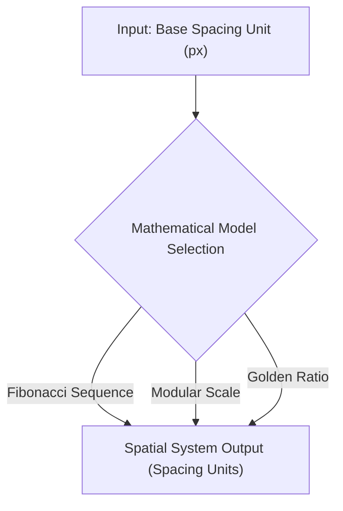

```mermaid
graph TD
	A["Input: Base Spacing Unit (px)"] --> B{Mathematical Model Selection};
	B -- Fibonacci Sequence --> C["Spatial System Output (Spacing Units)"]; 
	B -- Modular Scale --> C; 
	B -- Golden Ratio --> C;
```