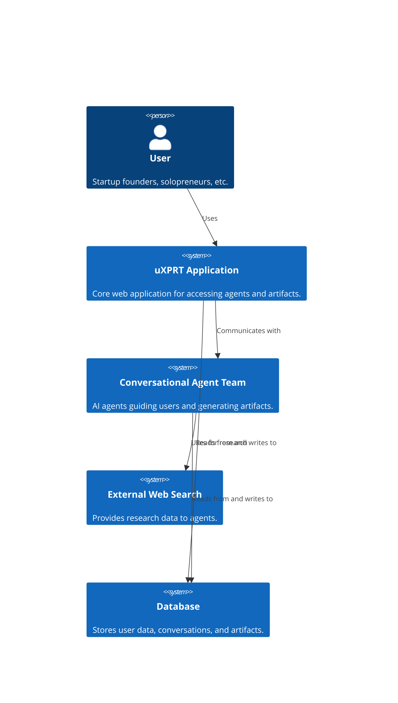

# System Context Diagram Concept: uXPRT

## Diagram Description

This diagram outlines the main components and external entities interacting with the uXPRT system. It shows the user interacting with the core uXPRT application, which in turn communicates with the conversational agent team, an external web search service, and a database for storing generated artifacts and user data.

## Entities

- **User:** The primary actor using the uXPRT application (Startup founders, solopreneurs, small business owners, content creators, marketers).
- **uXPRT Application:** The core web application interface.
- **Conversational Agent Team:** A set of AI agents providing guidance and generating artifacts.
- **External Web Search:** A service used by the agents for research.
- **Database:** Stores user data, conversation history, and generated artifacts.

## Relationships

- User interacts with the uXPRT Application.
- uXPRT Application communicates with the Conversational Agent Team.
- Conversational Agent Team uses the External Web Search for information.
- uXPRT Application and Conversational Agent Team read from and write to the Database.

