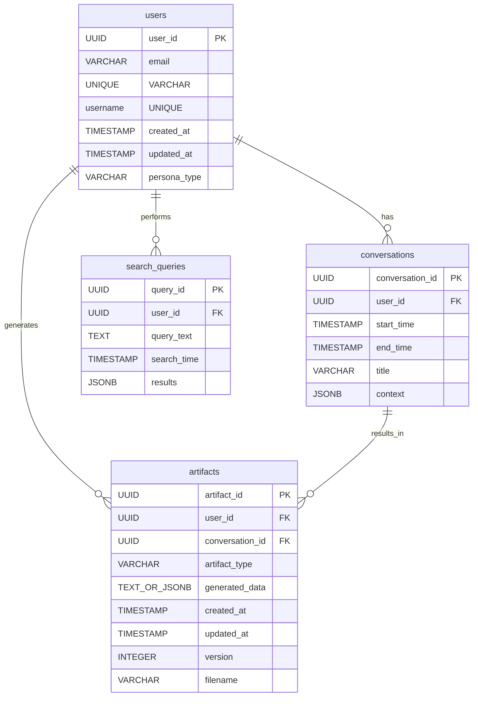

# Database Schema Design: uXPRT

## Goal

Design the initial database schema to support user input, artifact generation data, user account information, and search data for the uXPRT project, based on the requirements and user personas.

## Data Types and Entities

Based on the requirements and user personas, the primary data entities are:

1.  **Users:** Representing individual user accounts.
2.  **Conversations:** Storing interactions between users and the AI agent team.
3.  **Artifacts:** Storing the generated product development and content creation outputs.
4.  **Search Queries:** Logging user search requests and potentially results.

## Proposed Schema (Relational Model - Postgres/Supabase)

Considering the technical stack includes Supabase (Postgres), a relational model is suitable.

### Table: `users`

Stores user account information.

| Column         | Type                       | Constraints                                | Description                                                     |
| :------------- | :------------------------- | :----------------------------------------- | :-------------------------------------------------------------- |
| `user_id`      | `UUID`                     | `PRIMARY KEY`, `DEFAULT gen_random_uuid()` | Unique identifier for the user                                  |
| `email`        | `VARCHAR(255)`             | `UNIQUE`, `NOT NULL`                       | User's email address                                            |
| `username`     | `VARCHAR(255)`             | `UNIQUE`                                   | User-defined username                                           |
| `created_at`   | `TIMESTAMP WITH TIME ZONE` | `DEFAULT CURRENT_TIMESTAMP`                | Timestamp of user creation                                      |
| `updated_at`   | `TIMESTAMP WITH TIME ZONE` | `DEFAULT CURRENT_TIMESTAMP`                | Timestamp of last update                                        |
| `persona_type` | `VARCHAR(50)`              | `NULL`                                     | Optional: User's primary persona type (e.g., 'Startup Founder') |

### Table: `conversations`

Stores the history and context of user interactions with the AI agents.

| Column            | Type                       | Constraints                                                   | Description                             |
| :---------------- | :------------------------- | :------------------------------------------------------------ | :-------------------------------------- |
| `conversation_id` | `UUID`                     | `PRIMARY KEY`, `DEFAULT gen_random_uuid()`                    | Unique identifier for the conversation  |
| `user_id`         | `UUID`                     | `NOT NULL`, `FOREIGN KEY (user_id) REFERENCES users(user_id)` | The user who had the conversation       |
| `start_time`      | `TIMESTAMP WITH TIME ZONE` | `DEFAULT CURRENT_TIMESTAMP`                                   | Timestamp when the conversation started |
| `end_time`        | `TIMESTAMP WITH TIME ZONE` | `NULL`                                                        | Timestamp when the conversation ended   |
| `title`           | `VARCHAR(255)`             | `NULL`                                                        | Optional: AI-generated summary title    |
| `context`         | `JSONB`                    | `NOT NULL`                                                    | Stores conversation messages and state  |

### Table: `artifacts`

Stores the generated artifacts and associated metadata.

| Column            | Type                       | Constraints                                                                       | Description                                          |
| :---------------- | :------------------------- | :-------------------------------------------------------------------------------- | :--------------------------------------------------- |
| `artifact_id`     | `UUID`                     | `PRIMARY KEY`, `DEFAULT gen_random_uuid()`                                        | Unique identifier for the artifact                   |
| `user_id`         | `UUID`                     | `NOT NULL`, `FOREIGN KEY (user_id) REFERENCES users(user_id)`                     | The user who generated the artifact                  |
| `conversation_id` | `UUID`                     | `NULL`, `FOREIGN KEY (conversation_id) REFERENCES conversations(conversation_id)` | The conversation that led to the artifact (optional) |
| `artifact_type`   | `VARCHAR(50)`              | `NOT NULL`                                                                        | Type of artifact (e.g., 'PRD', 'ERD')                |
| `generated_data`  | `TEXT` or `JSONB`          | `NOT NULL`                                                                        | The content of the generated artifact                |
| `created_at`      | `TIMESTAMP WITH TIME ZONE` | `DEFAULT CURRENT_TIMESTAMP`                                                       | Timestamp of artifact creation                       |
| `updated_at`      | `TIMESTAMP WITH TIME ZONE` | `DEFAULT CURRENT_TIMESTAMP`                                                       | Timestamp of last update                             |
| `version`         | `INTEGER`                  | `DEFAULT 1`                                                                       | Version number of the artifact                       |
| `filename`        | `VARCHAR(255)`             | `NULL`                                                                            | Suggested filename for download                      |

_Note: `generated_data` type can be refined based on the specific needs for storing different artifact formats (e.g., TEXT for markdown, JSONB for structured data)._

### Table: `search_queries`

Logs user search activities.

| Column        | Type                       | Constraints                                                   | Description                       |
| :------------ | :------------------------- | :------------------------------------------------------------ | :-------------------------------- |
| `query_id`    | `UUID`                     | `PRIMARY KEY`, `DEFAULT gen_random_random_uuid()`             | Unique identifier for the query   |
| `user_id`     | `UUID`                     | `NOT NULL`, `FOREIGN KEY (user_id) REFERENCES users(user_id)` | The user who performed the search |
| `query_text`  | `TEXT`                     | `NOT NULL`                                                    | The search query string           |
| `search_time` | `TIMESTAMP WITH TIME ZONE` | `DEFAULT CURRENT_TIMESTAMP`                                   | Timestamp of the search           |
| `results`     | `JSONB`                    | `NULL`                                                        | Optional: Stored search results   |

## Relationships

- `users` 1-to-many `conversations`
- `users` 1-to-many `artifacts`
- `users` 1-to-many `search_queries`
- `conversations` 1-to-many `artifacts` (optional link)

## Indexes

- Indexes should be created on foreign key columns (`user_id` in `conversations`, `artifacts`, `search_queries`; `conversation_id` in `artifacts`).
- Consider indexing `artifact_type` in `artifacts` for querying by type.
- Consider indexing `search_time` in `search_queries` for time-based analysis.

## ER Diagram (Mermaid Syntax)

## Next Steps

- Create initial SQL DDL scripts based on this design.
- Refine schema based on specific data structures required for different artifact types.
- Implement ORM models if applicable to the chosen framework.
- Plan for database migrations.
