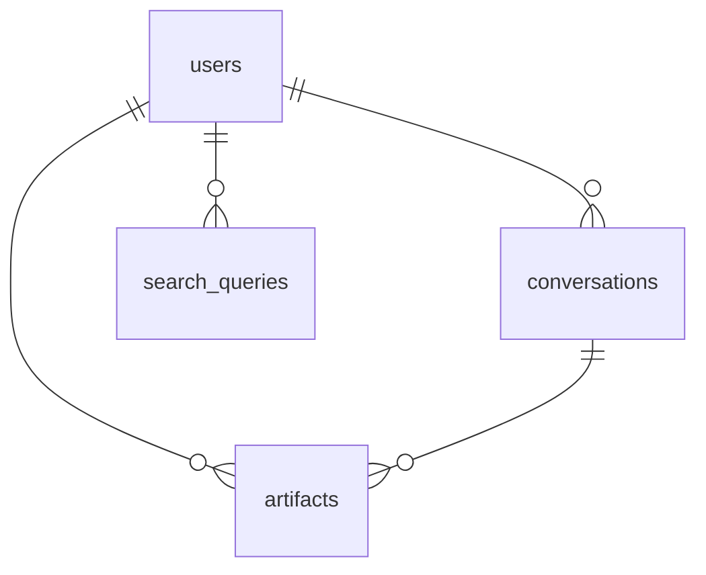

# Entity Relationship Diagram (ERD) Draft - uXPRT

## 1. Introduction

This document provides a draft of the Entity Relationship Diagram (ERD) for the uXPRT project, outlining the main entities and their relationships based on the database schema in `src/db/schema.sql`.

## 2. Entities and Relationships

- **users**
- **conversations**
- **artifacts**
- **search_queries**

Relationships:

- `users` 1 -- \* `conversations` (on `user_id`)
- `users` 1 -- \* `artifacts` (on `user_id`)
- `users` 1 -- \* `search_queries` (on `user_id`)
- `conversations` 1 -- \* `artifacts` (on `conversation_id`, optional)

## 3. Attributes

(Refer to DRD for detailed attributes of each entity)

## 4. Cardinality and Optionality

- A `users` record can be associated with zero or more `conversations` (0..\*).
- A `conversations` record must be associated with exactly one `users` record (1).
- A `users` record can be associated with zero or more `artifacts` (0..\*).
- An `artifacts` record must be associated with exactly one `users` record (1).
- A `users` record can be associated with zero or more `search_queries` (0..\*).
- A `search_queries` record must be associated with exactly one `users` record (1).
- A `conversations` record can be associated with zero or more `artifacts` (0..\*).
- An `artifacts` record can be associated with zero or one `conversations` record (0..1).

## 5. Diagram (Placeholder)

(Placeholder for a more detailed visual ERD, which can be generated using a diagramming tool based on the entities, relationships, and cardinalities defined above.)
