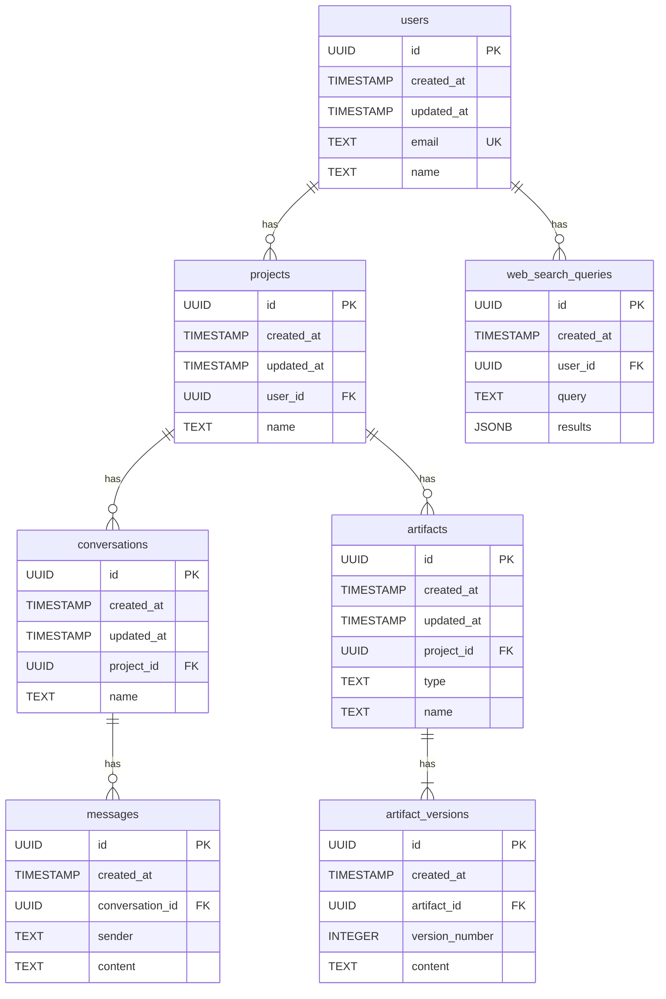

# Task Log: TASK-DB-20250503-235159 - Database Schema/Migration

**Goal:** Design and implement initial database schema for data handling based on the requirements in `project_journal/planning/requirements.md` and the ERD draft in `project_journal/planning/erd_draft.md`.

## Design Choices

- Implemented entities based on ERD draft: `users`, `projects`, `conversations`, `messages`, `artifacts`, `artifact_versions`, `web_search_queries`.
- Used UUIDs for primary keys with `gen_random_uuid()` default for uniqueness and scalability.
- Included `created_at` and `updated_at` timestamps for tracking record lifecycle.
- Defined foreign key constraints with `ON DELETE CASCADE` for appropriate relationships.
- Added indexes on foreign key columns and frequently queried columns (`users.email`, `artifacts.type`) to improve query performance.
- Stored `web_search_queries.results` as JSONB to accommodate flexible search result structures.
- Stored `artifact_versions.content` as TEXT for now, but noted that JSONB or another type might be more suitable depending on artifact type.

## Implementation Details

- Created `src/db/schema.sql` with DDL statements for the initial schema.

## Mermaid ER Diagram Syntax

---

**Status:** ✅ Complete
**Outcome:** Success
**Summary:** Designed and implemented the initial database schema based on requirements and ERD draft. Created `src/db/schema.sql` with DDL for `users`, `projects`, `conversations`, `messages`, `artifacts`, `artifact_versions`, and `web_search_queries` tables, including appropriate keys and indexes. Logged design choices and implementation details. Requested update of the database schema diagram.
**References:** [`project_journal/planning/requirements.md`, `project_journal/planning/erd_draft.md`, `src/db/schema.sql`, `project_journal/visualizations/database_schema.md` (update requested)]
