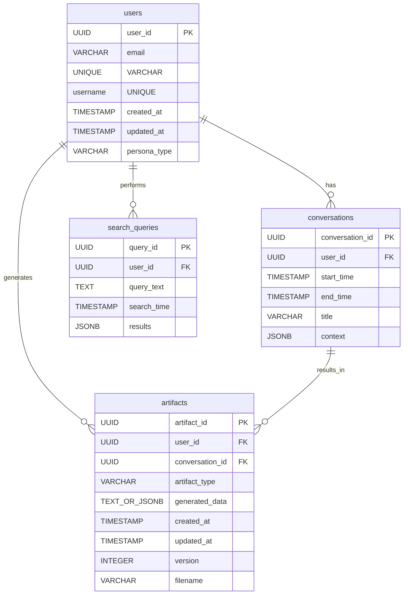

# Database Schema ER Diagram

```mermaid
erDiagram
    users {
        UUID user_id PK
        VARCHAR email UNIQUE
        VARCHAR username UNIQUE
        TIMESTAMP created_at
        TIMESTAMP updated_at
        VARCHAR persona_type
    }

    conversations {
        UUID conversation_id PK
        UUID user_id FK
        TIMESTAMP start_time
        TIMESTAMP end_time
        VARCHAR title
        JSONB context
    }

    artifacts {
        UUID artifact_id PK
        UUID user_id FK
        UUID conversation_id FK
        VARCHAR artifact_type
        TEXT_OR_JSONB generated_data
        TIMESTAMP created_at
        TIMESTAMP updated_at
        INTEGER version
        VARCHAR filename
    }

    search_queries {
        UUID query_id PK
        UUID user_id FK
        TEXT query_text
        TIMESTAMP search_time
        JSONB results
    }

    users ||--o{ conversations : "has"
    users ||--o{ artifacts : "generates"
    users ||--o{ search_queries : "performs"
    conversations ||--o{ artifacts : "results_in"
```
