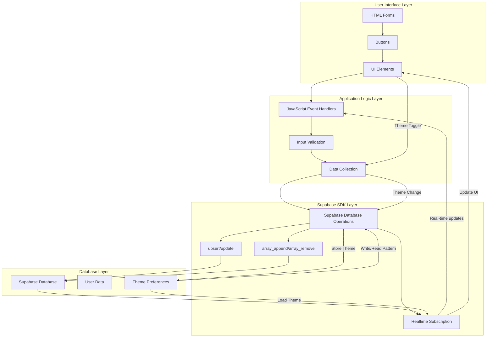

# PRD: WebApp Planning Workbook

## 1. Executive Summary

### Product Vision
To provide a structured, interactive digital workbook that unifies fragmented early-stage web application planning workflows into a single, guided, and AI-augmentable experience (future).

### MVP Focus
Core workbook SPA functionality enabling users to define and document Branding, Goals & Objectives, User Stories, Core Features, Wireframes, foundational Atomic Design System elements, and Key Data Points. Includes user authentication (via Clerk) and persistent data storage via Supabase.

### Long-Term Vision
Expand into a comprehensive planning OS with AI-assisted content generation for sections, integrated design system management, enhanced collaboration tools, export functionalities, and potential integration with other development lifecycle tools.

## 2. MVP Scope

### In Scope

#### Core Platform & Authentication

- Next.js application deployed on Vercel
- User Authentication:
  - Managed through Clerk
  - Support for environment-provided authentication tokens
- Data Persistence:
  - All user-entered workbook data saved to user-specific Supabase tables with Row Level Security

#### Workbook Sections (Data Entry & Display)

##### Branding

- Inputs for mission, target audience, brand personality/voice, moodboard links/notes
- Dynamic list for core values (add/delete)

##### Goals & Objectives

- Text area inputs for problem statement, refined target audience, MVP functionalities, desired outcomes

##### User Stories

- Form to add user stories (user type, action, benefit)
- Dynamic list display with delete option

##### Core Features

- Input to add feature name
- Dynamic list display with delete option

##### Wireframes/Mockups

- Form to add screen descriptions (name/purpose, key elements, user interactions)
- Dynamic list display with delete option

##### Atomic Design System (Foundational)

###### Atoms

- Input fields for Brand Color Palette (Primary, Secondary, Accent), Neutral Palette Notes, Semantic Color Palette (Success, Error, Warning, Info), Typography (Heading/Body font names)
- Text areas for notes on Iconography, Type Scale, Color Scales
- Links to external resources

###### Molecules, Organisms, Templates, Pages

- Text area inputs for descriptive notes

##### Data Points

- Form to add data points (name, type from dropdown, description)
- Dynamic list display with delete option

#### User Interface & Experience

- Clean, modern UI built with Tailwind CSS, Radix UI, and ShadCN
- Animations powered by Framer Motion and anime.js
- Intuitive sidebar navigation with active section highlighting
- Dark/Light mode toggle with preference saved to Supabase
- Toast notifications for user feedback (save, error)
- Loading indicators for asynchronous operations
- Responsive design (desktop-first focus for MVP)

### Out of Scope (for MVP)

- AI-assisted content generation or suggestions within sections
- Advanced diagramming tools (e.g., interactive flowchart builder beyond HTML/CSS representation)
- Direct code generation from planning inputs
- Real-time multi-user collaboration on the same workbook instance
- Built-in version control or history for workbook content
- Export to PDF/Markdown functionality
- User account management beyond basic auth state

## 3. User Personas & Journeys

### Personas

#### Priya (Aspiring Developer/Student)

- **Needs**:
  - A structured framework to learn and apply web app planning principles for personal or academic projects
  - Clear guidance and examples
- **Goals**:
  - Successfully plan and document a web app from idea to a pre-development blueprint
  - Understand best practices

#### Alex (Solo Founder/Entrepreneur)

- **Needs**:
  - A quick, efficient tool to translate business ideas into a tangible plan for validation, communication with potential freelancers, or initial technical scoping
- **Goals**:
  - Rapidly document core app concepts, features, and user flows
  - Maintain organization and clarity

#### Sam (PM/Designer in a Small Team)

- **Needs**:
  - A centralized, simple tool to define product scope, user requirements, and initial design system elements to ensure team alignment before detailed design or development sprints
- **Goals**:
  - Create a shareable source of truth for the early planning phase
  - Ensure consistency in understanding user needs and brand application

### MVP User Journey (Example: Priya planning a new app)

#### 1. Access & Setup:
   - Priya opens the WebApp Planning Workbook
   - Signs in using Clerk authentication
#### 2. Branding Definition:
   - Navigates to "Branding"
   - Enters mission, defines 3 core values, describes target audience, outlines brand personality, and adds a link to her Pinterest moodboard
   - Saves Branding section
#### 3. Goal Setting:
   - Moves to "Goals & Objectives"
   - Defines the problem her app solves, refines audience details, lists 3 MVP features, and sets 2 desired outcomes
   - Saves Goals
#### 4. User-Centric Planning:
   - Proceeds to "User Stories," adding 5 key stories
   - Then lists corresponding "Core Features"
#### 5. Visual & Structural Planning:
   - Describes 3 main "Wireframes"
   - Moves to "Atomic Design," defining primary/secondary colors, typography choices, and notes for type scale
#### 6. Data Definition:
   - Lists 4 key "Data Points" her app will manage
#### 7. Review & Iteration:
   - Switches to Light Mode
   - Navigates back through sections to review and refine her inputs
   - All data is persisted

## 4. Functional Requirements

### FR1: Core Platform & User Session

- #### FR1.1:
  - System MUST allow users to authenticate using Clerk
- #### FR1.2:
  - System MUST support authentication via tokens if provided by the environment
- #### FR1.3:
  - All user-generated content within the workbook MUST be persistently stored in Supabase, scoped to the authenticated user and application instance (appId)
- #### FR1.4:
  - User interface MUST provide clear sidebar navigation to all workbook sections
- #### FR1.5:
  - The currently active section in the sidebar and content area MUST be visually indicated
- #### FR1.6:
  - User MUST be able to toggle between a dark and light visual theme for the application
- #### FR1.7:
  - The selected theme preference MUST be saved per user and automatically applied on subsequent sessions

### FR2: Branding Section

- #### FR2.1:
  - User MUST be able to input and save a mission statement
- #### FR2.2:
  - User MUST be able to add multiple core values (text input) to a dynamic list. Each value MUST have a unique ID
- #### FR2.3:
  - User MUST be able to delete core values from the list
- #### FR2.4:
  - User MUST be able to input and save target audience description, brand personality/voice, and moodboard links/notes

### FR3: Goals & Objectives Section

- #### FR3.1:
  - User MUST be able to input and save: problem statement, target audience (refined), MVP functionalities, and desired outcomes

### FR4: User Stories Section

- #### FR4.1:
  - User MUST be able to input a new user story consisting of: user type, action, and benefit
- #### FR4.2:
  - Added user stories MUST be displayed in a dynamic list. Each story MUST have a unique ID
- #### FR4.3:
  - User MUST be able to delete user stories from the list

### FR5: Core Features Section

- #### FR5.1:
  - User MUST be able to input a new core feature name
- #### FR5.2:
  - Added features MUST be displayed in a dynamic list. Each feature MUST have a unique ID
- #### FR5.3:
  - User MUST be able to delete features from the list

### FR6: Wireframes/Mockups Section

- #### FR6.1:
  - User MUST be able to input a new screen description consisting of: screen name/purpose, key elements, and user interactions/flow
- #### FR6.2:
  - Added screen descriptions MUST be displayed in a dynamic list. Each entry MUST have a unique ID
- #### FR6.3:
  - User MUST be able to delete screen descriptions from the list

### FR7: Atomic Design System Section

- #### FR7.1 (Atoms - Colors):
  - User MUST be able to input and save hex codes for Primary, Secondary, Accent, Success, Error, Warning, and Info colors
- #### FR7.2 (Atoms - Text Areas):
  - User MUST be able to input and save notes for Neutral Color Palette, Typography (Heading/Body font names), Iconography, Type Scale, and Color Scales
- #### FR7.3 (Molecules, Organisms, Templates, Pages):
  - User MUST be able to input and save descriptive notes for each of these categories

### FR8: Data Points Section

- #### FR8.1:
  - User MUST be able to input a new data point consisting of: name, type (selected from a predefined list), and description

- #### FR8.2:
  - Added data points MUST be displayed in a dynamic list. Each data point MUST have a unique ID
- #### FR8.3:
  - User MUST be able to delete data points from the list

### FR9: User Feedback & System Status

- #### FR9.1:
  - System MUST display non-intrusive toast notifications to confirm successful data save operations
- #### FR9.2:
  - System MUST display clear error messages via toast notifications if a data operation fails
- #### FR9.3:
  - System MUST display a loading indicator during asynchronous data operations (e.g., initial load, saving)

## 5. Technical Specifications

### 5.1 Architecture

- #### Frontend:
  - Next.js application with React components
- #### UI Framework:
  - Tailwind CSS with custom configuration, Radix UI, ShadCN
- #### Animation Libraries:
  - Framer Motion, anime.js
- #### Backend:
  - Supabase (PostgreSQL database with Row Level Security)
- #### Authentication:
  - Clerk Authentication
- #### Fonts:
  - Inter (via Google Fonts or local files)
- #### Icons:
  - Inline SVGs (for sidebar navigation and UI elements like delete buttons)
- #### Deployment:
  - Frontend on Vercel, Database on Supabase, additional services potentially on Fly.io or Railway
- #### Animation Libraries:
  - Framer Motion, anime.js
- #### Backend:
  - Supabase (PostgreSQL database with Row Level Security)
- #### Authentication:
  - Clerk Authentication
- #### Fonts:
  - Inter (via Google Fonts or local files)
- #### Icons:
  - Inline SVGs (for sidebar navigation and UI elements like delete buttons)
- #### Deployment:
  - Frontend on Vercel, Database on Supabase, additional services potentially on Fly.io or Railway

### 5.2 Data Flow Diagram

User Interface (HTML forms, buttons)
→ React Event Handlers (Input Validation & Data Collection)
→ Supabase SDK (Database operations for writes; Real-time subscriptions for reads)
→ Supabase Database.
Theme preference also follows this write/read pattern.

### 5.3 Dependencies
- Next.js
- React
- Tailwind CSS with custom configuration
- Radix UI
- ShadCN UI components
- Framer Motion
- anime.js
- Supabase JS Client Library
- Clerk Authentication SDK

## 6. Non-Functional Requirements

### NFR1: Performance

- Initial application load time: < 5 seconds on a standard broadband connection
- UI interactions (e.g., opening sections, typing): No perceptible lag
- Data save/load operations: Visual feedback (loader) provided; operations should ideally complete within 2-3 seconds

### NFR2: Security

- User data MUST be isolated based on authenticated user ID using Supabase Row Level Security (RLS)
- RLS policies must verify auth.uid() matches the user_id column in relevant tables
- Clerk JWT must be properly configured to work with Supabase RLS policies
- All communication with Supabase and Clerk services MUST use HTTPS

### NFR3: Scalability

- Supabase is built on PostgreSQL which provides robust scaling capabilities
- Database connection pooling should be implemented for high-traffic scenarios
- Implement proper indexing on frequently queried columns
- The application architecture is designed for per-user workbook instances

### NFR4: Usability

- Interface MUST be intuitive and require minimal learning curve for target users
- All form fields and sections MUST have clear labels and beginner-friendly descriptive helper text
- Navigation MUST be consistent and predictable
- Animations should enhance UX without causing distraction or delay

### NFR5: Maintainability
- Code SHOULD be organized using modern React patterns with clear component responsibilities
- State management should follow best practices (React Context, SWR/React Query, or similar)
- Styling SHOULD primarily use Tailwind utility classes with component abstractions where appropriate
- Database schema should be well-documented with clear relationships

### NFR6: Accessibility (A11Y)

- Strive for WCAG 2.1 Level AA compliance for basic elements:
  - Sufficient color contrast for text and UI elements in both light and dark modes
  - Keyboard navigability for all interactive elements (sidebar, buttons, inputs, dynamic list actions)
  - ARIA attributes used where appropriate for semantic meaning
  - Radix UI components should be leveraged for their built-in accessibility features

## 7. Success Criteria & KPIs

<table>
  <thead>
    <tr>
      <th>KPI</th>
      <th>Target (12 months post-MVP launch)</th>
      <th>Measurement Method</th>
    </tr>
  </thead>
  <tbody>
    <tr>
      <td><strong>User Engagement</strong></td>
      <td>&nbsp;</td>
      <td>&nbsp;</td>
    </tr>
    <tr>
      <td>Average Workbook Sections Completed</td>
      <td>&gt; 70% of available sections per active user</td>
      <td>Analytics tracking section save events</td>
    </tr>
    <tr>
      <td>Average Session Duration</td>
      <td>&gt; 15 minutes per active user</td>
      <td>Analytics tracking</td>
    </tr>
    <tr>
      <td><strong>User Retention</strong></td>
      <td>&nbsp;</td>
      <td>&nbsp;</td>
    </tr>
    <tr>
      <td>Monthly Active Users (MAU)</td>
      <td>&gt; 500 users</td>
      <td>Clerk authentication user counts</td>
    </tr>
    <tr>
      <td>30-Day Retention Rate</td>
      <td>&gt; 20%</td>
      <td>Analytics tracking returning users</td>
    </tr>
    <tr>
      <td><strong>Task Completion &amp; Satisfaction</strong></td>
      <td>&nbsp;</td>
      <td>&nbsp;</td>
    </tr>
    <tr>
      <td>Workbook Completion Rate</td>
      <td>&gt; 30% of new users complete at least 5 sections</td>
      <td>Analytics tracking section completion milestones</td>
    </tr>
    <tr>
      <td>User Satisfaction (CSAT) Score</td>
      <td>&gt; 4.0/5.0</td>
      <td>In-app survey (post-MVP enhancement)</td>
    </tr>
    <tr>
      <td>Reduction in Perceived Planning Complexity</td>
      <td>Positive trend in qualitative feedback</td>
      <td>User interviews and open-ended survey questions</td>
    </tr>
  </tbody>
</table>

## 8. Risks & Mitigations

| Risk | Likelihood | Impact | Mitigation Strategy |
|----------------------------------|------------|--------|-------------------------------------------------------------------------------------------------------------------|
| Low User Adoption | Medium | High | Intuitive UI/UX, clear value proposition, gather user feedback early and iterate. Focus on beginner-friendly guidance. |
| Data Loss/Corruption | Low | Medium | Utilize Supabase's backup features and PostgreSQL reliability. Implement robust error handling for data operations. |
| Security Vulnerabilities | Medium | High | Implement strict RLS policies, HTTPS, regular review of Supabase and Clerk best practices, input sanitization. |
| Scope Creep during MVP Dev | Medium | Medium | Adhere strictly to the defined MVP scope. Maintain a clear "Out of Scope" list. Prioritize core functionality. |
| Technical Debt | Medium | Medium | Follow maintainability guidelines (NFR5), conduct code reviews, refactor as needed post-MVP. |
| Browser Compatibility Issues | Low | Medium | Test on modern evergreen browsers. Use standard web technologies. Graceful degradation for minor unsupported features. |

## 9. Roadmap

### Q2 2025 (MVP Launch & Initial Iteration)

- Launch WebApp Planning Workbook MVP with all features defined in "In Scope"
- Monitor initial usage, gather early feedback via simple channels (e.g., contact email)
- Bug fixing and performance optimizations based on initial usage

### Q3 2025 (Enhancements & Foundation for Growth)

- #### Feature:
  - Implement a basic user feedback mechanism within the app (e.g., simple survey or feedback form)
- #### Exploration:
  - Proof-of-concept for AI-assisted content suggestions for one simple section (e.g., generating example user stories based on goals)
- #### Enhancement:
  - Improve responsive design for tablet and mobile views
- #### Technical:
  - Review and refine Supabase data structures based on early usage patterns

### Q4 2025 (Expanding Value)

- #### Feature:
  - Develop "Export to Markdown" functionality for key sections
- #### AI Integration:
  - Expand AI assistance to one more section if PoC is successful and user feedback is positive
- #### Community:
  - Consider a simple way for users to share read-only versions of their workbooks (e.g., shareable link with a unique token)

### Post Q4 2025 (Long-Term Vision Execution)

- Full AI-assisted content generation across multiple sections
- Advanced design system management features
- Enhanced collaboration tools (beyond read-only sharing)
- Potential integrations with other development tools
- Export to PDF

## 10. Compliance & Governance

- ### Data Privacy:
  - The application is designed with user privacy in mind. Authentication through Clerk minimizes direct PII handling. All user-generated workbook content is considered private to the user
- ### Data Security:
  - #### User data is protected through:
    - Supabase Row Level Security ensuring users can only access their own data
    - Encryption at rest and in transit provided by Supabase and Clerk
- ### Data Ownership:
  - Users own the content they create within their workbooks
- ### No Sale of Data:
  - User data or content will not be sold to third parties

## 11. Next Steps (Post-PRD Approval)

1. ### Finalize UI/UX Design:
  - Create detailed mockups for all sections and interactions, ensuring consistency with the Atomic Design principles outlined
2. ### Set up Development Environment:
  - Initialize Next.js project with TypeScript, Tailwind CSS, Radix UI, and other dependencies
3. ### Supabase & Clerk Setup:
  - Create Supabase project, define database schema, configure RLS policies, and set up Clerk authentication
4. ### Implement Core Authentication:
  - Develop and test Clerk sign-in flow and token handling
5. ### Build Section by Section:
  - Start with one core section (e.g., Branding)
  - Implement data input forms, dynamic list management, and Supabase save/load functionality
  - Test thoroughly before moving to the next section
6. ### Implement Theme Toggle:
  - Develop dark/light mode switching and persistence in Supabase
7. ### Integrate Navigation & UI Feedback:
  - Ensure sidebar navigation, active state highlighting, toast notifications, and loading indicators are functional
8. ### Testing & QA:
  - Conduct thorough testing across modern browsers, focusing on functionality, usability, and data integrity
9. ### Deployment:
  - Deploy frontend to Vercel, ensure proper configuration with Supabase and Clerk

## 12. Revision History

| Version | Date | Author(s) | Changes |
|---------|-------------|----------------------------------|-------------------------------------------------------------------------|
| 1.0 | May 31, 2025 | AI Assistant & User (via prompt) | Initial comprehensive PRD based on previous drafts and workflow requirements. |
| 1.1 | June 1, 2025 | AI Assistant & User (via prompt) | Updated technical stack: Replaced Firebase with Supabase, added Clerk for authentication, and updated dependencies to include Next.js, Radix UI, ShadCN, Framer Motion, and anime.js. |