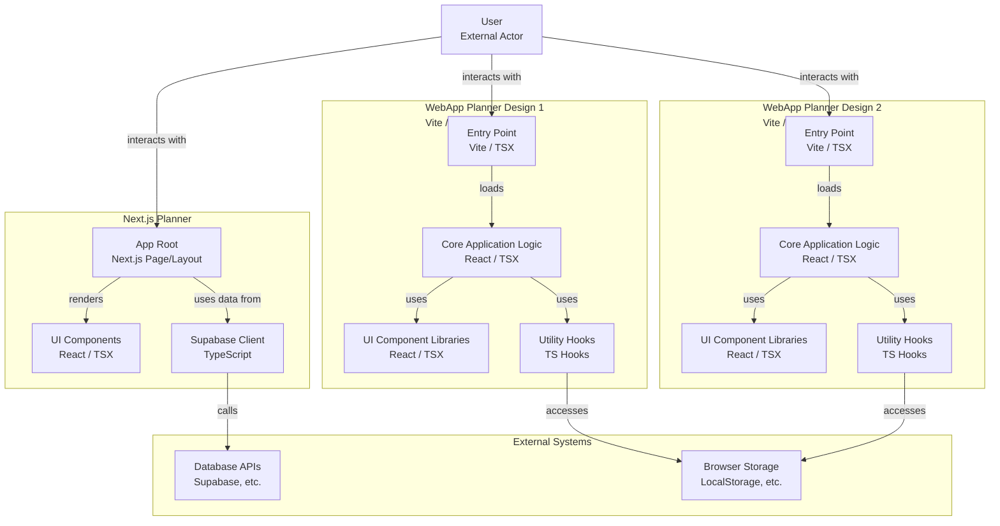

```mermaid
graph TD

    5155["User<br>External Actor"]
    subgraph 5138["External Systems"]
        5153["Database APIs<br>Supabase, etc."]
        5154["Browser Storage<br>LocalStorage, etc."]
    end
    subgraph 5139["WebApp Planner Design 2<br>Vite / React"]
        5149["Entry Point<br>Vite / TSX"]
        5150["Core Application Logic<br>React / TSX"]
        5151["UI Component Libraries<br>React / TSX"]
        5152["Utility Hooks<br>TS Hooks"]
        %% Edges at this level (grouped by source)
        5149["Entry Point<br>Vite / TSX"] -->|loads| 5150["Core Application Logic<br>React / TSX"]
        5150["Core Application Logic<br>React / TSX"] -->|uses| 5151["UI Component Libraries<br>React / TSX"]
        5150["Core Application Logic<br>React / TSX"] -->|uses| 5152["Utility Hooks<br>TS Hooks"]
    end
    subgraph 5140["WebApp Planner Design 1<br>Vite / React"]
        5145["Entry Point<br>Vite / TSX"]
        5146["Core Application Logic<br>React / TSX"]
        5147["UI Component Libraries<br>React / TSX"]
        5148["Utility Hooks<br>TS Hooks"]
        %% Edges at this level (grouped by source)
        5145["Entry Point<br>Vite / TSX"] -->|loads| 5146["Core Application Logic<br>React / TSX"]
        5146["Core Application Logic<br>React / TSX"] -->|uses| 5147["UI Component Libraries<br>React / TSX"]
        5146["Core Application Logic<br>React / TSX"] -->|uses| 5148["Utility Hooks<br>TS Hooks"]
    end
    subgraph 5141["Next.js Planner<br>Next.js / React"]
        5142["App Root<br>Next.js Page/Layout"]
        5143["UI Components<br>React / TSX"]
        5144["Supabase Client<br>TypeScript"]
        %% Edges at this level (grouped by source)
        5142["App Root<br>Next.js Page/Layout"] -->|renders| 5143["UI Components<br>React / TSX"]
        5142["App Root<br>Next.js Page/Layout"] -->|uses data from| 5144["Supabase Client<br>TypeScript"]
    end
    %% Edges at this level (grouped by source)
    5155["User<br>External Actor"] -->|interacts with| 5142["App Root<br>Next.js Page/Layout"]
    5155["User<br>External Actor"] -->|interacts with| 5145["Entry Point<br>Vite / TSX"]
    5155["User<br>External Actor"] -->|interacts with| 5149["Entry Point<br>Vite / TSX"]
    5144["Supabase Client<br>TypeScript"] -->|calls| 5153["Database APIs<br>Supabase, etc."]
    5148["Utility Hooks<br>TS Hooks"] -->|accesses| 5154["Browser Storage<br>LocalStorage, etc."]
    5152["Utility Hooks<br>TS Hooks"] -->|accesses| 5154["Browser Storage<br>LocalStorage, etc."]

```