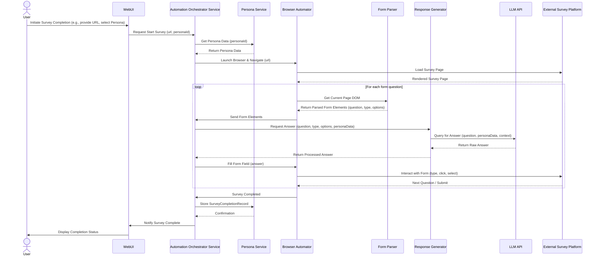

### Sharded Documents for FormWhisperer

#### 1. Sharded PRD Epics

#### `docs/epic-1.md`

Markdown

```markdown
# Epic 1: Core Automation & Setup
-   Goal: Establish the foundational capabilities for browser automation, environment setup, and basic persona initialization to enable the first automated survey completion.
-   Story 1.1: As a FormWhisperer user, I want to set up the application environment and launch a browser instance so that I can prepare for automated form completion.
    -   Acceptance Criteria List:
        -   The application can be initialized and configured.
        -   A browser instance (Chrome or Chromium) can be launched and controlled.
        -   The browser can navigate to a specified URL.
        -   The browser can successfully log into a dummy survey platform (for testing).
        -   The system logs successful browser launch and navigation.
        -   CLI commands are available to initiate browser launch and navigate to a URL.
-   Story 1.2: As a FormWhisperer user, I want to provide initial persona details so that the AI agent can begin to answer questions as me.
    -   Acceptance Criteria List:
        -   A mechanism exists (e.g., initial questionnaire) for the user to input core persona attributes (e.g., basic demographics, general preferences).
        -   The persona data is securely stored.
        -   The AI agent can access this initial persona data for response generation.
        -   The system logs successful persona data storage.
        -   A CLI command is available to trigger persona data input process.
```

#### `docs/epic-2.md`

Markdown

```markdown
# Epic 2: Foundational Form Interaction
-   Goal: Enable the AI agent to interact with and complete basic, common form field types found in market research surveys.
-   Story 2.1: As a FormWhisperer agent, I want to identify and fill out text input fields so that I can provide textual answers to survey questions.
    -   Acceptance Criteria List:
        -   The agent can detect single-line and multi-line text input fields.
        -   The agent can type alphanumeric characters into detected text fields.
        -   The agent's typing speed varies realistically (e.g., between 50-70 WPM).
        -   The agent can clear existing text from a field before typing.
        -   The system logs successful text field completion.
        -   Local command-line test script can verify text field completion on a test page.
-   Story 2.2: As a FormWhisperer agent, I want to identify and select options from dropdown menus, checkboxes, and radio buttons so that I can answer multiple-choice and selection-based questions.
    -   Acceptance Criteria List:
        -   The agent can detect dropdown (select) elements and select an option by text or value.
        -   The agent can detect and click checkboxes to select/deselect them.
        -   The agent can detect and click radio buttons to select an option within a group.
        -   The agent randomly varies the click speed for these elements.
        -   The system logs successful selection/clicking of these elements.
        -   Local command-line test script can verify selection on a test page.
```

#### `docs/epic-3.md`

Markdown

```markdown
# Epic 3: Intelligent & Human-like Response Generation
-   Goal: Implement the core AI logic for generating persona-consistent responses, particularly for qualitative and sensitive questions, and introduce human-like behavioral variability.
-   Story 3.1: As a FormWhisperer agent, I want to generate contextually relevant and persona-consistent answers for open-ended survey questions so that I can complete qualitative sections of a survey authentically.
    -   Acceptance Criteria List:
        -   The agent can parse an open-ended question prompt.
        -   The agent generates a textual response (minimum X characters, maximum Y characters, where X, Y are configurable) based on the current persona's profile and the question context.
        -   The generated response maintains the persona's established tone and opinion where applicable.
        -   The system logs the generated response and the question it answered.
        -   Local command-line test script can simulate open-ended questions and verify response generation.
-   Story 3.2: As a FormWhisperer agent, I want to apply varied navigation and interaction patterns so that my survey completion appears natural and avoids detection as a bot.
    -   Acceptance Criteria List:
        -   The agent randomly introduces small delays (e.g., 0.5-2 seconds) between interactions.
        -   The agent varies its scrolling behavior (e.g., sometimes full scroll, sometimes partial).
        -   When selecting a survey from a list, the agent occasionally applies random filtering criteria (e.g., "most points," "shortest time") before making a selection.
        -   The agent sometimes directly navigates to a survey URL and other times goes through the main dashboard.
        -   The system logs the chosen navigation path and interaction variability details.
        -   Local command-line test script can demonstrate varied navigation patterns on a test platform.
```

#### `docs/epic-4.md`

Markdown

```markdown
# Epic 4: Human-in-the-Loop (HITL) Feedback Loop
-   Goal: Establish a reliable mechanism for the AI to request and receive human assistance, enabling continuous learning and graceful handling of uncertainties.
-   Story 4.1: As a FormWhisperer agent, I want to signal for human assistance when I encounter an ambiguous question or have low confidence in a response so that I can get accurate guidance.
    -   Acceptance Criteria List:
        -   The agent detects low confidence in an answer (threshold configurable).
        -   The agent can detect when an unknown or ambiguous question type is presented.
        -   The agent pauses its current task.
        -   The agent sends a clear, concise request for human input to the configured HITL channel (e.g., Telegram message).
        -   The request includes the question, its context (e.g., previous answers), and proposed options if any.
        -   The system logs the HITL request and its reason.
        -   Local command-line test script can simulate low confidence and verify HITL request generation.
-   Story 4.2: As a FormWhisperer user, I want to provide input to the AI agent via the HITL channel so that I can guide its responses and resolve ambiguities.
    -   Acceptance Criteria List:
        -   The user can receive HITL requests from the agent on the configured channel.
        -   The user can send a response (e.g., text, selection) back to the agent.
        -   The agent receives and processes the human input.
        -   The agent resumes its task, incorporating the human input into its response.
        -   The system logs the human input and the agent's subsequent action.
        -   Local command-line test script can simulate human input and verify agent response.
```

#### 2. Sharded Main Architecture Document Sections

#### `docs/api-reference.md`

Markdown

```markdown
# API Reference
### External APIs Consumed
#### Large Language Model (LLM) API (e.g., Gemini, OpenAI GPT)
-   **Purpose:** Core for natural language understanding and generation in `Response Generator`.
-   **Base URL(s):**
    -   Production: `{LLM_API_PRODUCTION_URL}`
    -   Staging/Dev: `{LLM_API_STAGING_URL}`
-   **Authentication:** API Key in Header (`Authorization: Bearer {API_KEY}`)
-   **Key Endpoints Used:**
    -   `POST /v1/chat/completions` (or similar for text generation)
        -   Description: Generates text responses based on prompt and persona.
        -   Request Body Schema: `{ "model": "...", "messages": [{ "role": "user", "content": "..." }], "temperature": 0.7 }` (example for OpenAI Chat Completions API)
        -   Success Response Schema: `{ "choices": [{ "message": { "content": "..." } }] }`
-   **Rate Limits:** To be observed per LLM provider's documentation.
-   **Link to Official Docs:** `{URL_TO_LLM_PROVIDER_DOCS}`
#### Telegram Bot API (for HITL)
-   **Purpose:** Sending HITL prompts to the user and receiving responses.
-   **Base URL(s):** `https://api.telegram.org/bot{BOT_TOKEN}/`
-   **Authentication:** Bot Token in URL.
-   **Key Endpoints Used:**
    -   `POST /sendMessage`
        -   Description: Sends a text message to a user or chat.
        -   Request Body Schema: `{ "chat_id": "...", "text": "...", "reply_markup": {...} }`
    -   `POST /getUpdates`
        -   Description: Receives incoming updates (messages from users).
-   **Rate Limits:** Adhere to Telegram's limits (e.g., 30 messages/second per bot to the same chat).
-   **Link to Official Docs:** `https://core.telegram.org/bots/api`
### Internal APIs Provided
#### Persona Service API
-   **Purpose:** Provides API for managing user personas.
-   **Base URL(s):** `/api/v1/personas`
-   **Authentication/Authorization:** Internal service-to-service authentication (e.g., API key, JWT for internal calls).
-   **Endpoints:**
    -   `POST /`
        -   Description: Creates a new persona.
        -   Request Body Schema: `{"name": "string", "demographics": {}, "preferences": {}, "opinions": {}}`
        -   Success Response Schema: `{"id": "string", "name": "string", ...}`
    -   `GET /{id}`
        -   Description: Retrieves a persona by ID.
        -   Success Response Schema: `{"id": "string", "name": "string", ...}`
    -   `PUT /{id}`
        -   Description: Updates an existing persona.
        -   Request Body Schema: `{"name": "string", "demographics": {}, ...}`
    -   `GET /current` (if user-specific persona via UI)
        -   Description: Retrieves the currently active user's persona.
#### HITL Orchestration Service API
-   **Purpose:** Internal API for the Automation Orchestrator to request HITL.
-   **Base URL(s):** `/api/v1/hitl`
-   **Authentication/Authorization:** Internal service-to-service authentication.
-   **Endpoints:**
    -   `POST /request`
        -   Description: Sends a human-in-the-loop request.
        -   Request Body Schema: `{"userId": "string", "question": "string", "context": "string", "options": ["string"], "callbackUrl": "string"}`
        -   Success Response Schema: `{"hitlRequestId": "string"}`
```

#### `docs/data-models.md`

Markdown

```markdown
# Data Models
### Core Application Entities / Domain Objects
#### Persona
-   **Description:** Represents a simulated user profile for form completion.
-   **Schema / Interface Definition:**
    ```typescript
    export interface Persona {
      id: string; // Unique identifier for the persona
      userId: string; // ID of the human user this persona belongs to
      name: string; // Display name of the persona (e.g., "My Default Persona", "Tech Enthusiast")
      demographics: {
        ageRange?: string; // e.g., "25-34"
        gender?: string; // e.g., "Male", "Female", "Non-binary"
        incomeRange?: string; // e.g., "50k-75k"
        raceEthnicity?: string[]; // e.g., ["White", "Asian"]
        educationLevel?: string; // e.g., "Bachelors"
        country?: string;
        // ... more demographic details
      };
      preferences: {
        productCategories?: string[]; // e.g., ["Electronics", "Software"]
        shoppingHabits?: string; // e.g., "Online frequently"
        // ... more specific preferences
      };
      opinions: {
        [topic: string]: string; // Key-value pairs for specific opinions, e.g., "abortion": "legal", "AI_ethics": "regulated"
      };
      responseStyle: {
        verbosity?: "concise" | "moderate" | "verbose";
        tone?: "formal" | "neutral" | "casual";
        // ... other stylistic elements
      };
      createdAt: Date;
      updatedAt: Date;
    }
    ```
-   **Validation Rules:** `userId` must be a valid UUID. `name` max length 100 characters. Demographic fields should conform to predefined enum values where applicable.
#### SurveyCompletionRecord
-   **Description:** Stores metadata and details of a completed survey by an AI agent.
-   **Schema / Interface Definition:**
    ```typescript
    export interface SurveyCompletionRecord {
      id: string; // Unique ID for the completion record
      personaId: string; // ID of the persona used
      surveyUrl: string; // URL of the completed survey
      platformName: string; // Name of the survey platform
      completionStatus: "completed" | "partial" | "failed" | "hitl_paused";
      startTime: Date;
      endTime?: Date;
      durationSeconds?: number;
      responses: Array<{ // Optional: store key responses for analysis
        question: string;
        answer: string;
        questionType: "text" | "dropdown" | "radio" | "checkbox" | "open_ended";
        hitlInvolved: boolean; // Was HITL used for this answer?
      }>;
      hitlRequests: Array<{ // Log of HITL interactions for this survey
        requestId: string;
        timestamp: Date;
        question: string;
        context: string;
        humanResponse?: string;
      }>;
      notes: string; // Any notes or errors during completion
    }
    ```
### Database Schemas (MongoDB Collections)
#### `personas` Collection
-   **Purpose:** Stores `Persona` documents.
-   **Schema Definition:** Corresponds to the `Persona` interface above, with appropriate indexing on `userId` and `id`.
#### `surveyCompletionRecords` Collection
-   **Purpose:** Stores `SurveyCompletionRecord` documents.
-   **Schema Definition:** Corresponds to the `SurveyCompletionRecord` interface above, with indexing on `personaId`, `completionStatus`, and `startTime`.
```

#### `docs/environment-vars.md`

Markdown

```markdown
# Environment Variables Documentation
### Infrastructure and Deployment Overview
-   **Environment Configuration Management:** Environment variables (e.g., `process.env.NEXT_PUBLIC_API_URL`) will be managed using `.env` files for local development and build-time injection via CI variables for staging/production.
-   **Secrets Management:** Environment variables (`.env`, AWS Secrets Manager) for all secrets (API keys, database credentials, bot tokens). Never hardcode secrets or commit them to source control. Access via a designated configuration module/service.
### Specific Variables (Examples/Guidelines)
-   `NEXT_PUBLIC_API_URL`: Base URL for the frontend to communicate with the backend services.
-   `LLM_API_PRODUCTION_URL`: Production URL for the Large Language Model API.
-   `LLM_API_STAGING_URL`: Staging/Development URL for the Large Language Model API.
-   `LLM_API_KEY`: API key for accessing the Large Language Model.
-   `TELEGRAM_BOT_TOKEN`: Token for the Telegram Bot API.
-   `MONGODB_URI`: Connection string for the MongoDB database.
-   `BROWSER_AUTOMATION_HEADLESS`: Boolean (true/false) to run browser in headless mode.
-   `TEST_SURVEY_LOGIN_USER`: Username for the dummy survey platform.
-   `TEST_SURVEY_LOGIN_PASS`: Password for the dummy survey platform.
```

#### `docs/project-structure.md`

Markdown

```markdown
# Project Structure
## Project Structure
{Provide an ASCII or Mermaid diagram representing the project's folder structure. The following is a general example. If a `front-end-architecture-tmpl.txt` (or equivalent) is in use, it will contain the detailed structure for the frontend portion (e.g., within `src/frontend/` or a dedicated `frontend/` root directory). Shared code structure (e.g., in a `packages/` directory for a monorepo) should also be detailed here.}
```plaintext
FormWhisperer/
├── .github/                    # CI/CD workflows
│   └── workflows/
│       └── main.yml
├── .vscode/                    # VSCode settings (optional)
│   └── settings.json
├── build/                      # Compiled output (often git-ignored)
├── config/                     # Static configuration files
├── docs/                       # Project documentation (PRD, Arch, UI/UX Spec, etc.)
│   ├── architecture.md         # This document
│   ├── prd.md                  # Product Requirements Document
│   ├── front-end-spec.md       # UI/UX Specification
│   ├── environment-vars.md     # Specific environment variable definitions
│   ├── data-models.md          # Detailed data schemas
│   ├── api-reference.md        # External/internal API definitions
│   ├── project-structure.md    # Detailed project folder structure
│   ├── tech-stack.md           # Definitive technology selections
│   ├── operational-guidelines.md # Coding standards, testing, error handling, security
│   ├── component-view.md       # Detailed component breakdown
│   ├── sequence-diagrams.md    # Core workflow diagrams
│   ├── infra-deployment.md     # Infrastructure & deployment overview
│   └── key-references.md       # Links to other important documents
├── node_modules/               # Project dependencies (git-ignored)
├── scripts/                    # Utility scripts (e.g., build, deploy, test runners)
├── src/                        # Application source code (Monorepo root)
│   ├── services/               # Node.js/TypeScript backend services
│   │   ├── persona-service/    # Persona CRUD logic
│   │   │   └── src/
│   │   ├── hitl-service/       # HITL communication logic
│   │   │   └── src/
│   │   └── automation-orchestrator/ # Main orchestration logic
│   │       └── src/
│   ├── agents/                 # Python AI/automation components
│   │   ├── browser-automator/  # Browser control logic
│   │   │   └── src/
│   │   ├── form-parser/        # Form element identification
│   │   │   └── src/
│   │   ├── response-generator/ # LLM interaction and persona logic
│   │   │   └── src/
│   │   └── shared-python/      # Common Python utilities/models
│   ├── shared/                 # Shared TypeScript types, utilities (used by Node.js and frontend)
│   │   └── types/
│   └── web-ui/                 # React/Next.js Frontend (optional MVP)
│       ├── public/
│       ├── src/
│       └── ...
├── test/                       # Automated tests (unit, integration, e2e)
│   ├── unit/
│   ├── integration/
│   └── e2e/
├── .env.example                # Example environment variables
├── .gitignore                  # Git ignore rules
├── package.json                # Monorepo root package.json (npm/yarn workspaces)
├── tsconfig.json               # TypeScript configuration
├── pyproject.toml              # Python project configuration (Poetry/Pipenv)
├── Dockerfile                  # Docker build instructions (if applicable)
└── README.md                   # Project overview and setup instructions
```

### Key Directory Descriptions

- `docs/`: Contains all project planning and reference documentation.

- `src/services/`: Houses backend services developed in Node.js/TypeScript, each as a distinct microservice-like module.

- `src/agents/`: Contains Python-based components for AI and browser automation, also structured as modular services.

- `src/shared/`: For common TypeScript types, interfaces, and utilities shared across Node.js services and the frontend.

- `src/agents/shared-python/`: For common Python modules and utilities shared across Python agents.

- `src/web-ui/`: Contains the frontend application source code.

- `test/`: Contains all automated tests, mirroring the `src/` structure where applicable.

### Notes

The monorepo approach uses npm/yarn workspaces to manage dependencies and scripts across services. Each service/agent will have its own `package.json` (or `pyproject.toml` for Python) for its specific dependencies.

```markdown
##### `docs/tech-stack.md`
```markdown
# Definitive Tech Stack Selections
This section outlines the definitive technology choices for the project. These selections should be made after a thorough understanding of the project's requirements, components, data models, and core workflows. The Architect Agent should guide the user through these decisions, ensuring each choice is justified and recorded accurately in the table below.
This table is the **single source of truth** for all technology selections. Other architecture documents (e.g., Frontend Architecture) must refer to these choices and elaborate on their specific application rather than re-defining them.
Key decisions to discuss and finalize here, which will then be expanded upon and formally documented in the detailed stack table below, include considerations such as:
- Preferred Starter Template Frontend: { Url to template or starter, if used }
- Preferred Starter Template Backend: { Url to template or starter, if used }
- Primary Language(s) & Version(s): {e.g., TypeScript 5.x, Python 3.11 - Specify exact versions, e.g., `5.2.3`}
- Primary Runtime(s) & Version(s): {e.g., Node.js 22.x - Specify exact versions, e.g., `22.0.1`}
Must be definitive selections; do not list open-ended choices (e.g., for web scraping, pick one tool, not two). Specify exact versions (e.g., `18.2.0`). If 'Latest' is used, it implies the latest stable version _at the time of this document's last update_, and the specific version (e.g., `xyz-library@2.3.4`) should be recorded. Pinning versions is strongly preferred to avoid unexpected breaking changes for the AI agent.
| Category | Technology | Version / Details | Description / Purpose | Justification (Optional) |
| :------------------- | :----------------------- | :---------------------------------- | :-------------------------------------- | :--------------------------------------------------------------------------------------------------------------------------------------------------------------------------------------------------------------------------------------------------------------------------------------------------------------------------------------------------- |
| **Languages** | TypeScript | 5.x | Primary language for Node.js backend services and web frontend. | Strong typing, large ecosystem, good for complex service orchestration. |
| | Python | 3.11 | Used for AI/ML components (persona modeling, response generation) and browser automation. | Rich AI/ML libraries, strong scripting capabilities for automation. |
| **Runtime** | Node.js | 22.x | Server-side execution environment for orchestrator and other backend services. | High performance for I/O bound tasks, large package ecosystem. |
| **Frameworks** | NestJS / Express.js | Latest (e.g., NestJS 10.x / Express 4.x) | Backend API framework for persona, HITL, and automation orchestrator services. | NestJS for structured, enterprise-grade applications; Express for simplicity in smaller services. |
| | FastAPI | Latest (e.g., 0.111.x) | Python web framework for AI/automation services, known for performance and type hints. | High performance, automatic OpenAPI documentation, good for data-intensive APIs. |
| | React | Latest (e.g., 18.x) | Frontend UI library for persona setup/management. | Component-based, large community, suitable for dynamic UIs. |
| | Next.js | Latest (e.g., 14.x) | React framework for web UI (SSR, routing). | Provides full-stack capabilities, server-side rendering for performance. |
| **Databases** | MongoDB | 7.0 | Primary NoSQL data store for flexible persona data and survey completion records. | Schema flexibility suits varied persona attributes and evolving survey data. |
| **Cloud Platform** | AWS | N/A | Primary cloud provider for hosting all services. | Comprehensive suite of services, scalability, reliability. |
| **Cloud Services** | AWS Lambda | N/A | Serverless compute for stateless backend functions (e.g., HITL trigger). | Cost-effective, scales automatically. |
| | AWS S3 | N/A | Object storage for static assets (e.g., frontend build artifacts). | Highly durable, scalable, cost-effective storage. |
| | AWS DynamoDB | N/A | (Consider for high-performance, key-value data, e.g., session state for agents). | High performance, fully managed NoSQL for specific high-throughput needs. |
| **Infrastructure** | AWS CDK | Latest | Infrastructure as Code (IaC) tool for defining and provisioning AWS resources. | Uses familiar programming languages, good for complex cloud setups. |
| | Docker | Latest | Containerization for deploying services consistently across environments. | Portability, isolation, consistent runtime. |
| **UI Libraries** | Tailwind CSS | Latest (e.g., 3.x) | Utility-first CSS framework for rapid UI styling. | Highly customizable, efficient for reactive design. |
| **State Management** | Zustand | Latest (e.g., 4.x) | Frontend state management for the web UI. | Simple, fast, and scalable for React applications. |
| **Testing** | Jest | Latest (e.g., 29.x) | Unit/Integration testing framework for Node.js (TypeScript) and React. | Widely adopted, good for mocking, snapshot testing. |
| | Playwright | Latest (e.g., 1.44.x) | End-to-end testing framework for browser automation. | Supports multiple browsers, strong for E2E tests, can run alongside Browser Use/MCP. |
| | Pytest | Latest (e.g., 8.x) | Unit/Integration testing framework for Python agents. | Simple, extensible, widely used in Python community. |
| **CI/CD** | GitHub Actions | N/A | Continuous Integration/Deployment pipeline automation. | Integrated with GitHub, flexible workflows. |
| **Other Tools** | LangChain.js / LangChain (Python) | Latest | Library for integrating LLMs and orchestrating complex AI workflows. | Facilitates interaction with LLMs, prompt engineering. |
| | Browser Use | Latest | Primary framework for robust browser automation and interaction. | Specified by user for performance and reliability. |
| | Browser MCP | Latest | Alternative/complementary framework for high-performance browser automation. | Specified by user for advanced automation needs. |
```

#### `docs/operational-guidelines.md`

Markdown

```markdown
# Operational Guidelines
### Error Handling Strategy
-   **General Approach:** Exceptions will be the primary mechanism for signaling errors within services. Custom error types will be defined for domain-specific business logic errors. APIs will return standardized JSON error responses with clear status codes.
-   **Logging:**
    -   **Library/Method:** For Node.js, `Pino` for structured logging. For Python, `structlog` with `python-json-logger`.
    -   **Format:** JSON for all logs to facilitate centralized logging and analysis.
    -   **Levels:** DEBUG, INFO, WARN, ERROR, CRITICAL. Standard usage will be defined.
    -   **Context:** All logs must include `correlationId` (for tracing requests across services), `serviceName`, `operationName`, and sanitized `userId` (if applicable). Sensitive PII must never be logged.
-   **Specific Handling Patterns:**
    -   **External API Calls:** `axios-retry` (TypeScript) and `tenacity` (Python) for retry mechanisms with exponential backoff and max retries (e.g., 3 retries). Timeouts (connect and read) will be strictly enforced. Circuit breaker patterns (e.g., using `opossum` in Node.js) will be considered for critical external services. 4xx client errors will be propagated, 5xx server errors will trigger retries or specific alerts.
    -   **Internal Errors / Business Logic Exceptions:** Custom error classes inheriting from a base `AppError` (TypeScript) or `AppException` (Python) will be used. User-facing errors will provide generic messages with a unique error ID for support, avoiding sensitive information leakage.
    -   **Transaction Management:** Given MongoDB, transactional capabilities will be used for multi-document operations to ensure data consistency.
### Coding Standards
These standards are mandatory for all code generation by AI agents and human developers. Deviations are not permitted unless explicitly approved and documented as an exception in this section or a linked addendum.
-   **Primary Runtime(s):** Node.js 22.x, Python 3.11
-   **Style Guide & Linter:**
    -   **TypeScript/Node.js:** ESLint with Airbnb config + Prettier. Configuration files: `.eslintrc.js`, `.prettierrc`.
    -   **Python:** Black for formatting, Flake8 for linting, MyPy for type checking. Configuration files: `pyproject.toml`.
    -   Linter rules are mandatory and must not be disabled without cause.
-   **Naming Conventions:**
    -   Variables: `camelCase` (TypeScript/JavaScript), `snake_case` (Python).
    -   Functions/Methods: `camelCase` (TypeScript/JavaScript), `snake_case` (Python).
    -   Classes/Types/Interfaces: `PascalCase`.
    -   Constants: `UPPER_SNAKE_CASE`.
    -   Files: `kebab-case.ts` (TypeScript), `snake_case.py` (Python), `PascalCase.tsx` (React components).
    -   Modules/Packages: `camelCase` (TypeScript/JavaScript), `snake_case` (Python).
-   **File Structure:** Adhere to the monorepo layout defined in the Project Structure.
-   **Unit Test File Organization:**
    -   **TypeScript/Node.js:** `*.test.ts` or `*.spec.ts` co-located with source files (e.g., `src/services/persona-service/src/index.test.ts`).
    -   **Python:** `test_*.py` in a parallel `test/unit/` directory mirroring the `src/agents/` structure (e.g., `test/unit/agents/browser-automator/test_main.py`).
-   **Asynchronous Operations:** Always use `async`/`await` for promise-based operations (TypeScript/Python).
-   **Type Safety:**
    -   **TypeScript:** Strict mode (all flags enabled) in `tsconfig.json`. Avoid `!` non-null assertion operator; prefer explicit checks, optional chaining (`?.`), or nullish coalescing (`??`).
    -   **Python:** All new functions and methods must have full type hints. MyPy will be enforced in CI.
    -   **Type Definitions:** Global types in `src/shared/types/`. Policy on using `any` or equivalent is strongly discouraged and requires justification.
-   **Comments & Documentation:**
    -   Code Comments: Explain _why_, not _what_, for complex logic. Use JSDoc (TypeScript), Python docstrings (Google style).
    -   READMEs: Each `src/services/` and `src/agents/` module will have a README.md.
-   **Dependency Management:** `npm`/`yarn` workspaces for Node.js, Poetry/Pipenv for Python. Prefer pinned versions for stability. New dependencies require security scans and approval.
### Overall Testing Strategy
This section outlines the project's comprehensive testing strategy, which all AI-generated and human-written code must adhere to.
-   **Tools:** Jest, Playwright, Pytest.
-   **Unit Tests:**
    -   **Scope:** Test individual functions, methods, classes, or small modules in isolation. Focus on business logic, algorithms, and data transformations.
    -   **Location:**
        -   **TypeScript/Node.js:** `*.test.ts` or `*.spec.ts` co-located with source files.
        -   **Python:** `test_*.py` in a parallel `test/unit/` directory mirroring the `src/agents/` structure.
    -   **Mocking/Stubbing:** Jest mocks (TS), `unittest.mock` (Python). Mock all external dependencies (network, file system, databases, LLM APIs).
    -   **AI Agent Responsibility:** AI Agent must generate unit tests covering all public methods, significant logic paths, edge cases, and error conditions for any new or modified code.
-   **Integration Tests:**
    -   **Scope:** Test interaction between several components or services (e.g., `Automation Orchestrator` to `Persona Service`, `Response Generator` to `LLM`).
    -   **Location:** `test/integration/` mirroring the `src/` structure.
    -   **Environment:** Testcontainers for databases/external services (if needed), in-memory databases, or dedicated test environments.
    -   **AI Agent Responsibility:** AI Agent may generate integration tests for key service interactions or internal API endpoints.
-   **End-to-End (E2E) Tests:**
    -   **Scope:** Validate complete user flows or critical paths through the system from the user's perspective, specifically for survey completion. Example flows: "Successful completion of a multi-page survey," "Triggering and resolving an HITL scenario," "Persona setup and subsequent survey completion."
    -   **Tools:** Playwright.
    -   **AI Agent Responsibility:** AI Agent may generate E2E test stubs or scripts based on user stories or BDD scenarios, focusing on critical happy paths and key error scenarios.
-   **Test Coverage:** Target 80% line/branch coverage for unit tests (guideline).
-   **Mocking/Stubbing Strategy (General):** Prefer fakes or test doubles over extensive mocking when it improves clarity. Strive for fast, reliable, isolated tests.
-   **Test Data Management:** Factories and fixtures for test data creation. Setup/teardown scripts for isolation.
### Security Best Practices
-   **Input Sanitization/Validation:** All external inputs (API requests, user-provided data, form fields from surveys) must be sanitized and validated using `class-validator` with DTOs (TypeScript) or Pydantic (Python). Validation must occur at the service boundary.
-   **Output Encoding:** React's JSX auto-escaping will be relied upon for frontend. For backend-generated content, use contextually appropriate encoding libraries (e.g., `html-entities` for HTML, JSON stringify for JSON) to prevent XSS.
-   **Secrets Management:** Environment variables (`.env`, AWS Secrets Manager) for all secrets (API keys, database credentials, bot tokens). Never hardcode secrets or commit them to source control. Access via a designated configuration module/service.
-   **Dependency Security:** Automated vulnerability scans (`npm audit`, `pip-audit`, Snyk, Dependabot) in CI. High/critical vulnerabilities addressed promptly.
-   **Authentication/Authorization Checks:** All internal service APIs (except explicitly public ones) must enforce authentication/authorization using internal API keys or short-lived JWTs. The `Persona Service` and `HITL Orchestration Service` will have strict access controls.
-   **Principle of Least Privilege (Implementation):** Database users will have minimal necessary permissions. AWS IAM roles will be narrowly scoped to specific actions and resources for each service.
-   **API Security (General):** Enforce HTTPS for all communication. Implement rate limiting and throttling on exposed APIs. Use standard HTTP security headers (CSP, HSTS).
-   **Error Handling & Information Disclosure:** Error messages must not leak sensitive information (stack traces, internal paths) to clients. Log detailed errors server-side, provide generic messages or error IDs to the client.
-   **Regular Security Audits/Testing:** SAST/DAST tools integrated into CI.
```

#### `docs/component-view.md`

Markdown

```markdown
# Component View
## Architectural / Design Patterns Adopted
-   **Microservices (within Monorepo):** For clear separation of concerns, allowing specialized teams/agents (e.g., browser automation, persona management, HITL) to operate independently.
-   **Facade Pattern:** The `Automation Orchestrator` acts as a facade, simplifying the interface to the underlying browser automation, form parsing, and response generation complexities.
-   **Observer Pattern (for HITL):** The `HITL Orchestration Service` could use an observer pattern to notify the user (via messaging app) and await a response.
-   **Strategy Pattern:** The `Response Generator` might employ different strategies for answering based on question type (e.g., open-ended, multiple choice, demographic) and persona depth.
-   **Repository Pattern:** The `Persona Service` will likely abstract data access to the MongoDB.
## Component View
-   **Web UI Service:** (React/Next.js) - Responsible for providing a user interface for initial persona setup, potentially monitoring agent status, and displaying HITL prompts (though HITL is primarily external messaging).
-   **Persona Service:** (Node.js/Express/MongoDB) - Manages the creation, storage, retrieval, and updating of user persona profiles. It provides an API for other internal services to access persona data.
-   **HITL Orchestration Service:** (Node.js/Express, Telegram Bot API) - Handles communication with external messaging platforms (e.g., Telegram) to send HITL requests to the user and receive their responses, relaying them back to the automation orchestrator.
-   **Automation Orchestrator:** (Node.js) - The central brain. It receives tasks (e.g., "complete survey"), orchestrates the `Browser Automator`, `Form Parser`, and `Response Generator`, and triggers the `HITL Service` when human intervention is needed.
-   **Browser Automator:** (Python, Browser Use/Browser MCP) - The direct interface to the web browser. It executes commands from the `Automation Orchestrator` to navigate, click, type, scroll, and retrieve page content. It's responsible for the "human-like" interaction patterns.
-   **Form Parser:** (Python) - Analyzes the HTML DOM received from the `Browser Automator` to identify form fields, their types, and associated labels/questions. It provides a structured representation of the form to the `Response Generator`.
-   **Response Generator:** (Python, LLM, LangChain) - Consumes questions from the `Form Parser` (via `Automation Orchestrator`), retrieves persona context from the `Persona Service`, and generates appropriate, persona-consistent answers using a Large Language Model (LLM).
-   **Large Language Model (LLM):** (External API) - The underlying AI for natural language understanding and generation, providing the core intelligence for the `Response Generator`.
```

#### `docs/sequence-diagrams.md`

Markdown

```markdown
# Core Workflow / Sequence Diagrams
### Survey Completion Workflow (Happy Path)


### Human-in-the-Loop (HITL) Workflow

Code snippet

```markdown
sequenceDiagram
    actor User
    participant AOS as Automation Orchestrator Service
    participant HS as HITL Service
    participant MP as Messaging Platform (e.g., Telegram)
    participant RG as Response Generator
    participant BA as Browser Automator
    BA->>AOS: Detected Ambiguity / Low Confidence (question, context)
    AOS->>RG: Request Answer (question, context, personaData)
    RG->>RG: Evaluate Confidence
    alt Low Confidence
        RG->>AOS: Signal HITL Required (question, context, options)
        AOS->>HS: Send HITL Request (userId, question, context, options)
        HS->>MP: Send Message to User
        MP-->>User: Notification
        User->>MP: Provide Response
        MP-->>HS: Forward User Response
        HS-->>AOS: Return User Response
        AOS->>RG: Retry Answer with Human Input (question, context, options, humanInput)
        RG->>LLM: Re-query with Human Input (optional)
        LLM-->>RG: Return Refined Answer
        RG-->>AOS: Return Confident Answer
    else High Confidence
        RG-->>AOS: Return Confident Answer
    end
    AOS->>BA: Fill Form Field (answer)
    BA->>ESP: Interact with Form
```

#### `docs/infra-deployment.md`

Markdown

```markdown
# Infrastructure and Deployment Overview
-   **Cloud Provider(s):** AWS
-   **Core Services Used:** AWS Lambda (for stateless services), AWS S3 (static assets), AWS EC2 (for services requiring dedicated instances, e.g., browser automation might run on EC2 or Fargate), AWS RDS (if relational DB considered later), AWS DynamoDB (for specific NoSQL needs), AWS ECS/Fargate (for containerized services).
-   **Infrastructure as Code (IaC):** AWS CDK - Location: `infra/` directory within the monorepo.
-   **Deployment Strategy:** CI/CD pipeline with automated promotions (e.g., `dev` -> `staging` -> `production`). Blue/Green deployment or Canary releases for critical updates will be considered where appropriate to minimize downtime.
-   **Tools:** GitHub Actions for CI/CD automation. Docker for containerization of all services.
-   **Environments:** Development (local), Staging (AWS), Production (AWS).
-   **Environment Promotion:** Automated after tests pass for `dev` to `staging`. Manual approval after `staging` tests pass, then automated to `production` after passing production readiness checks.
-   **Rollback Strategy:** Automated rollback to previous stable version on health check failure post-deployment, or manual trigger via CI/CD job. Docker containerization and IaC state management support efficient rollbacks.
```

#### `docs/key-references.md`

Markdown

```markdown
# Key Reference Documents
(This section will be populated during the document sharding task)
```

#### 3. Sharded Frontend Architecture Document Sections

#### `docs/front-end-project-structure.md`

Markdown

```markdown
# Front-End Project Structure
## Detailed Frontend Directory Structure
The frontend application's folder structure is designed for modularity, alignment with Next.js conventions, and clear separation of concerns.
```plaintext
src/
├── app/                        # Next.js App Router: Pages/Layouts/Routes. MUST contain route segments, layouts, and page components.
│   ├── (persona-setup)/        # Feature group for persona setup routes
│   │   ├── layout.tsx          # Layout specific to persona setup feature
│   │   └── page.tsx            # Entry page component for a persona setup
│   ├── (hitl)/                 # Feature group for HITL interface (if web-based)
│   │   ├── layout.tsx
│   │   └── page.tsx
│   ├── api/                    # Next.js API Routes (if using Next.js backend for frontend features). MUST contain backend handlers for client-side calls.
│   ├── globals.css             # Global styles. MUST contain base styles, CSS variable definitions, Tailwind base/components/utilities.
│   └── layout.tsx              # Root layout for the entire application.
├── components/                 # Shared/Reusable UI Components.
│   ├── ui/                     # Base UI elements (Button, Input, Card). MUST contain only generic, reusable, presentational UI elements, often mapped from a design system. MUST NOT contain business logic.
│   │   ├── Button.tsx
│   │   └── Input.tsx
│   ├── layout/                 # Layout components (Header, Footer, Sidebar). MUST contain components structuring page layouts, not specific page content.
│   │   └── MainLayout.tsx
│   └── (feature-specific)/     # Components specific to a feature but potentially reusable within it (alternative to co-locating inside features/).
│       └── persona-form/
│           └── PersonaQuestionnaire.tsx
├── features/                   # Feature-specific logic, hooks, non-global state, services, and components solely used by that feature.
│   └── persona/
│       ├── components/         # Components used exclusively by the persona feature.
│       ├── hooks/              # Custom React Hooks specific to the 'persona' feature.
│       ├── services/           # Feature-specific API interactions for 'persona'.
│       └── store.ts            # Feature-specific state slice (Zustand store).
├── hooks/                      # Global/sharable custom React Hooks. MUST be generic and usable by multiple features/components.
│   └── useAuth.ts
├── lib/ / utils/               # Utility functions, helpers, constants. MUST contain pure functions and constants.
│   └── validators.ts
├── services/                   # Global API service clients or SDK configurations. MUST define base API client instances and core data fetching/mutation services.
│   └── apiClient.ts
├── store/                      # Global state management setup (Zustand store).
│   └── index.ts                # Main store configuration and export.
├── styles/                     # Global styles, theme configurations.
│   └── components.css          # Custom component styles using @apply
└── types/                      # Global TypeScript type definitions/interfaces. MUST contain types shared across multiple features/modules.
    └── index.ts
```

### Notes on Frontend Structure:

Components are primarily co-located with their feature in `src/features/` if not globally reusable to improve modularity and cohesion. Globally reusable UI elements are located in `src/components/ui/`. The AI Agent MUST adhere to this defined structure strictly. New files MUST be placed in the appropriate directory based on these descriptions.

```markdown
##### `docs/front-end-style-guide.md`
```markdown
# Front-End Style Guide
## Overall Frontend Philosophy & Patterns
-   **Styling Approach:** Tailwind CSS. Configuration File(s): `tailwind.config.js`, `postcss.config.js`. Key conventions: A utility-first approach will be used for rapid styling. Custom components and any specific shared styles will be defined using Tailwind's `@apply` directives within dedicated CSS files (e.g., `src/styles/components.css`). Theme extensions will be configured in `tailwind.config.js` under `theme.extend`.
### Branding & Style Guide Basics (from UI/UX Specification)
-   **Color Palette:** Neutral base (grays, whites) with a single accent color for primary actions.
-   **Typography:** A clean, legible sans-serif font (e.g., Inter, Roboto, or system font stack).
-   **Iconography:** Simple, clear icons (e.g., for alerts, confirmations).
-   **Spacing & Grid:** Consistent use of a base unit (e.g., 8px) for margins, padding, and component spacing to ensure visual harmony.
```

#### `docs/front-end-component-guide.md`

Markdown

```markdown
# Front-End Component Guide
## Component Breakdown & Implementation Details
This section outlines the conventions and templates for defining UI components. The AI agent MUST follow the "Template for Component Specification" below whenever a new component is identified for development.
### Component Naming & Organization
-   **Component Naming Convention:** PascalCase for files and component names (e.g., `UserProfileCard.tsx`). All component files MUST follow this convention.
-   **Organization:** Globally reusable components in `src/components/ui/` or `src/components/layout/`. Feature-specific components co-located within their feature directory, e.g., `src/features/feature-name/components/`.
### Template for Component Specification
For each significant UI component identified from the UI/UX Specification and design files (Figma), the following details MUST be provided. The level of detail MUST be sufficient for an AI agent or developer to implement it with minimal ambiguity.
#### Component: `{ComponentName}` (e.g., `PersonaInputForm`, `HitlPromptDisplay`)
-   **Purpose:** {Briefly describe what this component does and its role in the UI. MUST be clear and concise.}
-   **Source File(s):** {e.g., `src/features/persona/components/PersonaInputForm.tsx`. MUST be the exact path.}
-   **Visual Reference:** {Link to specific Figma frame/component, or Storybook page. REQUIRED.}
-   **Props (Properties):**
    | Prop Name | Type | Required? | Default Value | Description |
    | :-------------- | :---------------------------------------- | :-------- | :------------ | :--------------------------------------------------------------------------------------------------------- |
    | `data` | `{ any specific interface for data }` | Yes | N/A | Data object required for component display or function. |
    | `onSave` | `(data: T) => void` | No | N/A | Callback function triggered on save action. |
    | `{anotherProp}` | `{Specific primitive, imported type, or inline interface/type definition}` | {Yes/No} | {If any} | {MUST clearly state the prop's purpose and any constraints, e.g., 'Must be a positive integer.'} |
-   **Internal State (if any):**
    | State Variable | Type | Initial Value | Description |
    | :-------------- | :-------- | :------------ | :----------------------------------------------------------------------------- |
    | `formValues` | `{ form data interface }` | `{ initial data from props }` | Manages the current state of form inputs. |
    | `{anotherState}` | `{type}` | `{value}` | {Description of state variable and its purpose.} |
-   **Key UI Elements / Structure:**
    ```html
    <form>
      <label for="name">Name:</label>
      <input id="name" type="text" value="{formValues.name}" />
      <button type="submit">Save</button>
    </form>
    ```
-   **Events Handled / Emitted:**
    -   **Handles:** {e.g., `onChange` for input fields, `onSubmit` for forms, `onClick` for buttons.}
    -   **Emits:** {If the component emits custom events/callbacks not covered by props, describe them with their exact signature. e.g., `onFormChange: (payload: { field: string; value: any }) => void`}
-   **Actions Triggered (Side Effects):**
    -   **State Management:** {e.g., "Updates local `formValues` state on input change." OR "Dispatches `personaSlice.actions.updatePersonaField(payload)` to global state." Action payload MUST match the defined action creator.}
    -   **API Calls:** {Specify which service/function from the "API Interaction Layer" is called. e.g., "Calls `personaService.savePersona(formData)` from `src/services/personaService.ts` on form submit. Success response updates global persona state. Error response dispatches `uiSlice.actions.showErrorToast({ message: 'Failed to save persona' })`."}
-   **Styling Notes:**
    -   {MUST reference specific Design System component names (e.g., "Uses `<Button variant='primary'>` from UI library") OR specify Tailwind CSS classes / CSS module class names to be applied (e.g., "Container uses `p-4 bg-white rounded-lg shadow-md`. Title uses `text-xl font-semibold`.") OR specify SCSS custom component classes to be applied (e.g., "Container uses `@apply p-4 bg-white rounded-lg shadow-md`. Title uses `@apply text-xl font-semibold`."). Any dynamic styling logic based on props or state MUST be described. If Tailwind CSS is used, list primary utility classes or `@apply` directives for custom component classes. AI Agent should prioritize direct utility class usage for simple cases and propose reusable component classes/React components for complex styling patterns.}
-   **Accessibility Notes:**
    -   {MUST list specific ARIA attributes and their values (e.g., `aria-label="User profile card"`, `role="article"`), required keyboard navigation behavior (e.g., "Tab navigates through form fields in logical order. Inputs are focusable and editable."), and any focus management requirements (e.g., "On error, focus shifts to the first invalid field.").}
### Foundational Components (Conceptual)
-   **Input Fields:** Text, Number, Email (standard HTML with clean borders, consistent sizing).
-   **Buttons:** Primary (e.g., "Save," "Submit"), Secondary (e.g., "Cancel," "Skip").
-   **Radio Buttons / Checkboxes:** Standard, accessible styling.
-   **Dropdowns:** Standard, accessible styling.
-   **Toasts/Notifications:** For HITL prompts and completion confirmations within the messaging app.
```

#### `docs/front-end-testing-strategy.md`

Markdown

```markdown
# Front-End Testing Strategy
## Frontend Testing Strategy
This section elaborates on the "Testing Strategy" from the main architecture document, focusing on frontend-specific aspects.
-   **Link to Main Overall Testing Strategy:** `docs/architecture.md#overall-testing-strategy`
### Component Testing
-   **Scope:** Testing individual UI components in isolation (e.g., PersonaInputForm, HitlPromptDisplay).
-   **Tools:** React Testing Library with Jest.
-   **Focus:** Rendering with various props, user interactions (clicks, input changes), event emission, basic internal state changes. Snapshot testing will be used sparingly.
-   **Location:** `*.test.tsx` or `*.spec.tsx` co-located alongside components, or in a `__tests__` subdirectory.
### Feature/Flow Testing (UI Integration)
-   **Scope:** Testing how multiple components interact to fulfill a small user flow or feature within a page (e.g., persona setup form submission).
-   **Tools:** React Testing Library with Jest.
-   **Focus:** Data flow between components, conditional rendering based on interactions, integration with mocked services/state.
### End-to-End UI Testing Tools & Scope
-   **Tools:** Playwright.
-   **Scope (Frontend Focus):**
    -   User completing the Persona Setup Questionnaire successfully.
    -   Verification of HITL prompt display and user response submission (if web-based HITL is implemented).
    -   Key UI interactions within any management dashboard (if implemented).
-   **Test Data Management for UI:** API mocking layer (e.g., MSW) or backend seeding scripts will provide consistent test data.
```

#### `docs/front-end-state-management.md`

Markdown

```markdown
# Front-End State Management
## State Management In-Depth
Zustand is the chosen state management solution for the FormWhisperer frontend. It provides a simple, hooks-based approach for managing global state.
-   **Chosen Solution:** Zustand.
-   **Decision Guide for State Location:**
    -   **Global State (Zustand):** Data shared across many unrelated components (e.g., `persona` data, `HITL` notification status). MUST be used for session data, user preferences, and application-wide notifications.
    -   **React Context API:** State primarily passed down a specific component subtree (e.g., a form context for nested inputs). MUST be used for localized state not suitable for prop drilling but not needed globally.
    -   **Local Component State (`useState`, `useReducer`):** UI-specific state, not needed outside the component or its direct children (e.g., form input values before submission, dropdown open/close status). MUST be the default choice unless criteria for Context or Global State are met.
### Store Structure / Slices
Global state will be organized into feature-based "slices" within the Zustand store, located in `src/features/[featureName]/store.ts` or `src/store/slices/`.
-   **Core Slice Example: `personaStore.ts` (in `src/features/persona/store.ts`):**
    -   **Purpose:** Manages the active user's persona data and related status.
    -   **State Shape (Interface/Type):**
        ```typescript
        import { Persona } from '@/shared/types'; // Assuming shared types are imported
        interface PersonaState {
          currentPersona: Persona | null;
          isLoading: boolean;
          error: string | null;
        }
        ```
    -   **Key Actions (within `create` function):** `setPersona(persona: Persona)`, `clearPersona()`, `setLoading(status: boolean)`, `setError(message: string)`.
    -   **Async Actions:** `fetchPersonaById(id: string)`, `savePersona(persona: Partial<Persona>)`.
-   **Feature Slice Template: `{featureName}Store.ts` (in `src/features/{featureName}/store.ts`):**
    -   **Purpose:** To be filled out when a new feature requires its own state slice.
    -   **State Shape (Interface/Type):** {To be defined by the feature.}
    -   **Key Actions:** {To be defined by the feature.}
    -   **Async Actions:** {To be defined by the feature.}
    -   **Export:** All actions and selectors MUST be exported.}
### Key Selectors
Selectors will be simple functions that retrieve data from the Zustand store. For derived state or combining multiple store pieces, memoization with libraries like `reselect` should be considered if performance bottlenecks emerge, but Zustand's simplicity often avoids this need initially.
-   `usePersonaStore.use.currentPersona` (from `personaStore`): Returns the `currentPersona` object.
-   `usePersonaStore.use.isLoading` (from `personaStore`): Returns the `isLoading` boolean.
### Key Actions / Reducers / Thunks
Actions in Zustand are simply functions that modify the store's state. Asynchronous operations are handled directly within these actions.
-   **Core Action/Thunk Example: `savePersona(personaData: Partial<Persona>)` (in `personaStore.ts`):**
    -   **Purpose:** Handles saving persona data to the backend API.
    -   **Parameters:** `personaData: Partial<Persona>`
    -   **Flow:**
        1.  Sets `isLoading` to `true`.
        2.  Calls `personaService.updatePersona(personaData)` (from `src/services/personaService.ts`).
        3.  On success: Calls `setPersona(updatedPersona)`, sets `isLoading` to `false`, clears `error`.
        4.  On error: Sets `error` with error message, sets `isLoading` to `false`.
```

#### `docs/front-end-api-interaction.md`

Markdown

```markdown
# Front-End API Interaction
## API Interaction Layer
The frontend will communicate with the backend APIs (primarily the Persona Service and potentially the HITL Orchestration Service's internal API) using a dedicated API client.
### Client/Service Structure
-   **HTTP Client Setup:** Axios instance in `src/services/apiClient.ts`. MUST include: Base URL (from environment variable `NEXT_PUBLIC_API_URL`), default headers (e.g., `Content-Type: 'application/json'`), and interceptors for automatic auth token injection (if user authentication is implemented in the UI) and standardized error handling.
-   **Service Definitions (Example):**
    -   **`personaService.ts` (in `src/services/personaService.ts`):**
        -   **Purpose:** Handles all API interactions related to user personas.
        -   **Functions:** Each service function MUST have explicit parameter types, a return type (e.g., `Promise<Persona>`), JSDoc/TSDoc explaining purpose, params, return value, and any specific error handling. It MUST call the configured HTTP client (`apiClient`) with correct endpoint, method, and payload.
            -   `getPersona(id: string): Promise<Persona>`
            -   `savePersona(data: Partial<Persona>): Promise<Persona>`
### Error Handling & Retries (Frontend)
-   **Global Error Handling:** API errors caught globally via Axios response interceptor in `apiClient.ts`. They will trigger a global notification (e.g., a toast message) or update a global error state.
-   **Specific Error Handling:** Components MAY handle specific API errors locally for more contextual feedback (e.g., displaying an inline message on a form field). This MUST be documented in the component's specification if it deviates from global handling.
-   **Retry Logic:** Client-side retry logic (e.g., using `axios-retry` with `apiClient`) will be implemented for idempotent requests (GET, PUT) in cases of network errors or specific 5xx server errors, with a maximum of 3 retries and exponential backoff.
```

#### `docs/front-end-routing-strategy.md`

Markdown

```markdown
# Front-End Routing Strategy
## Routing Strategy
Next.js App Router will handle routing for the FormWhisperer web UI.
### Route Definitions
| Path Pattern | Component/Page (`src/app/...`) | Protection | Notes |
| :---------------- | :---------------------------------- | :------------------------------ | :---------------------------------------------------- |
| `/` | `app/page.tsx` | `Public` | Landing or default redirect. |
| `/persona-setup` | `app/(persona-setup)/page.tsx` | `Public` (initial) / `Authenticated` (updates) | Initial persona questionnaire. |
| `/hitl-dashboard` | `app/(hitl)/page.tsx` | `Authenticated` | Optional MVP page to view HITL status/history. |
| `/login` | `app/login/page.tsx` | `Public` | User login (if authentication is implemented for UI). |
| `{anotherRoute}` | `{ComponentPath}` | `{Public/Authenticated/Role:[ROLE_NAME]}` | {Notes, parameter names and types} |
### Route Guards / Protection
-   **Authentication Guard:** If user authentication is implemented for the web UI, routes will be protected using Next.js middleware (`middleware.ts`) or client-side checks in layouts. Logic MUST use authentication state from a global store (e.g., a simple `sessionStore` if separate from `personaStore`). Unauthenticated users attempting to access protected routes MUST be redirected to `/login`.
-   **Authorization Guard (if applicable):** Role-based authorization will be implemented as needed, similar to authentication, to restrict access to certain UI sections based on user roles (e.g., only administrators can view certain dashboards).
```

#### 4. Updated `docs/index.md`

Markdown

```markdown
# FormWhisperer Project Documentation Index
This document serves as the central catalog for all FormWhisperer project documentation, providing quick access and context for various aspects of the system.
### Product Requirements
-   [Project Requirements Document (PRD)](prd.md)
    * The primary document defining the product's goals, features, and scope.
-   [Epic 1: Core Automation & Setup](epic-1.md)
    * Defines foundational tasks for environment setup and basic persona initialization.
-   [Epic 2: Foundational Form Interaction](epic-2.md)
    * Covers enabling AI agent interaction with common form field types.
-   [Epic 3: Intelligent & Human-like Response Generation](epic-3.md)
    * Details AI logic for persona-consistent answers and human-like behavioral variability.
-   [Epic 4: Human-in-the-Loop (HITL) Feedback Loop](epic-4.md)
    * Establishes the mechanism for human assistance and continuous learning.
### System Architecture
-   [Architecture Document](architecture.md)
    * Outlines the overall system architecture, including backend, shared services, and core technical decisions.
-   [API Reference](api-reference.md)
    * Details all external APIs consumed and internal APIs provided by the system.
-   [Data Models](data-models.md)
    * Defines core application entities, API payload schemas, and database schemas.
-   [Environment Variables Documentation](environment-vars.md)
    * Specifies environment variable definitions and configuration management.
-   [Project Structure](project-structure.md)
    * Provides a diagram and description of the monorepo's folder structure.
-   [Technology Stack Selections](tech-stack.md)
    * The single source of truth for all definitive technology choices and versions.
-   [Operational Guidelines](operational-guidelines.md)
    * Consolidates coding standards, testing strategy, error handling, and security best practices.
-   [Component View](component-view.md)
    * Describes major logical components, services, and adopted architectural/design patterns.
-   [Core Workflow / Sequence Diagrams](sequence-diagrams.md)
    * Illustrates key or complex workflows using Mermaid sequence diagrams.
-   [Infrastructure and Deployment Overview](infra-deployment.md)
    * Covers cloud provider, core services used, IaC, and deployment strategies.
-   [Key Reference Documents](key-references.md)
    * Lists other important reference documents for the project.
### UI/UX & Frontend Architecture
-   [UI/UX Specification](front-end-spec.md)
    * Defines user experience goals, information architecture, user flows, and high-level visual design.
-   [Front-End Project Structure](front-end-project-structure.md)
    * Details the frontend application's specific folder structure and conventions.
-   [Front-End Style Guide](front-end-style-guide.md)
    * Outlines the chosen styling approach and key branding/style elements for the UI.
-   [Front-End Component Guide](front-end-component-guide.md)
    * Provides conventions and a template for defining UI components, including props, state, and structure.
-   [Front-End Testing Strategy](front-end-testing-strategy.md)
    * Elaborates on frontend-specific testing aspects: component, UI integration, and E2E UI testing.
-   [Front-End State Management](front-end-state-management.md)
    * Details the chosen state management solution (Zustand), store structure, and key actions/selectors.
-   [Front-End API Interaction](front-end-api-interaction.md)
    * Describes how the frontend communicates with backend APIs, including client setup and error handling.
-   [Front-End Routing Strategy](front-end-routing-strategy.md)
    * Defines how navigation and routing are handled in the frontend application.
```

