## The "Specialist" Model:
### LangGraph and AutoGen for Different Jobs

Instead of trying to mash both frameworks into a single agent, you would use them to build separate, specialized agents or agentic systems.

### **LangGraph is the "Workflow Engine".**
- It excels at creating predictable, stateful, and complex workflows with clear, controllable steps.
- It's the perfect choice for your core landing page generation process, which we've already defined as a distinct three-step sequence.
- We would build this as a self-contained LangGraph application.
- ts job is to receive a set of inputs (the offer details) and reliably execute the graph (Research -> Dimensionalize -> Build) to produce the final landing page code.

### **AutoGen is the "Conversational Front Office".**
- It is brilliant for managing dynamic, unpredictable conversations and orchestrating a team of agents.
- We would use AutoGen to create the user-facing agent(s).
- This "Project Manager" agent's role is not to generate the landing page itself, but to:

    - Interact with the human user in a natural, conversational way.
    - Ask clarifying questions to distill the requirements (`[OFFER]`, `[AUDIENCE]`, etc.).
    - Make decisions about which specialized "tool" or "expert agent" to call upon to get the job done.

### A2A: The Universal Communication Bus

- This is where A2A comes in.
- It's the crucial layer that allows specialist agents, built on different frameworks, to talk to each other without needing custom, brittle integration code.

### **A2A (Agent-to-Agent Protocol)**
- Is an open standard designed to solve this exact problem.
- It provides a universal, framework-agnostic language for agents to:

	- **Discover each other's capabilities** (via an `Agent Card`).
	- **Assign and accept tasks.**
	- **Securely exchange information** and stream updates.

## Putting It All Together:
### An Architectural Blueprint

Here is how the system would be structured:

### 1. **The "Landing Page Agent" (Built with LangGraph):**

- Create the three-step workflow as a `StateGraph`.
    - Wrap this LangGraph application in a simple web server (like FastAPI).
    - This server implements the A2A protocol, acting as an **A2A Remote Agent**.
	    - It has an endpoint (e.g., `/a2a`) that listens for task requests.
    - It publishes an `Agent Card` (a JSON file) that advertises its capabilities:
	    - "I can generate a high-conversion landing page.
	    - I require the following inputs: offer, audience, problem, details..."

## 2. **The "User Interaction Agent" (Built with AutoGen):**

- Set up an AutoGen group with a
	- `UserProxyAgent` (to talk to the human)
	- and a `GroupChatManager` or custom "Project Manager" agent.

- This Project Manager agent is equipped with an **A2A Client** tool.
- This tool knows how to find other agents by reading their Agent Cards and how to send them tasks according to the A2A protocol.

## 3. **The End-to-End Workflow:**

### **Step A:
#### Conversation.**
- A user connects to your AutoGen agent via your TUI or Next.js app.
- They say, "I need a landing page for my new SaaS product."

### **Step B:
#### Requirement Gathering.**
- The AutoGen agent starts a conversation, asking for all the necessary details, and populates its internal state.

### **Step C:
#### Discovery & Delegation.**
- Once it has the required info, the AutoGen agent decides it needs the "Landing Page Agent."
- It uses its A2A client to look up the agent and sees that it can handle the task.

### **Step D:
#### A2A Communication.**
- The AutoGen agent formats the gathered information into a formal A2A task request and sends it to the LangGraph agent's A2A endpoint.

### **Step E:
#### Execution.**
- The LangGraph agent receives the task, kicks off its internal graph, and executes the three-prompt workflow.
- It can stream status updates back (`"Status: Generating Avatars..."`).

### **Step F:
#### Response.**
- Once the LangGraph workflow is complete, it sends the final artifact (the landing page HTML/CSS) back to the AutoGen agent as the result of the A2A task.

### **Step G:
#### Delivery.**
- The AutoGen agent receives the result and presents it to the user.

- This architecture is highly scalable and robust.
- You can independently develop, test, and deploy new specialist agents
	- (like an "SEO Analyzer Agent" or a "Brand Voice Agent")
- As long as they speak A2A, your AutoGen "Project Manager" can immediately start collaborating with them.
- We are perfectly aligning the strengths of each framework to its ideal use case.

---

## Multi-Agent System Architecture

```mermaid
graph TD
    subgraph "User Interface Layer"
        U[/"👤 User"/]
        F[/"💻<br>Next.js / Textual TUI"/]
    end

    subgraph "Backend API & Orchestration Layer"
        API[/"🌐 API Layer<br>(FastAPI)"/]
        AG["🤖 AutoGen 'Project Manager' Agent Group<br>(Conversational & Task Orchestration)"]
    end

    subgraph "Specialized Agent Layer"
        LG["⚙️ LangGraph 'Landing Page' Agent<br>(Structured Workflow Execution)"]
    end

    subgraph "AI Model Layer"
        LLM[/"🧠 Gemini LLM"/]
    end

    subgraph "Communication Protocol"
        A2A[/"🔗 A2A Protocol<br>(Agent-to-Agent Communication)"/]
    end

    %% Connections
    U -- "Interacts with" --> F
    F -- "HTTP/WebSocket" --> API
    API -- "Initiates/Streams" --> AG

    AG -- "1 Gathers requirements from user" --> AG
    AG -- "2 Discovers & Delegates Task via" --> A2A
    A2A -- "3 Sends Task Request" --> LG

    subgraph "LangGraph Internal Workflow"
        direction LR
        S1["Step 1: Research<br>(Generate Avatar)"]
        S2["Step 2: Dimensionalize<br>(Write Diary)"]
        S3["Step 3: Build<br>(Generate Page)"]
        S1 --> S2 --> S3
    end

    LG -- "4 Executes Graph" --> S1
    S1 -- "Calls" --> LLM
    S2 -- "Calls" --> LLM
    S3 -- "Calls" --> LLM
    S3 -- "5 Returns Final Artifact" --> LG
    LG -- "6 Streams Result via" --> A2A
    A2A -- "7 Returns Result" --> AG
    AG -- "8 Presents Final Landing Page to User" --> API

    %% Styling
    classDef user fill:#cde4ff,stroke:#6699ff,stroke-width:2px;
    classDef frontend fill:#e1f5fe,stroke:#4fc3f7,stroke-width:2px;
    classDef backend fill:#e8f5e9,stroke:#66bb6a,stroke-width:2px;
    classDef agent fill:#fff3e0,stroke:#ffb74d,stroke-width:2px;
    classDef protocol fill:#f3e5f5,stroke:#ba68c8,stroke-width:2px;
    classDef llm fill:#ffebee,stroke:#ef5350,stroke-width:2px;

    class U user;
    class F frontend;
    class API,AG backend;
    class LG agent;
    class A2A protocol;
    class LLM llm;
```

### **How to Read the Diagram:**

1. **User Interaction:** The process starts with the **User** interacting through the **Next.js** web app or the **Textual TUI**.

2. **Orchestration:** This frontend communicates with a **FastAPI** backend, which manages the connection to your primary **AutoGen 'Project Manager' Agent**. This agent's job is to handle the conversation and delegate tasks.

3. **A2A Communication:** When the user's request is clear, the AutoGen agent doesn't do the work itself. Instead, it sends a standardized task request over the **A2A Protocol**.

4. **Specialized Execution:** The **LangGraph 'Landing Page' Agent** is listening for A2A requests. Upon receiving one, it triggers its internal, highly structured workflow, making calls to the **Gemini LLM** for each of the three steps (Research, Dimensionalize, Build).

5. **Returning the Result:** Once the LangGraph workflow is complete, the final artifact (the landing page code) is sent back through the **A2A Protocol** to the AutoGen agent.

6. **Final Presentation:** The AutoGen agent then presents this final result back to the user through the API and frontend.

This architecture effectively separates concerns, allowing you to build a system that is robust, scalable, and leverages the best of each technology.

---

## Development Process Roadmap

```mermaid
graph TD
    subgraph "Phase 1: Build the Interactive CLI (Proof of Concept)"
        direction LR
        P1_A["1 Define Core Logic<br>Implement the 3-prompt sequence in Python using the Gemini API."] --> P1_B("2 Create CLI Structure<br>Use Typer to create commands like `generate`.")
        P1_B --> P1_C("3 Build TUI<br>Use Textual to create interactive forms for input and formatted windows for output.")
        P1_C --> P1_OUT[("✅ **Outcome:**<br>A standalone, interactive<br>CLI tool that validates the<br>entire workflow.")]
    end

    subgraph "Phase 2: Refactor into a Multi-Agent System (Intelligence Layer)"
        direction LR
        P2_A["1 Specialize Agents<br>Re-implement the 3-step workflow as a 'Landing Page Agent' using LangGraph."] --> P2_B("2 Implement Communication<br>Wrap the LangGraph agent in a server that speaks the A2A Protocol.")
        P2_B --> P2_C("3 Build the Orchestrator<br>Create a conversational 'Project Manager' agent using AutoGen.")
        P2_C --> P2_D("4 Connect Agents<br>Have the AutoGen agent delegate tasks to the LangGraph agent via A2A.")
        P2_D --> P2_OUT[("✅ **Outcome:**<br>A modular backend where a conversational agent orchestrates a specialized workflow agent.")]
    end

    subgraph "Phase 3: Scale to a Full-Stack Web App (Production System)"
        direction LR
        P3_A["1. Develop Backend API<br>Expose the AutoGen orchestrator via a robust FastAPI with endpoints for chat & project management."] --> P3_B("2. Build Frontend UI<br>Create a Next.js application with user auth, collaboration features, and a rich editor.")
        P3_B --> P3_C("3 Enable Real-Time<br>Use WebSockets to stream agent responses and progress to the UI.")
        P3_C --> P3_OUT[("🚀 **Outcome:**<br>A deployed, collaborative, multi-agent SaaS platform accessible via a web browser.")]
    end

    %% Connections between phases
    P1_OUT --> P2_A
    P2_OUT --> P3_A

    %% Styling
    classDef phase fill:#f3f3f3,stroke:#555,stroke-width:2px,rx:10,ry:10;
    classDef step fill:#e1f5fe,stroke:#4fc3f7,stroke-width:1px;
    classDef outcome fill:#e8f5e9,stroke:#66bb6a,stroke-width:2px,font-weight:bold;
    classDef rocket fill:#fff3e0,stroke:#ffb74d,stroke-width:2px,font-weight:bold;


    class P1_A,P1_B,P1_C step;
    class P1_OUT outcome;
    class P2_A,P2_B,P2_C,P2_D step;
    class P2_OUT outcome;
    class P3_A,P3_B,P3_C step;
    class P3_OUT rocket;
```

### **Breaking Down the Journey:**

- **Phase 1: Interactive CLI:** This is the foundational stage. The goal is to create a tangible, working tool as quickly as possible. It proves the core value of your three-prompt workflow in a self-contained environment, allowing you to refine the prompts and logic.

- **Phase 2: Multi-Agent System:** This is where you introduce advanced intelligence and modularity. You transition from a monolithic script to a more robust architecture of specialized agents that communicate via a standard protocol (A2A). This makes the system more scalable, maintainable, and powerful.

- **Phase 3: Full-Stack Web App:** This final phase focuses on user experience and accessibility. You wrap your powerful agent-driven backend in a user-friendly Next.js frontend, turning your internal tool into a full-fledged, collaborative SaaS product that can be used by a wider audience.

---