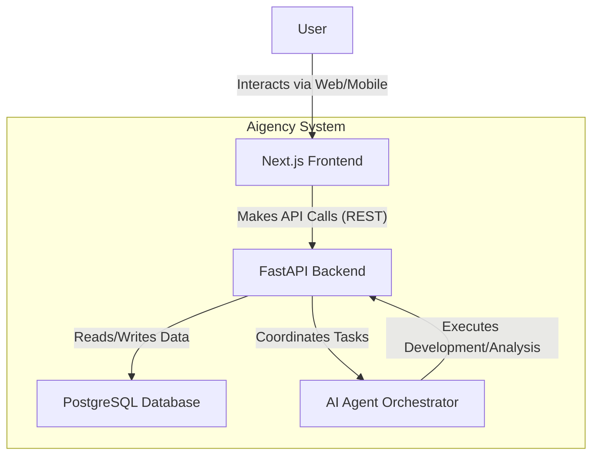

# Aigency Architecture Document

## Introduction / Preamble

This document outlines the overall project architecture for Aigency, including backend systems, shared services, and non-UI specific concerns. Its primary goal is to serve as the guiding architectural blueprint for AI-driven development, ensuring consistency and adherence to chosen patterns and technologies.

### Technical Summary

The Aigency architecture is designed as a monorepo housing a Next.js frontend and a Python (FastAPI) backend, leveraging a PostgreSQL database for core data persistence. The system is architected to be a scalable, reliable, and performant platform for a multi-agent system that powers a highly interactive and "sentient" user interface. The initial focus is on delivering the POC functionality with a clear path for future expansion.

### High-Level Overview

The project will be structured as a Monorepo managed by Turborepo, containing distinct applications for the frontend (apps/web) and backend (apps/api), promoting code sharing and unified tooling. The architectural style is a pragmatic, modular approach where the Next.js frontend communicates with the FastAPI backend via a REST API. The backend is responsible for orchestrating the AI agent squad and managing business logic.

**Here is a high-level system context diagram:**



## Architectural / Design Patterns Adopted

### Monorepo:

- To unify version control, streamline dependency management, and simplify cross-application development between the frontend and backend.

### Multi-Agent System:

- The core of the application's intelligence, where different AI agents with specific roles (PM, Architect, etc.) are orchestrated to fulfill user requests.

### Modular Backend:

- The FastAPI backend will be organized into logical modules (e.g., project management, user auth, agent interaction) to ensure separation of concerns.

### Component-Based Frontend:

- The Next.js frontend will be built using a strict component-based architecture, promoting reusability and maintainability, essential for the "living UI" concept.

### Project Structure

This structure is adopted from the Collaboratory prototype and is well-suited for our monorepo architecture.

aigency/
├── apps/
│   ├── api/                 # FastAPI backend
│   │   ├── main.py         # API routes and application
│   │   ├── models.py       # Database models and schema
│   │   └── ...
│   └── web/                # Next.js frontend
│       ├── app/            # App Router pages
│       ├── components/     # React components
│       └── ...
├── packages/               # Shared packages (e.g., for types, utils)
└── turbo.json             # Turborepo configuration

### Key Directory Descriptions:

**apps/api/:** Contains all backend source code for the FastAPI application.
**apps/web/:** Contains all frontend source code for the Next.js application.
**packages/:** Will be used for any code shared between the frontend and backend, such as TypeScript types or validation schemas.

## Data Models

Here are the initial definitions for the core data entities the application will work with. For the POC, we will keep these simple and focused on the required functionality.

### User
**Description:** Represents an authenticated user of the platform.

#### Schema / Interface Definition:

```TypeScript
export interface User {
  id: string; // Unique identifier (e.g., UUID)
  email: string; // User's email address
  name?: string; // Optional display name
  createdAt: Date;
}
```

### Project

**Description:** Represents a user's project, the top-level container for all work.

#### Schema / Interface Definition:
TypeScript

```TypeScript
export interface Project {
  id: string;
  ownerId: string; // Foreign key to User.id
  name: string;
  description?: string;
  createdAt: Date;
}
```

### KanbanStory

**Description**: Represents a user story card on the Kanban board.

#### Schema / Interface Definition:

```TypeScript
export interface KanbanStory {
  id: string;
  projectId: string; // Foreign key to Project.id
  epic: string; // The Epic this story belongs to
  title: string;
  status: 'To Do' | 'In Progress' | 'Done';
  order: number; // For positioning within a status column
}
```

## Definitive Tech Stack Selections

| Category  | Technology | Version / Details | Description / Purpose         |
|-----------|------------|-------------------|-------------------------------|
| Languages | TypeScript | Latest            | Primary language for frontend |
| Python	| 3.11+	| Primary language for backend & AI |
| Runtime	| Node.js	| LTS	| Frontend execution environment |
| Frameworks	| Next.js	| 14+	| Frontend React framework |
| FastAPI	| Latest	| Backend API framework |
| LangGraph	| Latest	| AI agent orchestration |
| Databases	| PostgreSQL	| 15+	| Primary relational data store |
| Drizzle ORM	| Latest	| ORM for interacting with PostgreSQL |
| UI Libraries	| Tailwind CSS	| Latest	| Utility-first CSS framework |
| Radix UI	| Latest	| Headless UI components for accessibility |
| Framer Motion	| Latest	| Animation library |
| Three.js/R3F/Drei	| Latest	| 3D graphics and interaction |
| Infrastructure	| Docker	| Latest	| Containerization for local dev & deployment |
| Turborepo	| Latest	| Monorepo management tool |
| Testing	| Jest / RTL	| Latest	| Frontend unit/component testing |
| Pytest	| Latest	| Backend unit/integration testing |
| CI/CD	| GitHub Actions	| N/A	| Continuous Integration/Deployment |


