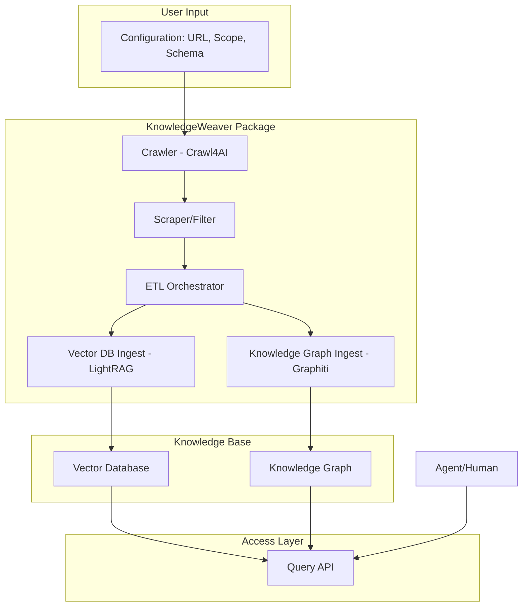

### Product Plan: KnowledgeWeaver

**1. Product Name:**

KnowledgeWeaver

**2. Problem Statement/Goal:**

The goal of KnowledgeWeaver is to provide a seamless and autonomous solution for transforming web content into a structured and queryable knowledge base. Developers and data scientists need a way to easily crawl websites, extract relevant information, and ingest it into both a vector database for semantic search and a knowledge graph for relationship analysis. Currently, this process is often manual, complex, and requires stitching together multiple tools and writing significant custom code. KnowledgeWeaver aims to simplify this by providing an integrated package that handles the end-to-end workflow from crawling to knowledge base creation.

**3. Target Audience:**

*   **AI/ML Developers:** Building RAG applications that need to source data from the web.
*   **Data Scientists/Analysts:** Who need to build knowledge graphs from web data for analysis and insights.
*   **Software Engineers:** Integrating web-sourced knowledge into their applications.
*   **Researchers:** Gathering and structuring information from online sources.

**4. Core Features:**

*   **Configurable Crawling:**
    *   Crawl an entire website based on its sitemap.
    *   Crawl a specific URL.
    *   Crawl a subset of pages matching a pattern.
    *   Define crawl depth and scope.
    *   Use Crawl4AI for robust and scalable crawling.

*   **Intelligent Scraping & Filtering:**
    *   Use CSS selectors, XPath, or AI-based content extraction to identify relevant data on pages.
    *   Define data schemas for the information to be extracted.
    *   Filter out boilerplate content (navbars, footers, ads).

*   **Autonomous ETL Pipeline:**
    *   **Vector Database Ingestion:**
        *   Automatically chunk extracted text content.
        *   Generate embeddings for the chunks.
        *   Store chunks and embeddings in a vector database (e.g., ChromaDB, FAISS, or a managed service).
        *   Leverage LightRAG for efficient indexing and retrieval.
    *   **Knowledge Graph Creation:**
        *   Define entities and relationships to be extracted from the content.
        *   Use LLMs to perform entity and relation extraction.
        *   Use Graphiti to model and build the knowledge graph.
        *   Incrementally update the graph with new information from subsequent crawls.
        *   Support for graph databases like Neo4j or an in-memory graph representation.

*   **Unified Access Layer:**
    *   Provide a simple API to query the knowledge base.
    *   Hybrid search (semantic search on the vector DB and graph traversal on the KG).
    *   Allow other agents or applications to easily connect and consume the knowledge.

*   **Monitoring and Scheduling:**
    *   Dashboard to monitor crawl jobs and ETL processes.
    *   Schedule recurring crawls to keep the knowledge base up-to-date (e.g., daily, weekly).

**5. Technology Stack:**

*   **Crawling:** Crawl4AI
*   **RAG & Vector Ingestion:** LightRAG
*   **Knowledge Graph:** Graphiti
*   **Core Language:** Python
*   **Vector Database:** ChromaDB (as a default, pluggable for others)
*   **Graph Database:** Neo4j (as a default, pluggable for others) or in-memory with persistence.
*   **Orchestration:** Agent OS

**6. High-Level Architecture:**

**7. Development Roadmap (Milestones):**

*   **Milestone 1: Core Crawling and Vector Ingestion (MVP)**
    *   Create a new package structure.
    *   Integrate Crawl4AI for basic URL and sitemap crawling.
    *   Implement simple content extraction (e.g., main article text).
    *   Integrate LightRAG to create a vector index from the crawled content.
    *   Provide a basic Python API to run a crawl and query the resulting vector index.
    *   **Install Agent OS** to manage the development process.

*   **Milestone 2: Knowledge Graph Integration**
    *   Integrate Graphiti.
    *   Implement basic entity extraction using an LLM.
    *   Build a simple knowledge graph from the extracted entities.
    *   Extend the Query API to allow basic graph queries.

*   **Milestone 3: Advanced Configuration and Filtering**
    *   Allow users to define detailed scraping and filtering rules (CSS selectors, etc.).
    *   Allow users to define the schema for both vector and graph data.
    *   Implement incremental updates for both the vector DB and the KG.

*   **Milestone 4: Scheduling and Monitoring**
    *   Add functionality to schedule recurring crawls.
    *   Create a simple dashboard (maybe a web UI or a rich CLI) to view crawl status and statistics.

*   **Milestone 5: Polish and Release**
    *   Improve documentation and examples.
    *   Add comprehensive error handling and logging.
    *   Package the product for distribution (e.g., on PyPI).